<!DOCTYPE html>
<html>
  
<body>
<h2>Introduction</h2>

<em>MEDIOCRATES: I cannot tell how you feel about the speeches of my accusers, people of Atherita. I heard their speeches, and even I forgot who I was, as was their intended effect. Nothing they have said is remotely true. Even so, there was one falsehood that stood out to me, regarding the force of my eloquence. They should be ashamed for accusing me of such, because their falsehood would be revealed as soon as I would speak.</em>

<em>-- The Ninth Cloudruled Dialogue: The Apology of Mediocrates</em>

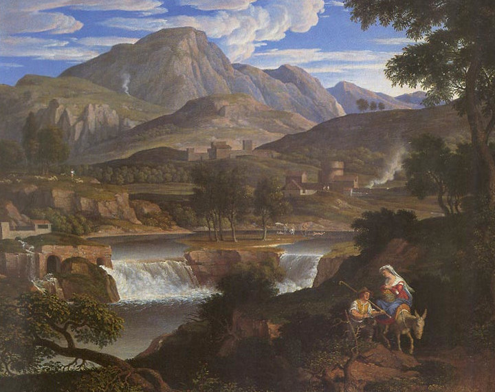

Nephelai is a continent-spanning fantasy setting full of political and cosmic struggle. This sourcebook is designed for use with any fantasy tabletop RPG such that a GM can easily adapt the materials to any appropriate RPG system. The author has considered the most popular fantasy role-playing system in both modern and old-school variants, as well as narrative-first role-playing systems, when designing this setting. The author attempted to strike a balance between enabling a variety of play-styles and environments while independently maintaining thematic and logical cohesion. This sourcebook provides history, geography, plot hooks, and various other essential information without referring to any specific rules.

<h3>What You Must Know</h3>

Most of this sourcebook is written for GMs. It contains spoilers, so players should avoid reading this sourcebook. However, there are a few bits of information every player character ought to know on the first day of the year 189 YE:

<ul>
<li><strong>Where Are You:</strong> You are on the continent of Conliah. Conliah was thought to be the only continent in the world, surrounded by endless ocean, until explorers from a continent to the east called Lodumpis landed on its shores nineteen years ago.</li>
<li><strong>History:</strong> In ancient times, there was a High Elven empire called the Magellian Empire. They had incredible magical technology which is now lost to time, and they mysteriously collapsed. 188 years ago, the Yargyez Empire was formed which reunited all of Conliah under Human rule.</li>
<li><strong>Races:</strong> There are eight major races in Conliah: the Humans of Eastgardia, the Dwarves of Helscar, the Halflings of Middlestone, the Dark Elves of Valorgale, the Wood Elves of Westerwood, the High Elves of Fair Island, the Catfolk of Wuthelark, and the Lizardfolk of Nightglade. All eight provinces are ruled by the Yargyez Empire, a Human empire whose capital is in the city of Inton, Eastgardia.</li>
<li><strong>Religion:</strong> There are good gods called the Agathoi, and evil gods called the Archons. The Imperial Cult worships the Agathoi (especially the Six Guardians) and hunts down those who worship the Archons. Archon worship is uncommon, but Archons grant their worshippers immense power in exchange for spiritual corruption.</li>
<li><strong>Cosmology:</strong> There are three realms of existence: Ksylia, Asteria, and Cthonia. The Agathoi reside in Asteria, the Archons reside in Cthonia, and mortals reside in Ksylia. Ksylia is further divided into three parts: The Skies above are the open atmosphere, the Neaths below are a network of deep caverns, and Arbigard is the surface where the majority of mortal affairs take place.</li>
<li><strong>Magic:</strong> Soul material is present in all three realms of existence. Soul material grants animate beings their life force, and magic wielders gain powers by manipulating this soul material. However, magic wielders possess different magical powers based on which realm their soul material is sourced from.</li>
<li><strong>Threat Ecology:</strong> Conliah has a distinct threat ecology which is different from other classic fantasy settings. Two classic categories of "always evil humanoids" and "magical beasts" are absent, and must be reimagined as belonging to one of the below categories.
<ul>
<li><strong>Sentient mortals</strong> are creatures capable of forming their own societies and politics. Examples are Humans, Elves, Dwarves, Halflings, and Orcs.</li>
<li><strong>Mundane beasts</strong> may be majestic, strange, or dangerous, but they are essentially mundane. Examples are pterodactyls, giant ants and carnivorous apes.</li>
<li><strong>Cthonically corrupt mortals</strong> are members of the sentient mortal races, but who have changed their physical form through interaction with Cthonic magic. Examples are Iavols and Draklings.</li>
<li><strong>Cthonian invaders</strong> are aberrations from Cthonia itself, temporarily present in Ksylia itself as an army of destruction. Examples are Nightcreeps and Tormentors.</li>
<li><strong>Artificial beings</strong> are products of arcane manipulation, which has transformed life or granted life to an inanimate vessel. Examples are War Puppets, Steelskulls and Flesh Mutants.</li>
<li><strong>Undead beings</strong> are a special kind of artificial being, whose only universal traits are (1) their existence perverts the cycle of life and death, either spiritually or physically and (2) they are Cthonically corrupt. Examples are Haunters, Zombies, and Blood Monsters.</li>
</ul></li>
<li><strong>Factions:</strong> You have heard about several factions with continent-spanning impact:
<ul>
<li><strong>The Yargyez Empire:</strong> The Empire was established 188 years ago by Humans from Eastgardia. The Yargyez Emperor is the head of religion through the Imperial Cult, military through the Royal Guard, and law through the Imperial Council.</li>
<li><strong>The Uzvu Confederation:</strong> A confederation of Orcs, Goblins, and Ogres landed on the shores of Conliah nineteen years ago. They have rapidly started invading the land, declaring their domination of Conliah divinely mandated.</li>
<li><strong>The Academy of Knowledge:</strong> The Academy is the largest magical organization in Conliah, and is dedicated to the systematic study of magic. Many magic wielders are taught in their universities.</li>
<li><strong>The Philosophers Guild:</strong> A strange group of philosophical lodges across Conliah have formed a guild to defend free thinking against orthodoxy. They are not outright Archon worshippers, but they are viewed as suspicious by the Yargyez Empire.</li>
<li><strong>The Artisans Guild:</strong> Urban manufacturers across Conliah are members of the Artisans Guild. The Guild also has an operative wing of covert agents who use stealth and advanced magical technology.</li>
<li><strong>The Belligerantes:</strong> The Belligerantes are a martial organization that shuns magic and stealth in favor of physical combat. They are mercenaries for hire in rural areas the Empire cannot protect.</li>
</ul></li>
</ul>

<h2>World Overview</h2>

<em>KAITO THE HALFLING: I have heard a legend that in the Age of Might Makes Right, there was an Archon who ruled over a settlement with the most righteous laws of all.</em>

<em>ASEM THE WOOD ELF: That's a surprising legend, Kaito. You'll need to tell us about that.</em>

<em>-- The Thirty-Third Cloudruled Dialogue: The Warlords</em>

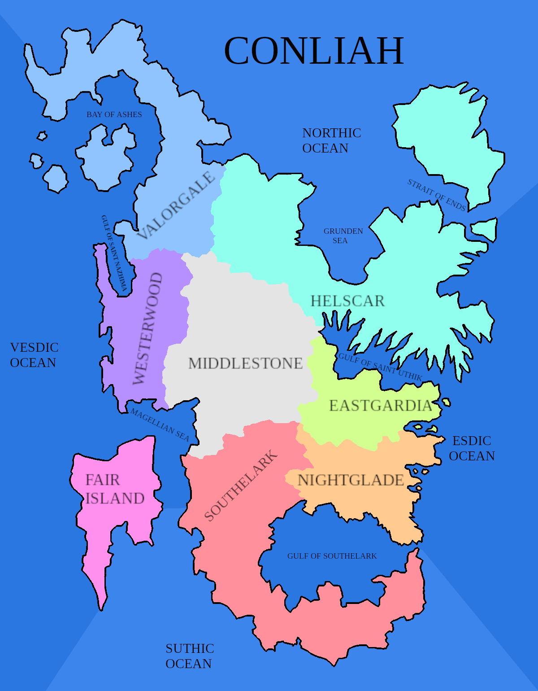

<h3>Geographic Summary</h3>

Conliah is the main continent on the surface of Arbigard. It is bordered by two oceans: the Talantic Ocean to the east, and the Acivic Ocean to the west. The entire continent is approximately 10.8 million square miles in area, including all land and bodies of water.

The Yargyez Empire has divided the continent into eight provinces, each one the homeland of a distinct race:

<ul>
<li><strong>Eastgardia</strong> is a temperate coastal region to the east, and the heart of the Yargyez Empire. It is the homeland of all Humans.</li>
<li><strong>Helscar</strong> is a land of icy highlands to the northeast. It is the homeland of the Dwarves.</li>
<li><strong>Middlestone</strong> has endless fertile plains at the very center of Conliah. It is the homeland of the Halflings.</li>
<li><strong>Valorgale</strong> is made of volcanically active barrens and boreal forests to the northwest. It is the homeland of the Dark Elves.</li>
<li><strong>Westerwood</strong> is made of dense, old growth forest to the west. It is the homeland of the Wood Elves.</li>
<li><strong>Fair Island</strong> is a massive island of arid mountains to the southwest. It is the homeland of the High Elves.</li>
<li><strong>Wuthelark</strong> is a land of deserts and jungles to the south. It is the homeland of the Catfolk.</li>
<li><strong>Nightglade</strong> is a marsh to the southeast. It is the homeland of the Lizardfolk.</li>
</ul>

Until very recently, denizens of Conliah believed they were the only continent in the world and no other lands were beyond the oceans. Recently this was proven incorrect by explorers from across the Talantic Ocean, who claim to be from a continent called Lodumpis.

<h3>Cosmological Summary</h3>

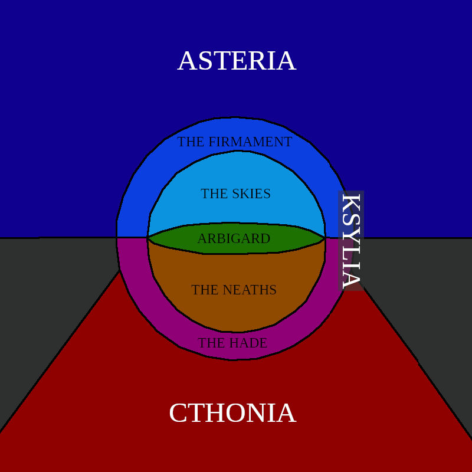

According to the doctrine of the Imperial Cult, there are three realms:

<ul>
<li><strong>Ksylia</strong> has moderation in the quality of soul material and quantity of elemental substance. Arbigard is a flat disc at the center of Ksylia, dividing it into upper and lower hemispheres. This flat disc of unknown size is the surface where mortals dwell. Above Arbigard is a hemisphere called The Skies (the air and the clouds), enclosed by a dome of water called The Firmament. Below Arbigard is a hemisphere called The Neaths (the earth below), enclosed by a dome of magma called The Hade. Ksylia is suspended in a larger cosmos between Asteria and Cthonia.</li>
<li><strong>Asteria</strong> is a realm composed of fine soul material, and very little elemental substance. It is the residence of the Agathoi (good gods) and where souls rest between transmigratory cycles. It is physically above Ksylia, separated from it by The Firmament.</li>
<li><strong>Cthonia</strong> is a realm composed of very degraded soul material, and huge amounts of elemental substance. It is the residence of the Archons (evil gods) and lesser Cthonians, their minions. It is physically below Ksylia, separated from it by The Hade.</li>
</ul>

It is impossible for mortals to freely navigate the wide open realms of Asteria and Cthonia. They can only navigate to spherical subrealms, through an action called phasing which transfers beings between spaces. According to the Imperial Cult, the Agathoi forbid mortals from accessing the Asteric spheres except during transmigration (between their reincarnations in Ksylia). The Agathoi are not all-powerful, however, so there may be exceptions.

In between transmigratory cycles, mortals occupy various Asteric spheres which correspond to their moral conduct in life:

<ul>
<li>Neutral lives: their sphere is like a blank, still space for introspection.</li>
<li>Virtuous lives: the soul is rewarded temporarily by beauty, harmony, and joy.</li>
<li>Wicked lives: the soul is punished temporarily to atone for their actions.</li>
</ul>

Some legendary individuals are said to have witnessed the Asteric spheres during life, but these are exceptional circumstances.

Phasing into Cthonic spheres is much more common. The Agathoi have a weaker hold here, so mortals can phase there through magical rituals much more easily. The exact nature of these spheres vary dramatically:

<ul>
<li>Some are formless spheres of raw elements. The sizes of these formless spheres vary greatly. The smallest are several feet in radius, and the largest are tremendous beyond known estimate.</li>
<li>Some are domains shaped by Archons reflecting their natures. Usually, these spheres have navigable environments large enough to hold armies of lesser Cthonians who serve the Archon and reflect its nature.</li>
</ul>

Archons are not content to reside in their spheres. The desire of all Archons is to breach the boundary with Ksylia and pull mortals into their domains with the ultimate goal of consuming the entire realm of Ksylia. Their capacity to do so is constrained, because Cthonic beings cannot permanently reside in Ksylia. Cthonians who overstay in Ksylia will eventually phase back into their home sphere of Cthonia. However, temporary breaches activated by mortals can create indefinitely durable zones of Cthonic influence. By remaining within these zones, lesser Cthonic beings may reside in Ksylia for prolonged stays. They can even venture for a short time outside of these zones, and safely return to them. Thankfully, these breaches mainly occur in pre-Magellian ruins, from a time when Archon worship was common. However, those who intentionally delve into ancient ruins to banish these threats must exercise great caution against the hordes of Cthonians residing there.

Ksylia does not naturally have spherical subrealms. However, the ancient Magellians knew how to warp space to create miniature spheres that mortals could phase into by the same magical means as Cthonic spheres. Within these spheres, the natural laws of Ksylia generally work as expected. The contents of Ksylic spheres varies depending on the intentions of its Magellian constructor. Interfaces to these Ksylic spheres were typically placed in lockets, mirrors, doors, and paintings. The Imperial Cult does not have any official stance on the exact spatial relationship between Ksylic spheres and Ksylia proper.

The Magellian Empire also built universal Ksylic sphere interfaces that could only be operated with a physical key. Each key was a precisely forged metal object whose shape and etched markings encoded a specific destination sphere. When inserted into a universal interface, the key reliably located the corresponding Ksylic sphere. Therefore, destruction of a particular interface or key did not strand the Ksylic sphere itself. As long as someone could reconstruct the key and locate a universal interface, that person could phase into that Ksylic sphere.

<h3>Technology</h3>

The technology level of Conliah is approximately 1100s medieval Europe. Military technology is still based on melee combat, longbows and crossbows, and basic siege weapons. There is very little innovation in enchanting, liming itself to simple enhancements to simple weapons and armor. War Puppets are the most advanced constructs which Conliah can produce.

The Uzvu Confederation from Lodumpis has advanced technology of approximately 1500s Europe. They possess magical firearms which work similarly to early muskets, pistols, and cannons. These firearms rely on yellow soul binding enchantments to operate. There are also undetectable traces of red soul material necessary for the mechanics to work. Instead of gunpowder, their enchantments generate an explosion which propels a bullet. The enchanters of Conliah have not been able to reverse engineer how firearms are constructed. They also possess extensive clockwork machinery appropriate to that era, which operates according to non-magical principles. Examples include clock towers, orreries, and wind-up toys. The Uzvu Confederation are perfectly capable of producing the same simple enchantments for weapons and armor as Conliah. In terms of constructs, the Uzvu Confederation is limited to War Puppets like Conliah.

The Magellian Empire was technologically advanced, being capable of magical modification of flesh and the construction of sentient clockwork constructs. This technology is native to Conliah, but is now lost in ancient ruins.

The Magellian Empire built advanced magical firearms called ray guns, which were powered by yellow soul binding enchantments. As with most Magellian technology, knowledge of their construction is lost to time. These weapons projected beams of elemental sunlight and elemental moonlight, concentrated into a single destructive stream. These weapons were built at various scales such that they were wielded by both clockwork foot soldiers called Mechanids and gigantic clockwork guardians called Agalmaliths. These weapons were powerful but self-recharged very slowly, which made their practical use in warfare challenging. To compensate, a large number of ray guns were manufactured then placed into storage for decades between uses. Some constructs in ancient ruins still possess these weapons, but these ray guns quickly become useless once fully discharged. In the case of the rifles used by Mechanids, the magazine capacity is between seven and twelve rounds. Once finished, those constructs must switch to simple weapons.

<h3>Currency</h3>

<ul>
<li>The base unit of currency is the Drachma (ud), which is a silver coin. Three Drachmas can buy one night's stay at an average inn.</li>
<li>A Hemiobol (ho) is a copper coin, worth one-tenth of one Drachma. Two Hemiobols can buy one loaf of bread.</li>
<li>A Dekadrachma (dd) is a gold coin, worth ten Drachmas. One Dekadrachma can buy one day of rations.</li>
<li>A Hekatodrachma (hd) is a platinum coin, worth one-hundred Drachmas. One Hekatodrachma can buy an extravagant banquet for one person.</li>
</ul>

<h3>Calendar</h3>

The year is 366 days long, with 12 months of exactly 30 days each and concluding with 6 intercalary days. There are no leap years. There are four seasons in Conliah, and daylight changes between months. For each month, there is a birthsign associated with that month, and each of the last 6 intercalary days of the year have their own birthsign. The below sunrise and sunset times are not intended as exact, but are provided for convenience.

<table>
  <thead>
    <tr>
      <th>Name</th>
      <th>Type</th>
      <th>Birthsign</th>
      <th>Season</th>
      <th>Sunrise</th>
      <th>Sunset</th>
    </tr>
  </thead>
  <tbody>
    <tr><td>Askonos</td><td>Month</td><td>Scorpion</td><td>Spring</td><td>7:00 AM</td><td>7:30 PM</td></tr>
    <tr><td>Bamos</td><td>Month</td><td>Horse</td><td>Spring</td><td>6:30 AM</td><td>8:30 PM</td></tr>
    <tr><td>Chomos</td><td>Month</td><td>Twin Princes</td><td>Spring</td><td>6:00 AM</td><td>9:00 PM</td></tr>
    <tr><td>Destachtos</td><td>Month</td><td>Crab</td><td>Summer</td><td>6:00 AM</td><td>9:00 PM</td></tr>
    <tr><td>Ekerios</td><td>Month</td><td>Sheep</td><td>Summer</td><td>6:00 AM</td><td>9:00 PM</td></tr>
    <tr><td>Flogos</td><td>Month</td><td>Princess</td><td>Summer</td><td>6:30 AM</td><td>8:30 PM</td></tr>
    <tr><td>Gaieros</td><td>Month</td><td>Trilobite</td><td>Fall</td><td>7:00 AM</td><td>7:30 PM</td></tr>
    <tr><td>Hanemos</td><td>Month</td><td>Pig</td><td>Fall</td><td>7:30 AM</td><td>7:00 PM</td></tr>
    <tr><td>Ikatagedos</td><td>Month</td><td>Servant</td><td>Fall</td><td>8:00 AM</td><td>6:30 PM</td></tr>
    <tr><td>Jostagonos</td><td>Month</td><td>Spider</td><td>Winter</td><td>8:00 AM</td><td>6:30 PM</td></tr>
    <tr><td>Kepotamos</td><td>Month</td><td>Donkey</td><td>Winter</td><td>8:00 AM</td><td>6:30 PM</td></tr>
    <tr><td>Lithalasos</td><td>Month</td><td>Judge</td><td>Winter</td><td>7:30 AM</td><td>7:00 PM</td></tr>
    <tr><td>Uletas</td><td>Intercalary Day</td><td>Moon</td><td>Spring</td><td>7:17 AM</td><td>7:13 PM</td></tr>
    <tr><td>Valentas</td><td>Intercalary Day</td><td>Sun</td><td>Spring</td><td>7:16 AM</td><td>7:14 PM</td></tr>
    <tr><td>Wethias</td><td>Intercalary Day</td><td>Hearth Fire</td><td>Spring</td><td>7:15 AM</td><td>7:15 PM</td></tr>
    <tr><td>Exostas</td><td>Intercalary Day</td><td>Wedding</td><td>Spring</td><td>7:14 AM</td><td>7:16 PM</td></tr>
    <tr><td>Yargasas</td><td>Intercalary Day</td><td>Mountain</td><td>Spring</td><td>7:13 AM</td><td>7:17 PM</td></tr>
    <tr><td>Zitimas</td><td>Intercalary Day</td><td>Thunderbolt</td><td>Spring</td><td>7:12 AM</td><td>7:18 PM</td></tr>
  </tbody>
</table>

There are seven days in a week, starting with Onodes Day. The days of the week are Onodes, Twetes, Tritos, Fodras, Fefdes, Sigtes, and Seftos.

The moon completes a lunar cycle in 28 days. The first day of the year 189 YE is a full moon, and it is Onodes Day.

<h3>Languages</h3>

<table>
  <thead>
    <tr>
      <th>Language</th>
      <th>Script</th>
      <th>Notes</th>
    </tr>
  </thead>
  <tbody>
    <tr>
      <td>Common</td>
      <td>Common</td>
      <td>Spoken by the Humans of Eastgardia, and most other Conlian races.</td>
    </tr>
    <tr>
      <td>Dwarvish</td>
      <td>Common</td>
      <td>Spoken by the Dwarves of Helscar.</td>
    </tr>
    <tr>
      <td>Halfling</td>
      <td>Common</td>
      <td>Spoken by the Halflings of Middlestone.</td>
    </tr>
    <tr>
      <td>Dark Elvish</td>
      <td>Elvish</td>
      <td>Spoken by the Dark Elves of Valorgale.</td>
    </tr>
    <tr>
      <td>Wood Elvish</td>
      <td>Elvish</td>
      <td>Spoken by the Wood Elves of Westerwood.</td>
    </tr>
    <tr>
      <td>High Elvish</td>
      <td>Elvish</td>
      <td>Spoken by the High Elves of Fair Island.</td>
    </tr>
    <tr>
      <td>Catfolk</td>
      <td>Elvish</td>
      <td>Spoken by the Catfolk of Wuthelark.</td>
    </tr>
    <tr>
      <td>Lizardfolk</td>
      <td>Common</td>
      <td>Spoken by the Lizardfolk of Nightglade.</td>
    </tr>
    <tr>
      <td>Orcish</td>
      <td>Orcish</td>
      <td>Spoken by the Orcs of Lodumpis, and most other Lodumpan races.</td>
    </tr>
    <tr>
      <td>Goblin</td>
      <td>Orcish</td>
      <td>Spoken by the Goblins of Lodumpis.</td>
    </tr>
    <tr>
      <td>Ogre</td>
      <td>Orcish</td>
      <td>Spoken by the Ogres of Lodumpis.</td>
    </tr>
  </tbody>
</table>

<h4>Special Languages</h4>

In addition to the languages spoken by those of a particular race, there are languages which are important for other reasons. While they may be obscure, they still have a writing system and structure of a full language.

<ul>
<li>
<b>Cthonic cult languages:</b> Every Cthonic cult has a secret spoken language with its own distinct writing system. The names of the languages are simply given the name of the associated Archon (e.g. "Igedeng's language", "Lize's language") and this is the language cultists use to commune with their deity. In general, any and all beings who are influenced by the specific Archon can understand these secret languages. Examples are intelligent Cthonians, corrupted mortals, and cultists. However, it is also possible to learn a Cthonic cult language through ordinary means.
</li>
<li><b>Classical:</b> The elite language spoken by the ancient Magellian Empire is known as Classical. It is written in Elvish script, and superficially sounds like modern High Elvish to those unfamiliar with both languages. However, the modern language of High Elvish is significantly different from the dialect spoken by the Magellians, such that they are mutually unintelligible. Schoolmages of the Academy of Knowledge generally know Classical, and it is widely known by scholars of the Imperial Cult and the Philosophers Guild. It is the lingua franca of Conlian Schoolmages, such that modern spell books are also written in Classical. Intelligent constructs from the Magellian Empire also speak this language.</li>
</ul>

<h4>Slang, Codes, and Signs</h4>

There are many secret ways of communicating which are significant across Conliah. Many of these are derivative of Common or do not meet the criteria of a full language.

<ul>
<li><b>High Tongue:</b> Imperial Cult Devouts, Cloud Devouts, and Ardents all have the ability to speak in a language called High Tongue. This language has no written form, and is supernaturally closed off to outsiders who will hear gibberish. Even so, outsiders in earshot will instantly and certainly be aware that this gibberish is High Tongue. High Tongue cannot be used to convey complex concepts, but may be used to impress abstract concepts upon the mind of listeners who share the language. Technically, these individual concepts may be chained together in a sequence to build a rudimentary language. However, under most circumstances outside of religious use this is excruciatingly and impractically slow. Usually its use is restricted to simple, singular or pairs of two messages in the following categories. The examples are not exhaustive, but the categories themselves are:
  <ul>
    <li>Broad intentions: "I come in peace", "I am hostile", "I surrender"</li>
    <li>Simple commands: "Follow me", "wait", "go away"</li>
    <li>Affirmative answers: "Yes", "no", "mostly yes", "mostly no", "maybe"</li>
    <li>Emotional states: "Danger", "hope", "sorrow"</li>
    <li>Relative time and place: "Now", "later", "ahead", "behind"</li>
    <li>Simple adjectives: "Large", "heavy", "red"</li>
    <li>Simple nouns: "Friend", "animal", "the moon"</li>
    <li>Basic quantities: "None/one/two" (no specific number more than two), "a few", "many", "more", "less"</li>
    <li>Philosophical abstractions: "Justice", "truth", "deception", "good", "evil"</li>
    <li>Intonation: "!", "?"</li>
  </ul>
</li>
<li><b>Spies' cant:</b> Operatives of the Artisans Guild have a secret code which allows them to insert secret messages into ordinary-sounding conversations, typically in Common.</li>
<li><b>Escapist trail codes:</b> Followers of the Escapist school of thought in the Philosophers Guild leave trail markers which are subtle to the untrained eye, but whose meanings are unmistakable to those trained in it.</li>
<li><b>Rhyming slang:</b> The lowest ranking soldiers of all martial factions native to Conliah are familiar with rhyming slang. This type of slang involves replacing a word with a rhyming phrase, then dropping the portion of the phrase which rhymes, which prevents analysis by outsiders. Examples of factions where this slang is widespread are the Belligerantes, the Royal Guard, the Artisans Guild, Tyvenlads, and Lizardfolk rebels. This informal variant of Common exists to obscure messages between <i>ranks within a faction</i> rather than <i>between factions</i>. For instance, a soldier can discreetly fraternize with a prisoner of an opposing faction if they both know rhyming slang. Attentive outsiders may catch on that rhyming slang is being used, but they will not have the slightest clue what is actually being said. When a low ranking soldier is promoted to the role of an officer, knowledge of rhyming slang is quickly lost. That is because the upkeep of knowledge of rhyming slang requires mnemonics embedded in the day-to-day life of a low ranking soldier, which an officer is required to alienate from. If someone retires at a low rank without being promoted to an officer, knowledge of rhyming slang is retained because this self-imposed alienation does not occur.</li>
<li><b>Oundar Edturn:</b> The name Oundar Edturn is derived from the phrase "Turned Around". Beggars, prisoners, thieves, and criminals of all kinds across Conliah are familiar with Oundar Edturn. This type of slang is an informal variant of Common that involves swapping the syllables within each word. It is at risk of being analyzed if someone is aware that Oundar Edturn is being used, but it takes great practice to speak and hear fluently. Due to its simplicity to learn and practice, it has become the standard language of the criminal underworld.</li>
<li><b>Arcane shorthand:</b> While Conlian Schoolmages write in Classical in a structured setting, it is very common in the field to use shorthand, a practice dating back to the Magellian Empire. By means of this shorthand, it is possible to convey several words of Classical in a few brief strokes. While it is designed for speed and space efficiency rather than security, this shorthand is totally illegible except to the one who wrote it. It is necessary to cast a spell for one Schoolmage to decipher another's shorthand, which converts it to the full Classical in the caster's vision. However, the same spell is ineffective when reading the tomes of Uzvu Schoolmages.</li>
<li><b>Uzvu Schoolmage script:</b> Uzvu Schoolmages use a script which is currently undecipherable by Conlian scholars.</li>
</ul>

<h2>History</h2>

<em>MEDIOCRATES: Do you agree with me, that resting and moving are direct opposites?</em>

<em>THEOMISUS: Certainly.</em>

<em>MEDIOCRATES: Do you also agree with me that when a thing is resting or moving, the thing exists?</em>

<em>THEOMISUS: Yes, again.</em>

<em>MEDIOCRATES: Then existence is a third quality which is different from that of resting or moving.</em>

<em>-- The Forty-First Cloudruled Dialogue: The Theomisus</em>

<h3>Mythological history</h3>

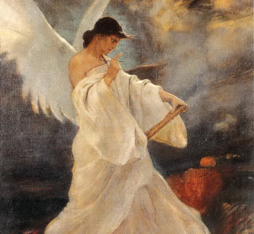

The below is an account given by the poet Romulus (a High Elf poet who adored the Yargyez Empire) in the year 25 YE. It is the official account of the Yargyez Empire, and the most complete account of mythic pre-history, but there are many contradicting myths in Conliah.

In the beginning, the universe existed in a state of chaos. The elements fire, water, air, earth, sunlight, and moonlight existed as unformed, chaotic motion diffusely scattered throughout the void of the universe.

Gora was a benevolent and intelligent being who could mold the elements and give them structure. Her desire was to bring order into the universe.

Her first and most important act was to forge soul material. Elemental sunlight contains a force of cohesion, and elemental moonlight contains a force of repulsion. By combining these two elements and forcing structure onto them, Gora manufactured a subtler state of matter called soul material which possessed distinct properties from raw elements. Despite its subtlety, soul material was not a simple essence but possessed a complex structure capable of storing memories, preferences, habits, and desires. When soul material was recombined with raw elements, the elements could be animated into living things. Forging soul material was very difficult for Gora, and not all the soul material she created was of uniform quality. The finer the soul material, the more benevolent the living thing was. Lower qualities of soul material resulted in less benevolent living things. However, she decided to use both higher and lower qualities of soul material in creation, because she still judged that existence is better than non-existence.

Her second act was to divide the cosmos into three realms: Asteria, Cthonia, and Ksylia. The purpose of Asteria was to house the finest soul material, the purpose of Cthonia was to house the elements, and Ksylia would bind soul material with elements into structured matter. Ksylia was divided into The Skies, The Neaths, and Arbigard between them. The Firmament was created to separate Ksylia from Asteria, and The Hade was created to separate Ksylia from Cthonia.

Her third and last act was to create the souls of Agathoi out of first-rate soul material. First-rate soul material is now commonly called blue soul material. These were benevolent and intelligent beings, who listened to Gora's will. Each Agathos was assigned responsibility for a fundamental principle of the cosmos. The souls of the Agathoi resided in Asteria, yet their influence extended into Ksylia. Gora explained her plan to the Agathoi, delegated all further tasks to them, and ceased to develop the cosmos further herself.

The first act of the Agathoi used second-rate soul material to create the souls of sentient mortals, along with their bodies. Second-rate soul material is now commonly called green soul material. Because sentient mortal souls were inferior to the Agathoi, they could not permanently reside in Asteria. Instead, their souls were always compelled to descend into Ksylia. These beings were capable of reason and virtue, but also error and corruption.

The second act of the Agathoi was to establish a system of transmigration to purify mortal souls and eventually reunite them with Asteria. Mortal souls continued through the cycle of life and death over multiple lifetimes according to the morality of their actions during life. The Agathoi did this because Gora did not desire for these mortals to permanently exist in Ksylia. However, the soul adjusted its memory and perception to the realm it occupied. Prolonged exposure to the brilliance of Asteria caused the soul to adjust, and eventually lose its memories of mortal life. Again, when they returned to Ksylia, the soul adjusted to its darkness, and forgot its experience of Asteria. Therefore, mortals did not retain memories across their lives. Yet, by moral conduct through successive lives, it was possible for a mortal soul to be promoted to that of an Agathos by stripping away the soul's impurities which made it second-rate.

The third and last act of the Agathoi was to create all other animals and lesser organisms using third-rate soul material. Third-rate soul material is now commonly called yellow soul material. These creatures populated Ksylia with simpler beings which would help mortals to sustain themselves. Instead of transmigrating, the third-rate soul material of these organisms cycled through Ksylia in an orderly fashion. Gora left the ultimate destiny of third-rate soul material to the discretion of the Agathoi, to be addressed in the distant future.

During the creative acts of the Agathoi, highly degraded fragments of soul material were generated which unintentionally descended into Cthonia and combined with the raw elements. These degraded fragments are now commonly called red soul material. This animated the elements spontaneously, making them alive with varying intelligence but alien to the celestial order established by Gora. These creatures were called Cthonians. Some of these Cthonians were lesser beings, much like typical mortals and animals, but some were incredibly powerful. These powerful Cthonians became known as Archons. The Archons never knew of Gora and the celestial order, so came to believe they were the primordial beings of the cosmos.

The soul material of Cthonians was so degraded that they could not permanently reside in Ksylia, much as mortals could not permanently reside in Asteria. However, the descent of fragmented soul material penetrated the boundary of the Hade. This allowed the Archons to repeatedly extend their reach into Ksylia to influence and harm mortals.

Mortals perceived the might of these Archons, and fearing them, began to worship them as gods. They sacrificed to them, formed cults, and raised temples to them. As a result there remained a cosmic struggle between these two sets of powerful beings: the Agathoi who were made with first-rate soul material who reside in Asteria, and the Archons who were formed with highly degraded fragments of soul material who reside in Cthonia.

After creation was finished, the Agathoi withdrew from Ksylia. Over time, distinct races emerged across Arbigard with their own cultures and identities. Civilizations rose and fell over the ages, with worship of the Agathoi and the Archons shifting back and forth.

<h3>Written History</h3>

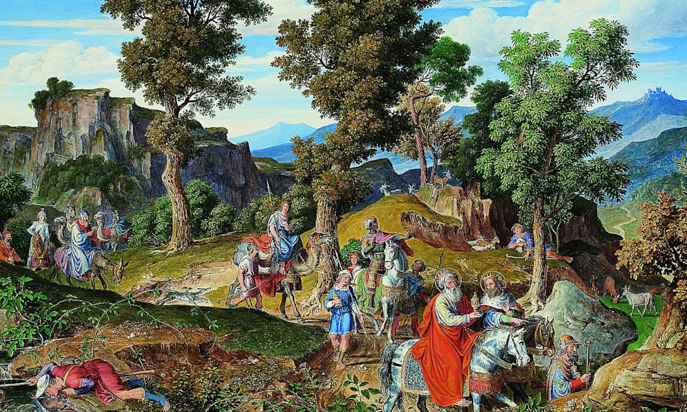

<h4>c. 3000 BYE - 1567 BYE</h4>

Before any continent-spanning empires, Conliah was politically decentralized. This era is often referred to as the "Age of Might Makes Right". The various races populated the continent in city-states, small kingdoms, and tribes. Borders were constantly shifting, and warfare was a common means of resolving disputes. The Archons were openly worshipped across Conliah. Their cults promised strength to their followers in exchange for submission. The Agathoi were unknown to most of Conliah, and were only a small cult within the Wood Elves in the Kara Ates mountains. Every province was divided into many cultures and political formations. Nonetheless, the kernel of higher political formations were present, and every province was yearning for the rule of law. This paved the way for the fast rise of the Magellian Empire.

Worship of the Agathoi spread across Westerwood, which had a long history of war, conquest, and economic exchange with Fair Island. As a result, the High Elven empires of Fair Island gradually adopted Agathos worship themselves.

<h4>1566 BYE - 566 BYE</h4>

A great kingdom consolidated power across Fair Island, and declared itself the Magellian Empire. It rapidly conquered the continent of Conliah with advanced technology powered by unprecedented arcane science. They banned Archon worship and instituted Agathos worship, which was unknown outside of Westerwood and Fair Island at that time. The provinces were united for the first time, and the High Elves imposed their worldview on the other races. This worldview included an emphasis on rationality, control, and introspection. They constructed centers of arcane scientific research across the continent.

After a long period of stability and prosperity, unusual ways of thinking emerged. One school of thought referred to themselves as the Cloudruled. They evaded persecution because although they denied the divinity of the Agathoi as mere superstition, they worshipped the clouds instead, and not any Archon. The Cloudruled claimed that lightning comes not from the wrath of Iazus, but the clouds themselves. They questioned why the Archons were able to send their red souled Cthonian minions to Ksylia to corrupt mortals, but even as Agathos worship was dominant in Conliah nobody could observe blue souled "Asterian" minions of the same sort. It seemed to the Cloudruled that if the Agathoi were as described, they could intervene more directly to cleanse the Cthonic threat. They established centers of learning called Phrontisteries, which were enormous floating buildings. At these Phrontisteries they trained the youth to argue against elders, defy norms, and scorn tradition. Their rhetorical methods were so excellent that they could make an unjust position appear just.

In an event later called "The Great Nothing", group of youth educated by the Cloudruled plotted an assassination against the Emperor and his heirs. The result was a succession crisis that could, theoretically, be resolved legally through an election at lower levels of government. However, the assassins made arguments that there could be no rightful successor that were so strong that government was gridlocked. What resulted was a continuation of the imperial bureaucracy that no longer had an emperor. Within a few years, the empire dissolved into rival states ruled by provincial governments. Over time, the magical technology spread by the Magellians was lost and the only remnants are magical, mechanical, and monstrous mysteries of their past. The magical knowledge behind the floating Phrontisteries was lost, and they collapsed into the ground.

<h4>565 BYE - 1 BYE</h4>

After the Magellian Empire collapsed, there was a long dark age. Various successor states claimed legitimacy, but none were able to consolidate power over the whole continent. Agathos worship remained the dominant religion, but each state interpreted the myths differently and combined them with local traditions. Archon worship was taboo, but it gradually gained a minority of practitioners. The teachings of the Cloudruled, in the form of written dialogues, were lost. This period lasted until humans from Eastgardia conquered Conliah and established a second empire.

During this period, many Magellian structures fell into ruin, or were repurposed by the locals of each province. As Agathos worship became blended with syncretic practices, new temples were constructed and old ones were modified. Practices of ancestor veneration became common again, and the rituals involved bound souls to physical objects. As a result, ghosts were bound to their resting places. Lastly, the many small kingdoms that arose were constantly at war with each other. Great fortresses were constructed to defend the land, and to prepare attacks on others.

<h4>1 YE - 189 YE (present)</h4>

Humans conquered Conliah, uniting it once again. 1 YE marks the consolidation of power of the Yargyez Empire. It conceived itself as the successor of the Magellian Empire. The eight major races were brought under one government, each having partial autonomy in its own province. Agathos worship was standardized under the Imperial Cult, displacing local rites, and Archon worship was banned again.

Now, in the past twenty years, the below events happened:

<ul>
<li>170 YE: Contact was made with peoples from a continent in the east named Lodumpis. They called themselves the Uzvu Confederation, a coalition between Orc warlords, Goblin traders and craftsmen, and Ogre manual laborers and soldiers. They have brought with them arcane technology superior to the Yargyez but inferior to the Magellians, and claim to be on a divine civilization mission to bring the continent under the ruler of the Uzvu Confederation.</li>
<li>172 YE: A group of high ranking Human officials launched a failed coup against the emperor in Inton. It was later uncovered that they were Brannenlads, cultists of Lundazing.</li>
<li>175 YE: In Nightglade, a faction of Lizardfolk launched a rebellion against the Empire. They were suppressed with force, undermining the legitimacy of the Empire.</li>
<li>178 YE: In western Helscar, a coalition of Chieftains have agreed to revive forbidden forms of ancestor worship that bind mortal souls, which the Imperial Cult considers a heresy.</li>
<li>178 YE: Philosophical lodges across the continent have joined forces for mutual protection, calling themselves the Philosophers Guild. While not promoting outright Archon worship, their questioning opens the door to heresy.</li>
<li>180 YE: The Osti Tribe has openly revived worship of Dreze, the Archon of Endurance, against the will of their fellow Ashfallen Tribes and the Empire.</li>
<li>188 YE: In complete secrecy, a faction operating across Valorgale, Westerwood, and Fair Island is conspiring to overthrow the Yargyez Emperor and install an Elven-ruled empire.</li>
<li>188 YE: A secret referendum was held by the Artisans Guild that, if Uzvu victory in Conliah appears immanent, then the Artisans Guild will begin trading with the Uzvu.</li>
</ul>

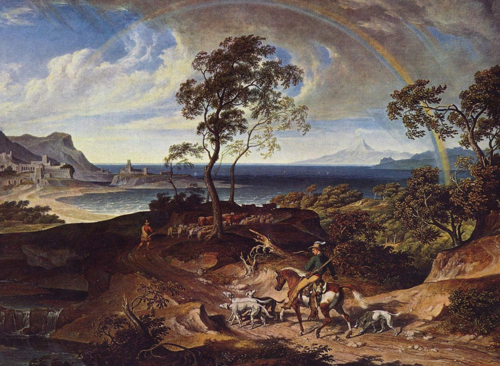

<h2>Races</h2>

<em>KAITO THE HALFLING: Tell me, friends, were the laws written by an Agathos or by a mortal?</em>

<em>ASEM THE WOOD ELF: An Agathos, Kaito, but I do not know which one. Among us Wood Elves we say Iazus made the laws, but High Elves like Sitarophilus say Burrue did it. Is that right, Sitarophilus?</em>

<em>SITAROPHILUS THE HIGH ELF: You are right we do, Asem, but I also do not really know.</em>

<em>-- The Thirty-Third Cloudruled Dialogue: The Warlords</em>

There are eight major races in Conliah, each hailing from one of the eight provinces. There are also less numerous races across the provinces, who answer to the provincial government they hail from.

<h3>Humans</h3>

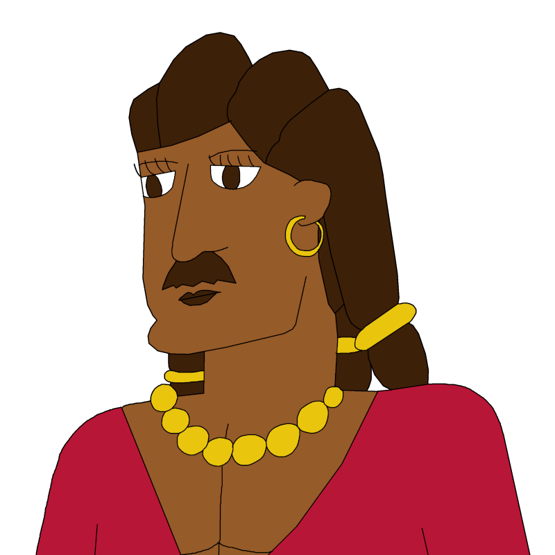

<ul>
<li><strong>Physical Description:</strong> Humans are highly varied in their physical appearance.</li>
<li><strong>Lifespan:</strong> Humans reach adulthood at 20 years, middle age at 40 years, elderhood at 60 years, and usually die by 80 years. They can live up to 110 years.</li>
<li><strong>Homeland:</strong> They hail from the temperate coast of Eastgardia, which has a variety of mountains, hills, forests, and wetlands.</li>
<li><strong>Culture:</strong> Human society is defined by pragmatism, diplomacy, and political aptitude.</li>
<li><strong>Disposition:</strong> As the ruling race of the Yargyez Empire, Humans seek to maintain its continuity in Conliah, restore its former glory, and broker agreement between the other provinces.</li>
<li><strong>Language:</strong> Humans speak Common, the official language of the Yargyez Empire.</li>
<li><strong>Names:</strong>
<ul>
<li><strong>Male:</strong> Lale, Kite, Rothik, Barap, Satip, Guthin</li>
<li><strong>Female:</strong> Giha, Basitra, Resha, Kata, Sapitha, Valeta</li>
<li><strong>Second names:</strong> Only the Human aristocracy has true patrilineal surnames of the form [Given Name] of House [Family]. Examples of major families are Yargyez, Gothiko, and Parsha. There is no standard rule for commoner bynames.</li>
</ul></li>
</ul>

<h3>Dwarves</h3>

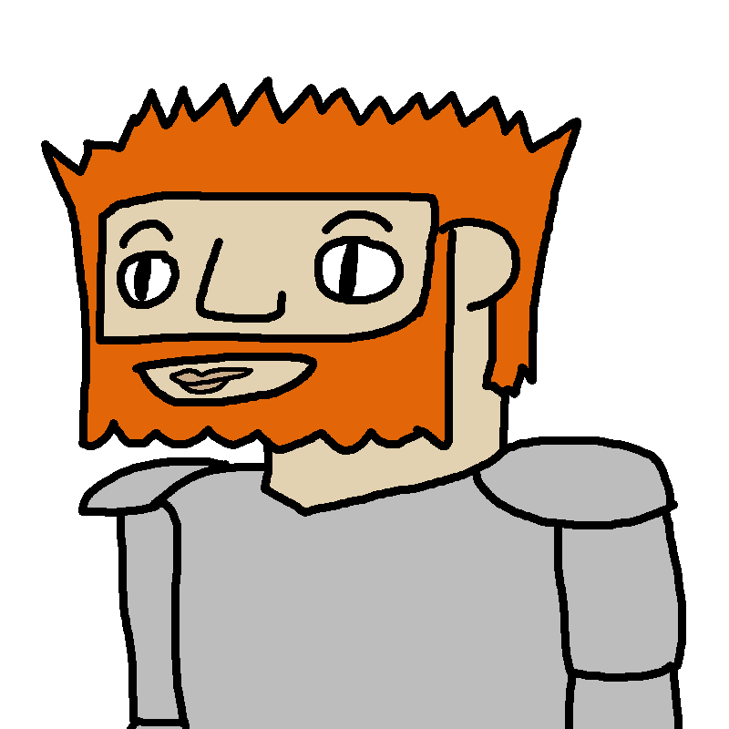

<ul>
<li><strong>Physical Description:</strong> Dwarves are stout, standing at about 4 feet tall. They are generally broad and strong.</li>
<li><strong>Lifespan:</strong> Dwarves reach adulthood at 24 years, middle age at 48 years, elderhood at 72 years, and usually die by 96 years. They can live up to 132 years.</li>
<li><strong>Homeland:</strong> Their homeland is the icy mountain province of Helscar.</li>
<li><strong>Culture:</strong> Dwarven society emphasizes stoicism, artisanry, military reverence.</li>
<li><strong>Disposition:</strong> The mountain Dwarves of western Helscar tend towards demanding greater autonomy from the Yargyez Empire, whereas the foothill Dwarves of eastern Helscar tend towards loyalty and integration with the Empire.</li>
<li><strong>Language:</strong> Dwarves speak Dwarvish and Common.</li>
<li><strong>Names:</strong>
<ul>
<li><strong>Male:</strong> Yurz, Frang, Wolfhan, Horik, Yarel, Karik</li>
<li><strong>Female:</strong> Heigrid, Inya, Sonti, Elya, Godhi, Bagrid</li>
<li><strong>Second names:</strong> Dwarves use patronymic bynames, of the form [Father]'s son, [Father]'s daughter, or [Father]'s kid.</li>
</ul></li>
</ul>

<h3>Halflings</h3>

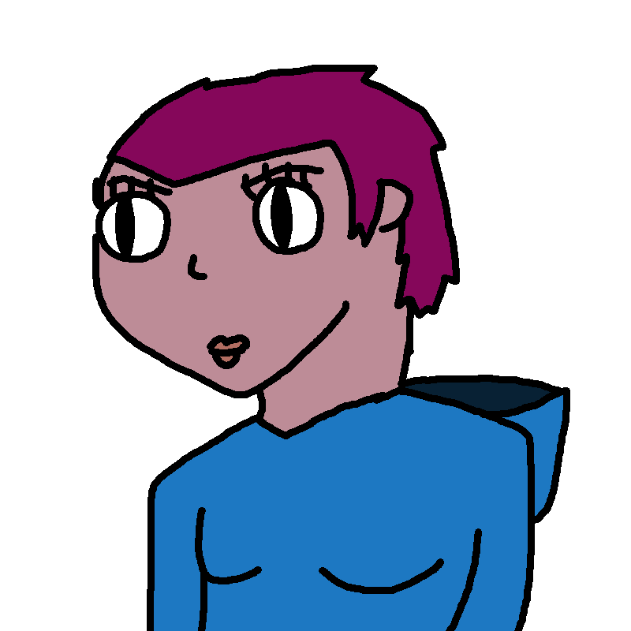

<ul>
<li><strong>Physical Description:</strong> Halflings are small, standing between 3 and 4 feet tall. They are skinnier and frailer than Dwarves.</li>
<li><strong>Lifespan:</strong> Halflings reach adulthood at 24 years, middle age at 48 years, elderhood at 72 years, and usually die by 96 years. They can live up to 132 years.</li>
<li><strong>Homeland:</strong> They hail from Middlestone, which consists of three regions: rolling hills and valleys to the north, a massive fertile prarie in the center, and forested hills to the south.</li>
<li><strong>Culture:</strong> Halfling society values chivalry, formal etiquette, humility, and piety.</li>
<li><strong>Disposition:</strong> As a central and agriculturally productive region, Middlestone was under constant attacks from adjacent regions during the interregnum. As a result, Halflings are among the most fervent supporters of the Yargyez Empire as protectors.</li>
<li><strong>Language:</strong> Halflings speak Halfling and Common.</li>
<li><strong>Names:</strong>
<ul>
<li><strong>Male:</strong> Ashiko, Yokashi, Takira, Kiriko, Shishito, Katako</li>
<li><strong>Female:</strong> Fuho, Miho, Shiko, Niko, Kiko, Tato</li>
<li><strong>Second names:</strong> Halflings have true patrilineal surnames of the form [Given Name] [Family]-zu. Examples of major clans are Teteko, Atana, and Kariko.</li>
</ul></li>
</ul>

<h3>Dark Elves</h3>

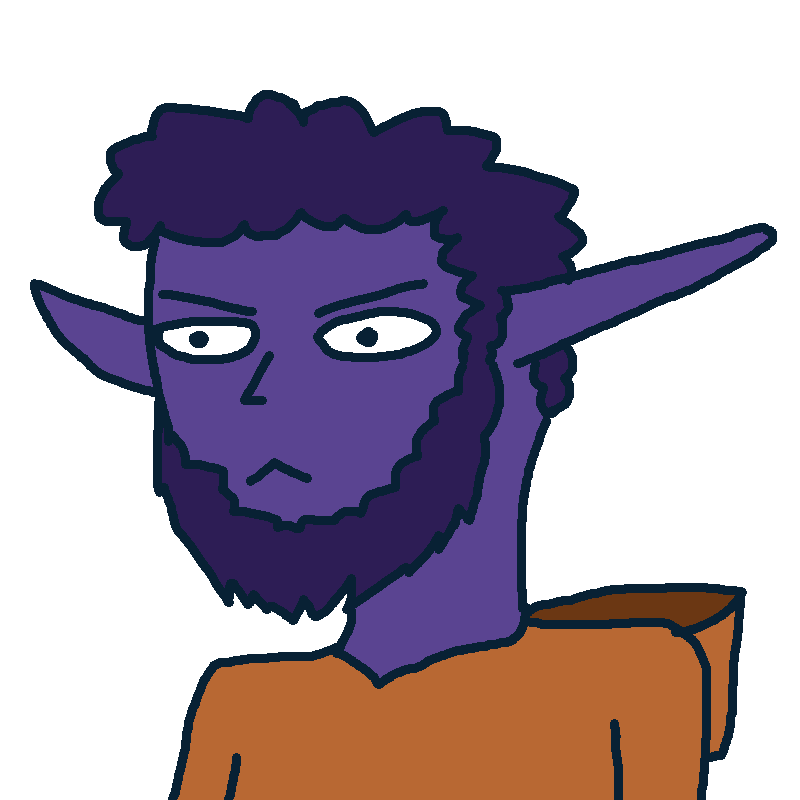

<ul>
<li><strong>Physical Description:</strong> Dark Elves are of average height, slender, with dark gray to bluish purple skin.</li>
<li><strong>Lifespan:</strong> Dark Elves reach adulthood at 22 years, middle age at 44 years, elderhood at 66 years, and usually die by 88 years. They can live up to 121 years.</li>
<li><strong>Homeland:</strong> Their homeland is the volcanic taiga province of Valorgale.</li>
<li><strong>Culture:</strong> Dark Elven culture is steeped in secrecy and clan loyalty.</li>
<li><strong>Disposition:</strong> Perspectives on the Yargyez Empire vary widely across clans: some are loyal to the Yargyez, and others are outright Archon worshipping revivalists.</li>
<li><strong>Language:</strong> Dark Elves speak Dark Elvish and Common.</li>
<li><strong>Names:</strong>
<ul>
<li><strong>Male:</strong> Azong, Taiguda, Tiyun, Gozing, Yongtin, Gaiti</li>
<li><strong>Female:</strong> Bumjer, Erbutai, Jerdeni, Umbani, Erjer, Jerutai</li>
<li><strong>Second names:</strong> Although clan identity is very important in Dark Elf culture, there is no formal system of surnames. The inconsistent use of bynames are common.</li>
</ul></li>
</ul>

<h3>Wood Elves</h3>

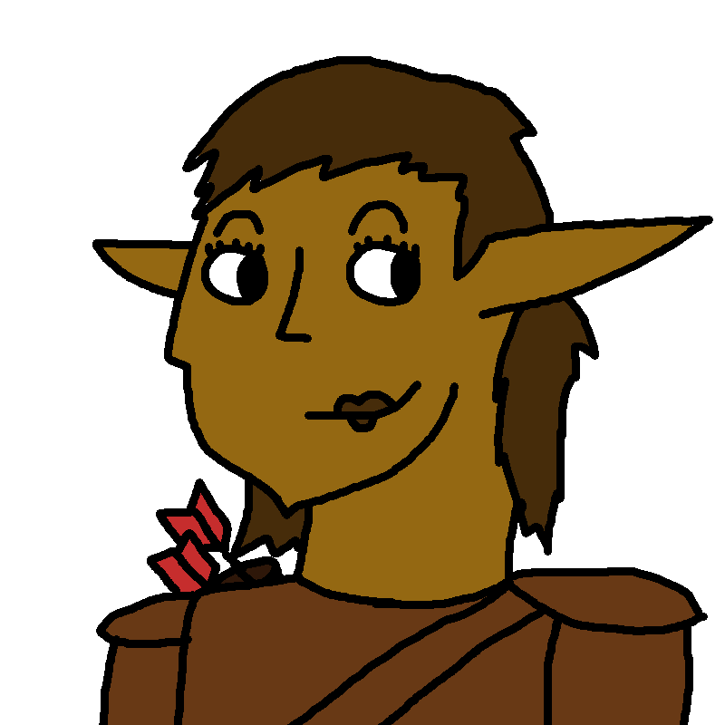

<ul>
<li><strong>Physical Description:</strong> Wood Elves are short and slender, with olive-toned to brown skin.</li>
<li><strong>Lifespan:</strong> Wood Elves reach adulthood at 22 years, middle age at 44 years, elderhood at 66 years, and usually die by 88 years. They can live up to 121 years.</li>
<li><strong>Homeland:</strong> They hail from the mountainous forests of Westerwood.</li>
<li><strong>Culture:</strong> Wood Elven culture values ecological spirituality, resourcefulness, and a strong hunting tradition.</li>
<li><strong>Disposition:</strong> Having historically suffered under High Elf domination, Wood Elves see the Empire as a stabilizing buffer preserving their autonomy. However, there are secret factions in Westerwood who side with High Elven revivalists.</li>
<li><strong>Language:</strong> Wood Elves speak Wood Elvish and Common.</li>
<li><strong>Names:</strong>
<ul>
<li><strong>Male:</strong> Takhildin, Turlandel, Akhsunal, Lursukhil, Tamirnal, Mirlakhil</li>
<li><strong>Female:</strong> Nazhan, Ainura, Dilima, Gizhan, Zhanura, Linira</li>
<li><strong>Second names:</strong> Wood Elves use patronymic bynames, of the form [Given Name] lim [Father].</li>
</ul></li>
</ul>

<h3>High Elves</h3>

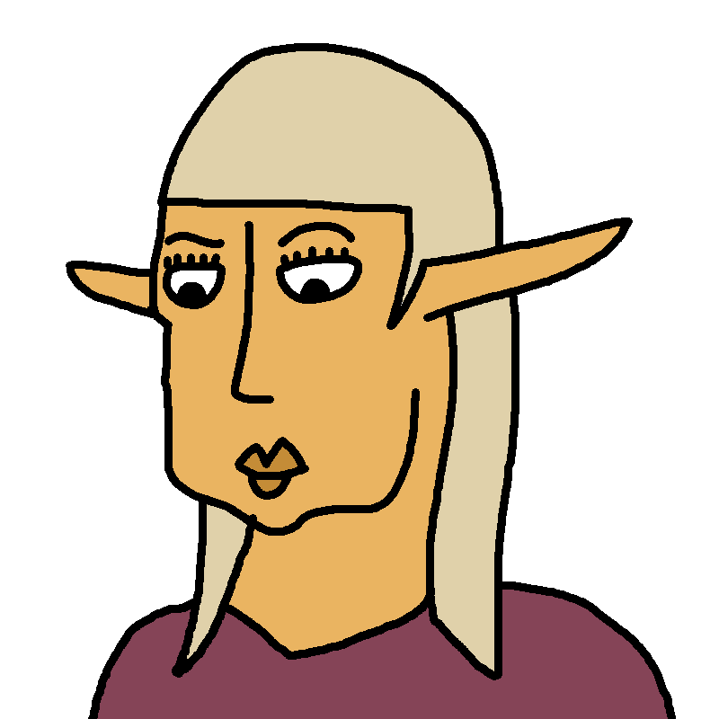

<ul>
<li><strong>Physical Description:</strong> High Elves are tall and slender, with radiant golden skin.</li>
<li><strong>Lifespan:</strong> High Elves reach adulthood at 24 years, middle age at 48 years, elderhood at 72 years, and usually die by 96 years. They can live up to 132 years.</li>
<li><strong>Homeland:</strong> They hail from the arid mountains of Fair Island.</li>
<li><strong>Culture:</strong> High Elven society upholds religious dogma, the arcane arts, and a hierarchy based on lineage.</li>
<li><strong>Disposition:</strong> High Elves are nostalgic for the Magellian Empire, which prioritized High Elf superiority. Many High Elves view the Yargyez Empire as having strayed from the original form of Agathos worship practiced in the Magellian Empire.</li>
<li><strong>Language:</strong> High Elves speak High Elvish and Common.</li>
<li><strong>Names:</strong>
<ul>
<li><strong>Male:</strong> Achos, Taleas, Diacrates, Lenysis, Goreas, Homias</li>
<li><strong>Female:</strong> Astera, Zedara, Ozia, Elaria, Dorela, Soria</li>
<li><strong>Second names:</strong> High Elves use toponymic bynames, of the form [Given Name] lin [District]. Populous districts in the capital of Thesekira are Apolek, Tarnis, and Maphelius.</li>
</ul></li>
</ul>

<h3>Catfolk</h3>

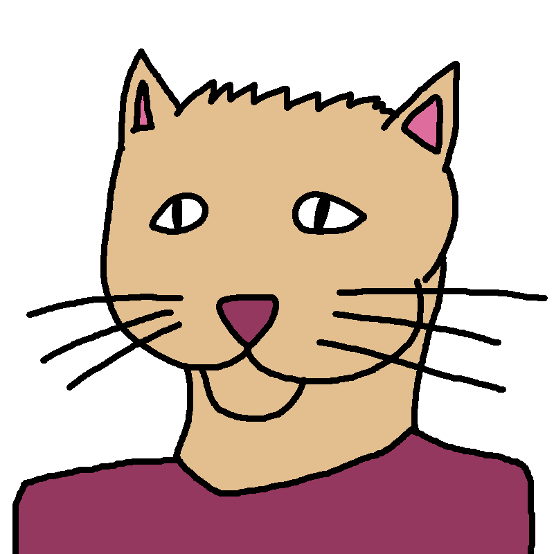

<ul>
<li><strong>Physical Description:</strong> Catfolk are feline humanoids with sandy brown fur, upright ears, sharp claws, and long tails.</li>
<li><strong>Lifespan:</strong> Catfolk reach adulthood at 20 years, middle age at 40 years, elderhood at 60 years, and usually die by 80 years. They can live up to 110 years.</li>
<li><strong>Homeland:</strong> They hail from Wuthelark, which consists of three regions: a jungle to the south, a desert to the north, and a mountain range dividing them.</li>
<li><strong>Culture:</strong> Catfolk culture centers celestial spirituality, clan loyalty, and libertinism.</li>
<li><strong>Disposition:</strong> Perspectives on the Yargyez Empire are split geographically between jungle and desert Catfolk. The northern nomads resist the Yargyez Empire's encroachment due to its unwillingness to recognize nomadic land rights.</li>
<li><strong>Language:</strong> Catfolk speak Catfolk and Common.</li>
<li><strong>Names:</strong>
<ul>
<li><strong>Male:</strong> Golni, Pundi, Dadiya, Tunnad, Samuha, Dvariya</li>
<li><strong>Female:</strong> Bangu, Binan, Enduk, Konis, Kalis, Untam</li>
<li><strong>Second names:</strong> Southern Catfolk use toponymic bynames, but these are informal and flexible. They take the form [Given Name] di [Place]. Occasionally, Southern Catfolk use other kinds of bynames too. Northern Catfolk have no consistent system of bynames.</li>
</ul></li>
</ul>

<h3>Lizardfolk</h3>

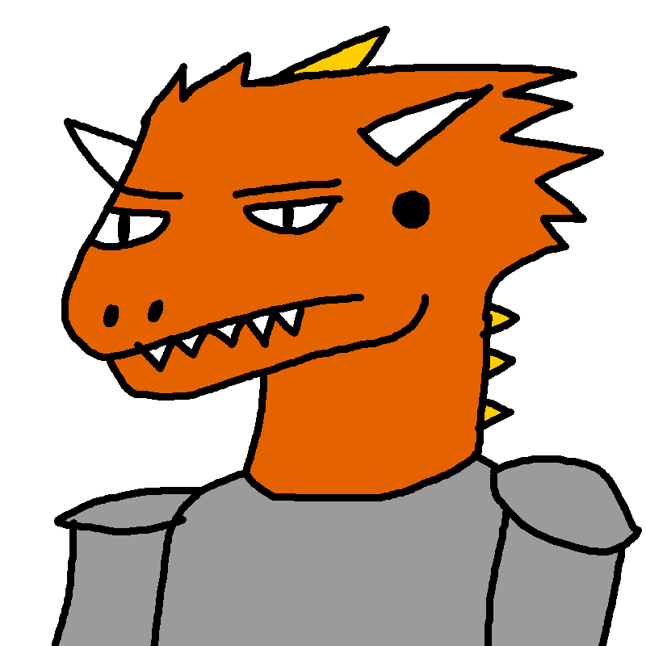

<ul>
<li><strong>Physical Description:</strong> Lizardfolk are reptilian humanoids with red or greenish brown scales and sharp claws.</li>
<li><strong>Lifespan:</strong> Lizardfolk reach adulthood at 20 years, middle age at 40 years, elderhood at 60 years, and usually die by 80 years. They can live up to 110 years.</li>
<li><strong>Homeland:</strong> They hail from the marsh province of Nightglade.</li>
<li><strong>Culture:</strong> Lizardfolk culture emphasizes ecological spirituality, ancestor veneration, and clan loyalty.</li>
<li><strong>Disposition:</strong> Lizardfolk are, on the whole, enemies of the Yargyez Empire. The Lizardfolk rulers who agreed to peacefully cede their lands to the Yargyez Empire in exchange for continuous rule are viewed as traitors to their own race. Factions of Lizardfolk across Nightglade actively resist Yargyez presence in the province. Many rebels have taken to underground caves across Nightglade and Eastgardia to stage attacks on Imperial outposts.</li>
<li><strong>Language:</strong> Lizardfolk speak Lizardfolk and Common.</li>
<li><strong>Names:</strong>
<ul>
<li><strong>Male:</strong> Yengtan, Hobuing, Dongok, Toavan, Kuyet, Sontan</li>
<li><strong>Female:</strong> Bithui, Nuwan, Natlan, Thiho, Tangko, Trinku</li>
<li><strong>Second names:</strong> Lizardfolk have true patrilineal surnames of the form [Given Name] [Family]. Examples of major clans are Yehok-Tin, Engpan-Yet, and Okyeng-Weng. These patrilineal surnames are somewhat political. Those who are loyal to the Yargyez Empire and the Lizardfolk aristocracy tend to retain traditional surnames. Those who support the Lizardfolk rebellion tend to abandon traditional family names in favor of self-assumed neologized honorifics like Dark-Eyes, Virtue-Speaker, and No-Name. These neologized honorifics are sometimes passed down patrilineally, matrilineally, or sometimes replaced with new honorifics of the same kind.</li>
</ul></li>
</ul>

<h3>Orcs</h3>

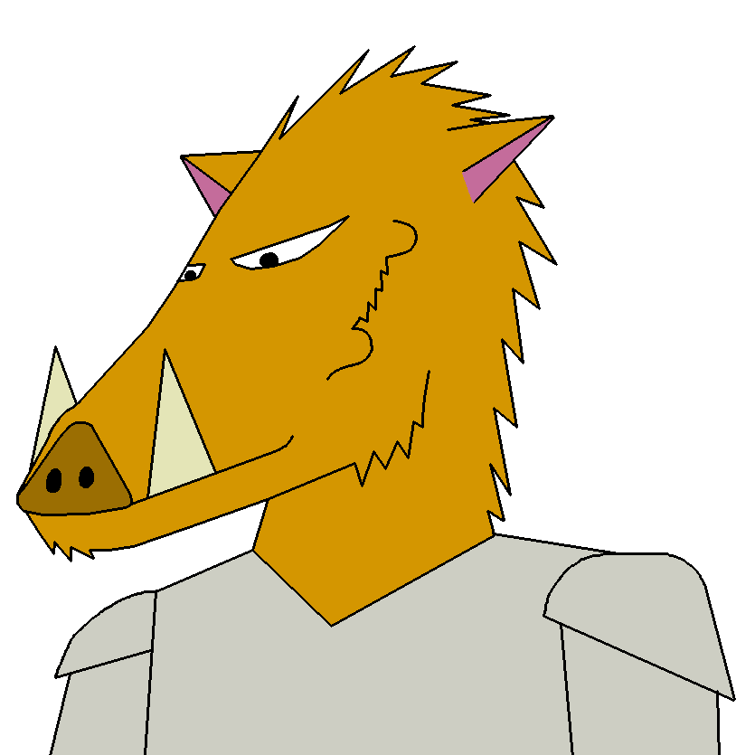

<ul>
<li><strong>Physical Description:</strong> Orcs are tall and strong. Their faces are somewhat warthog-like, with straight medium-length tusks, elongated snouts and small lower jaws, pronounced cheekbones, and short pointy ears. Their skin is primarily green with a tinge of gray, and their fur covers their entire body with a mix of black and brown hues.</li>
<li><strong>Lifespan:</strong> Orcs reach adulthood at 24 years, middle age at 48 years, elderhood at 72 years, and usually die by 96 years. They can live up to 132 years.</li>
<li><strong>Homeland:</strong> The Orcs are one of the Lodumpan races.</li>
<li><strong>Culture:</strong> Orcish culture upholds religious dogma, hereditary hierarchy, and reverence for military service.</li>
<li><strong>Disposition:</strong> They see the Yargyez Empire as decadent and corrupt, and view the incursion of the Uzvu as a divinely sanctioned civilizing mission.</li>
<li><strong>Language:</strong> Orcs speak Orcish.</li>
<li>
<strong>Names:</strong>

<ul>
<li><strong>Male:</strong> Goruk, Gona, Zargan, Estokel, Yabi, Kola, Margozek</li>
<li><strong>Female:</strong> Ruwa, Fiyotaz, Bozai, Ledo, Tigo, Rabo, Saka</li>
<li><strong>Second names:</strong> Orcs use patronymic bynames, of the form [Given Name] iz-[Father].</li>
</ul></li>
</ul>

<h3>Goblins</h3>

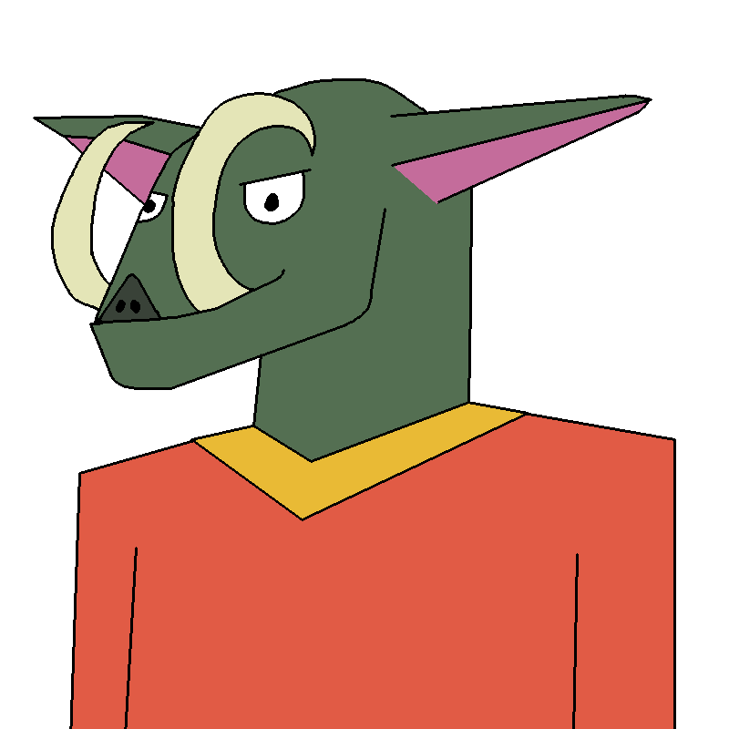

<ul>
<li><strong>Physical Description:</strong> Goblins are small humanoids. Their faces are somewhat babirusa-like, with long curved tusks long pointy ears, medium-length snouts and medium-size lower jaws. They are mostly hairless, with a skin tone halfway between green and gray.</li>
<li><strong>Lifespan:</strong> Goblins reach adulthood at 22 years, middle age at 44 years, elderhood at 66 years, and usually die by 88 years. They can live up to 121 years.</li>
<li><strong>Homeland:</strong> The Goblins are one of the Lodumpan races.</li>
<li><strong>Culture:</strong> Goblin culture values commerce, technological inventiveness, and pragmatism.</li>
<li><strong>Disposition:</strong> Goblins view the Yargyez Empire as a repository of riches, ripe for extraction and development.</li>
<li><strong>Language:</strong> Goblins speak Goblin and Orcish.</li>
<li>
<strong>Names:</strong>

<ul>
<li><strong>Male:</strong> Tims, Tins, Trix, Trops, Pats, Pils, Tox</li>
<li><strong>Female:</strong> Marx, Max, Renks, Rinks, Lits, Larts, Mux</li>
<li><strong>Second names:</strong> Goblins almost exclusively use profession-based bynames, of the form [Given Name] the [Profession].</li>
</ul></li>
</ul>

<h3>Ogres</h3>

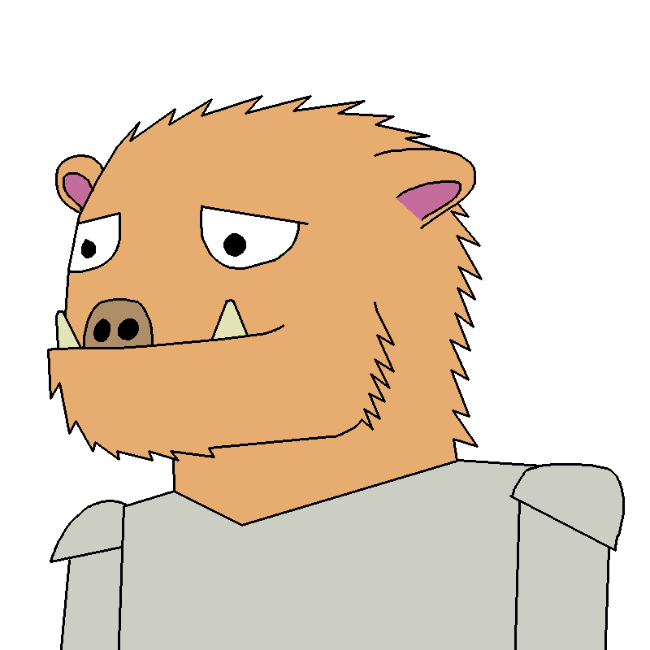

<ul>
<li><strong>Physical Description:</strong> Ogres are large and broad humanoids. Their faces are somewhat boar-like, with flat snouts, heavy jowls, small tusks, and large lower jaws. Their skin is primarily gray with a tinge of green, and their fur covers their entire body with hues of beige and gray.</li>
<li><strong>Lifespan:</strong> Ogres reach adulthood at 22 years, middle age at 44 years, elderhood at 66 years, and usually die by 88 years. They can live up to 121 years.</li>
<li><strong>Homeland:</strong> The Ogres are one of the Lodumpan races.</li>
<li><strong>Culture:</strong> Ogre culture highlights disciplined work ethic, economic individualism, and a desire for recognition.</li>
<li><strong>Disposition:</strong> They view the Yargyez Empire as an opportunity to raise their social status by acquiring underdeveloped tracts of land in exchange for serving as settler soldiers of the frontier.</li>
<li><strong>Language:</strong> Ogres speak Ogre and Orcish.</li>
<li>
<strong>Names:</strong>

<ul>
<li><strong>Male:</strong> Waraboo, Dalagoo, Monapoo, Bakadoo, Gomaloo, Bameroo, Boraboo</li>
<li><strong>Female:</strong> Boyaga, Nabito, Hokaro, Mabano, Dogabo, Tibaro, Wonata</li>
<li><strong>Second names:</strong> While it is not universal, many Ogres have patrilineal surnames of the form [Given Name] [Family]. Common surnames are Boogaroo, Banaboo, and Dagaroo. Otherwise, there is no standard form for Ogre bynames.</li>
</ul></li>
</ul>

<h3>Multiple Race Heritage</h3>

Racial identity has three layers in Nephelai: biology, culture, and legal classification. For the majority of sentient mortals, all three layers coincide without complication. However, multiple race heritage and cultural assimilation often results in multiple interpretations of an individual's race. Legal classification often does not resolve the ambiguity, but preserves it due to the small minority of multiple race individuals.

<h4>Biology</h4>

Although their exact origins are unknown, six major races of Conliah share a common lineage which allows full interbreeding between them. These are called the "Dimo races" and include Humans, Dwarves, Halflings, High Elves, Dark Elves, and Wood Elves. Their offspring have traits which are the average of the multiple racial backgrounds. It is commonly believed that three major pre-historic events shaped the history of the Dimo races, but nobody knows how long ago. First, the Old Elves became isolated from the rest of Conliah, perhaps on Fair Island. Second, the races of Conliah became very diverse, including Humans, Dwarves, and Halflings but also many other less numerous races which are no longer distinctive. Third, the Old Elves migrated back to the Conlian mainland and intermarried with different mainland races. These mainland races were not Humans, Dwarves, or Halflings, but from the less numerous races no longer known. After this intermarriage, each population of hybrid Elves remained insular within its own group. These events resulted in the unique traits of High Elves, Wood Elves, and Dark Elves yet also retained their common ancestral traits of the Old Elves.

Catfolk and Lizardfolk are not Dimo races. Each of them are biologically distinct, reproductively incompatible species. Orcs, Goblins, and Ogres are capable of producing offspring with each other, but not with any native race of Conliah. Again, their offspring have traits which are the average of the multiple racial backgrounds. These three races are called "Porcine races". Cthonians, as beings without a true "biology", are not capable of producing offspring with sentient mortals.

<h4>Culture</h4>

Certain combinations of two races have common names, and based on physical appearance are not socially understood as belonging to a single racial identity. These combinations are often found in border regions between two racial homelands as well as more cosmopolitan cities:

<ul>
<li><b>Elfmans</b> are part Elf and part Human.</li>
<li><b>Dwarfmans</b> are part Dwarf and part Human.</li>
<li><b>Elflets</b> are part Elf and part Halfling.</li>
<li><b>Dwarflets</b> are part Dwarf and part Halfling.</li>
<li><b>Humlets</b> are part Human and part Halfling.</li>
<li><b>Dwelves</b> are part Dwarf and part Elf.</li>
</ul>

When multiple races of Elves produce offspring, the offspring adopt a single Elf racial identity based on social perception regardless of physical appearance. The tendency is for mixed race Elves to always culturally identify with the lowest social stratum. High Elves are never recognized as descended from Wood or Dark Elves, and Wood Elves are never recognized as descended from Dark Elves. This means that, for instance, the child of a High Elf and Wood Elf having a High Elf "look" who is born on Fair Island and participates in High Elf society may still be considered a Woof Elf.

<h4>Legal Classification</h4>

Where such definition is unambiguous such as Lizardfolk and Catfolk, the Yargyez Empire defines race in terms of biology regardless of the cultural identity of the individual. Otherwise, the Yargyez Empire categorizes race according to cultural identity and ancestral homeland province regardless of the individual's "look". Multiple race identity is not considered a valid category in the Yargyez Empire's administration. In cases where self-identification and homeland are conflicting, the Empire tolerates the ambiguity without any attempt to resolve it. Both identities are treated as legally valid. Once again, this is because exceptions are fairly uncommon.

<h2>Religion</h2>

<em>MEDIOCRATES: What makes a person holy?</em>

<em>DYSTHYPHRO: To be holy is to root out and destroy unholiness: whatever is Cthonic, corrupt, and wicked. The people who dedicate their being to fight against it are called holy. Likewise, failing to root out and destroy unholiness is also unholiness. That definition seems sound, to me.</em>

<em>-- The Fifth Cloudruled Dialogue: The Dysthyphro</em>

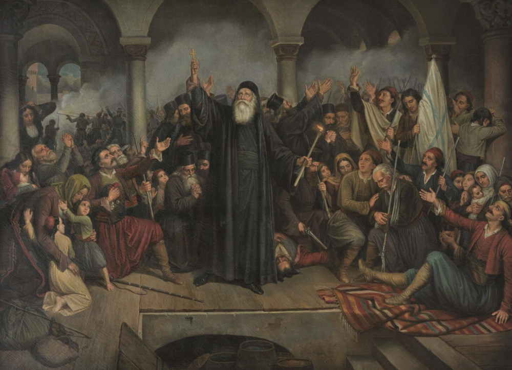

<h3>Overview of Religions in Conliah</h3>

<h4>Agathos Worship</h4>

The pantheon of the Yargyez Empire recognizes six major Agathoi named the Six Guardians. They are worshipped in public temples and holidays recognized by the Empire. Each Agathos has its own clerical hierarchy and rites, and provinces often combine these with syncretic traditions. Besides these Six Guardians there are also many minor Agathoi who are acknowledged by the Empire as having legitimate cults. The below list of minor Agathoi is not exhaustive, but includes the better-known ones.

<table>
  <thead>
    <tr>
      <th>Name</th>
      <th>Title</th>
      <th>Gender</th>
      <th>Domain(s)</th>
      <th>Notes</th>
    </tr>
  </thead>
  <tbody>
    <tr>
      <td>Iazus</td>
      <td>Sky Mother</td>
      <td>Female</td>
      <td>Storms, Law</td>
      <td>Iazus is one of the Six Guardians. She is called the "first among equals" in the Imperial Cult pantheon, and is revered by emperors and inquisitors. The Order of Iazus sanctions Imperial Cult Inquisitors to hunt down Cthonic threats of various kinds. Her symbol is a thunderbolt and stormcloud, and her elemental domains are wind and lightning.</td>
    </tr>
    <tr>
      <td>Inidilt</td>
      <td>Mountain King</td>
      <td>Male</td>
      <td>Agriculture, Seasons</td>
      <td>Inidilt is one of the Six Guardians. He is revered by soldiers and farmers. His symbol is a scythe. His elemental domain is earth.</td>
    </tr>
    <tr>
      <td>Burrue</td>
      <td>Sun Sister</td>
      <td>Female</td>
      <td>Beauty, Philosophy</td>
      <td>Burrue is one of the Six Guardians. She is revered by bards and philosophers. Her symbol is a lyre. Her elemental domain is sunlight.</td>
    </tr>
    <tr>
      <td>Lidnozie</td>
      <td>Moon Brother</td>
      <td>Male</td>
      <td>Wilderness, Full Moon</td>
      <td>Lidnozie is one of the Six Guardians. He is revered by lumberers and hunters. His symbol is a bow and arrow. His elemental domain is moonlight.</td>
    </tr>
    <tr>
      <td>Ereng</td>
      <td>Great Presider</td>
      <td>Male</td>
      <td>Marriage, Family</td>
      <td>Ereng is one of the Six Guardians. He is revered by widows and healers. His symbol is an ox. His elemental domain is water.</td>
    </tr>
    <tr>
      <td>Izdoeng</td>
      <td>Hearth Keeper</td>
      <td>Male</td>
      <td>Peace, Fraternal Love</td>
      <td>Izdoeng is one of the Six Guardians. He is revered by embassadors and second sons. Izdoeng's symbol is a hearth flame, and Izdoeng has a cult of missionaries called Friends of the Hearth Keeper. His elemental domain is fire.</td>
    </tr>
    <tr>
      <td>Dimie</td>
      <td>Clever Agathos</td>
      <td>Male</td>
      <td>Magic, Artisanship, War</td>
      <td>Minor cult is popular in Fair Island</td>
    </tr>
    <tr>
      <td>Ivezdazing</td>
      <td>Forge Master</td>
      <td>Female</td>
      <td>Forge, Fire, Craft</td>
      <td>Minor cult is popular in Helscar</td>
    </tr>
    <tr>
      <td>Vlutodie</td>
      <td>Prince of Joy</td>
      <td>Male</td>
      <td>Beauty, Infatuation, Hedonism</td>
      <td>Minor cult is popular in Middlestone</td>
    </tr>
    <tr>
      <td>Uzioting</td>
      <td>Lady of the Seas</td>
      <td>Female</td>
      <td>Oceans, Navigation</td>
      <td>Minor cult is popular among fishers</td>
    </tr>
    <tr>
      <td>Ilnizing</td>
      <td>Swift Agathos</td>
      <td>Female</td>
      <td>Travel, Trade</td>
      <td>Minor cult is popular among merchants</td>
    </tr>
    <tr>
      <td>Etizing</td>
      <td>Lady Necessity</td>
      <td>Female</td>
      <td>Life, Death</td>
      <td>Minor cult is popular among undertakers</td>
    </tr>
  </tbody>
</table>

Outside of the Imperial Cult, there are religious factions of High Elves and Wood Elves who advocate Burrueism, considering the Imperial Cult to be a distortion. They seek to restore the original practices of Agathos worship as spread by the Magellian Empire, including a belief in Elven racial superiority to other mortal races and a belief that Burrue is an emanation of Gora herself.

<h4>Archon Worship</h4>

Worship of the Archons is forbidden by Imperial law. Even so their cults persist, as their power is too alluring to resist. Shrines to them can be found in ancient ruins, concealed temples, and the basements of shady nobles.

There are many contradictory accounts regarding mythic history and cosmology given by Cthonic cultists. They vary between different cults, and even within the same cults. Many Archon-worshippers do not hold any opinion whatsoever on the topic of religion, and relate to the Archons in a purely transactional way. However, for cultists who do give an account, there are several points of agreement which never vary. The Archons themselves attest to these points.

First, they agree on the general sequence of mythic pre-history. The entire cosmos is Cthonia. Asteria does not exist, and Ksylia is a Cthonic sphere. Soul material was not created by anyone. It co-existed with the raw elements of Cthonia, and originally only red soul material existed. Cthonians erupted spontaneously throughout the cosmos, and the Archons were the strongest Cthonians who dominated the rest. The first generation of Archons are known as the Elder Ones. Their identities are forgotten, except for one legendary Archon named Pirzapap. The Elder Ones immediately waged war on each other, to take control of the cosmos.

This period is called the First Archonic War. Despite how ancient Archons and lesser Cthonians are, they are born and can permanently die like all other beings. After epochs of war, Pirzapap conquered all the cosmos and declared herself Queen of the Archons. Her Cthonic sphere was Ksylia itself, and the Hade was its outer boundary. Pirzapap earned her victory by exceptional cleverness. She manipulated the structure of soul material to create the colors yellow, green, and blue. None of the Elder Ones knew how she accomplished this, because she kept it a secret. Blue soul material was a powerful weapon, antithetical to all life that Pirzapap did not imbue with yellow and green souls. Pirzapap was sadistic, and enjoyed torturing the other Elder Ones with blue soul material. The remaining Elder Ones resented Pirzapap for declaring herself Queen of the Archons and torturing them, so they all rebelled and killed her.

After the death of Pirzapap, all of the Elder Ones wanted to conquer Ksylia. They saw Ksylia as the jewel of the cosmos, so swarmed to Ksylia with their armies to fight the Second Archonic War within Ksylia. After epochs of fighting without victor, a new generation of Archons arose called the Middle Ones. A few names of the Middle Ones are still remembered: Azoveleng, Zonutie, Eirping, Moztazing, and Elkozeng, but the details of their nature are disputed. The Elder Ones were more individually powerful than the Middle Ones, but also stubborn and proud. They refused to form alliances, for fear that it would reveal weakness. The Middle Ones were not as individually great, but readily formed truces. All of the Middle Ones came together in a posse to kill all of the Elder Ones, picking them off one by one and conquering their armies.

Once the Elder Ones were overthrown, the Middle Ones proceeded to continue feuding over control of Ksylia. This was the Third Archonic War, which continues into the present. The Middle Ones died, and all living Archons are called the Younger Ones who carry on the same war. There is no single event that divides the Middle Ones from the Younger Ones, except that the Younger Ones were not present for the killing of the Elder Ones. The oldest among the Younger Ones personally fought one or two of the Middle Ones, but only briefly. Most of their experience was fighting their peers among the Younger Ones. Even then, most of the Younger Ones are dead any many of those remaining are relatively young. The Middle Ones exclusively fought each other with armies of Cthonians, head to head. Sometime during the battles between the Younger Ones, their strategy shifted to recruiting mortals as soldier and generals to fight in their wars. Although mortals were physically weaker than most Cthonians, they were much better at battlefield improvisation. The events beyond that diverge among the Younger Ones, who each tell a different story.

The second point of agreement is that the structure of Ksylia is that of concentric spheres. The outermost sphere separating it from the Cthonic inter-sphere medium is the Hade. Then the Neaths, with its hollow surface of Arbigard. The Skies are at the center. The Firmament and Asteria do not exist. Thus, "up" is at the center of Ksylia, and "down" is away from its center.

Third and last, they only respect one moral law: that justice is the advantage of the stronger. The Magellian Empire, Yargyez Empire, and Uzvu Confederation are merely the latest usurpers in a chain of succession of the Archonic Wars. The conclusion of this war will determine who was right.

The below list of Archons is not exhaustive. There are many lesser-known Cthonic cults in Conliah, and Lodumpans know of Archons that Conlians had never heard of. Likewise, only some Archons known in Conliah are also known in Lodumpis, and Archons which are known in both continents are always given different names and interpreted with different emphases.

<table>
  <thead>
    <tr>
      <th>Name</th>
      <th>Title</th>
      <th>Gender</th>
      <th>Domain(s)</th>
      <th>Notes</th>
    </tr>
  </thead>
  <tbody>
    <tr>
      <td>Igedeng</td>
      <td>Father of Bones</td>
      <td>Male</td>
      <td>Knowledge, Undead</td>
      <td>Igedeng's sphere is called the Deadwoods, an endless forest of dead trees partially illuminated by the crescent moon. He is the patron of necromancers. Igedeng's cults are called the Tenkerlads, necromantic researchers who seek his blessings of knowledge of evil magic. His symbol is a crescent moon. In Lodumpis, the equivalent of Igedeng is female, and is known as Pestium the Rot Mother.</td>
    </tr>
    <tr>
      <td>Lozie</td>
      <td>Strife Maker</td>
      <td>Male</td>
      <td>Chaos, Pranks</td>
      <td>Lozie's sphere is called the Clashcircus, an enormous circus tent where mortals dress as jesters endlessly battle each other with ridiculous weapons like food and children's toys. The Clashcircus is populated by Fluttermice, enormous flying mice who harass mortals who refuse to fight in the arena. Lozie's cults are called the Spokefuglads, bands of pranksters who wander between towns creating unnecessary strife between townfolk. Mortals corrupted by Lozie become Laffids, granting them the power to shape-shift while making their true physical forms repulsive. His symbol is an apple with a bite taken out of it.</td>
    </tr>
    <tr>
      <td>Ogzim</td>
      <td>Lord of the Void</td>
      <td>Male</td>
      <td>Darkness, Silence</td>
      <td>Ogzim's sphere is called the Starless Abyss. There is no land there, only an immense ocean covering the entire sphere. The sky is pitch black, and even the light of fire seems to be absorbed into the void. Nightcreeps inhabit the Starless Abyss on permanent wooden rafts. Ogzim's cults are called the Tyvenlads, criminal syndicates who steal in his name. Mortals corrupted by Ogzim become Zoners, which turns them completely invisible. His symbol is a face with closed eyes. In Lodumpis, the equivalent of Ogzim is female, and is known as Umbrarum the Lady of Shadows.</td>
    </tr>
    <tr>
      <td>Lize</td>
      <td>Harvester of Mortals</td>
      <td>Female</td>
      <td>War, Torture</td>
      <td>Lize's sphere is called the Reaping Grounds. Endless fields of wheat are fed by the blood of mortals who her cultists have tortured and slain. Mortals who are phased into her sphere are subject to eternal torment by her Cthonians, the Tormentors. These Tormentors are eight-foot-tall muscular humanoids with horns, crimson skin, leathery wings, and hooked tails. Lize's cults are called the Overvelderlads, aspiring conquerors who summon Cthonian servants to aid in their conquest of all of Conliah. Her symbol is a helmet, shield and spear. In Lodumpis, the equivalent of Lize is male, and is known as Pastorum the Ghost Thief.</td>
    </tr>
    <tr>
      <td>Uluzing</td>
      <td>Mistress of Ends</td>
      <td>Female</td>
      <td>Fate, Death</td>
      <td>Uluzing's sphere is called the Quaking Peaks. This is a narrow mountain path which leads to an endless abyss on both sides, where mortals must carefully tread without wandering too far in either direction. Furthermore, they are subject to continuous earthquakes that threaten to send them onto one or the other side of the abyss. Uluzing's cults are called the Morderlads, cold-blooded killers who perform assassinations for hire. Her symbol is a knife dripping with blood. In Lodumpis, the equivalent of Uluzing is male, and is known as Ultimatum the End Maker.</td>
    </tr>
    <tr>
      <td>Lundazing</td>
      <td>Queen of Destruction</td>
      <td>Female</td>
      <td>Rebellion, Power</td>
      <td>In the Age of Might Makes Right, Lundazing was a popular deity of the Dwarves. Lundazing's sphere is called Cinderthrone. It is a landscape of obsidian and lava, where the air is thick with smog. Ruins of castles and destroyed statues dot the landscape. Cinderthrone is populated by Dragons and Dragon-like creatures who constantly compete for dominance. She has the power to corrupt mortals into Draklings, which are Dragon-like humanoids. Lundazing's cults are called the Brannenlads, an association of nobles across Conliah who aspire to usurp the Yargyez Emperor. Her symbol is an upside-down torch. In Lodumpis, the equivalent of Lundazing is male, and is known as Primarium the Destroyer.</td>
    </tr>
    <tr>
      <td>Ulviazing</td>
      <td>Dream Caller</td>
      <td>Female</td>
      <td>Dreams, Illusions</td>
      <td>Ulviazing's sphere is the Blissful Hollow. Blissful Hollow is filled with petrified trees and spiderwebs created by Arachnaurs. Arachnaurs are centaur-like creatures with the torso of a human and the lower body of a spider. Arachnaurs spin webs and play their strings like musical instruments. Those corrupted by Ulviazing's promises of blissful dreams become insect-like Husks. Ulviazing's cults are called the Gladlads. Her symbol is a red, pointed cap.</td>
    </tr>
    <tr>
      <td>Inizozim</td>
      <td>Prince of Last Strike</td>
      <td>Male</td>
      <td>Retribution, Plots</td>
      <td>Inizozim's sphere is the Mirror Marshes. The Mirror Marshes are a wetland filled with perfectly balanced logs on top of stones. Nagas wander around, ensuring that the weight of each logs is perfectly distributed. Those corrupted by Inizozim become fish-like Gutterplots. Inizozim's cults are called the Grublelads. His symbol is a measuring rod. In Lodumpis, the equivalent of Inizozim is female, and is known as Solum the Punisher.</td>
    </tr>
    <tr>
      <td>Nabazie</td>
      <td>Prince of Beasts</td>
      <td>Male</td>
      <td>Lust, Rage</td>
      <td>Nabazie's sphere is the Howling Hall. It is a tremendous, ornate castle populated by Lykoids, humanoid creatures with the faces of wolves. These Lykoids endlessly chase prey animals up and down the halls of the castle. Nabazie's cults are called the Jaktlads. His symbol is three red claw marks. In Lodumpis, the equivalent of Nabazie is female, and is known as Vitarum the Sanctioner.</td>
    </tr>
    <tr>
      <td>Eovumid</td>
      <td>Mother of Ills</td>
      <td>Female</td>
      <td>Sickness, Blight</td>
      <td>Eovumid's sphere is the Apothecary of Knives. The Apothecary of Knives is an endless row of prison cells. The guards of this prison are Pulsecutters, beings made of toxic blades bound together. They walk cell by cell, gently cutting the prisoners with their toxic blades, making them more and more sick. Eovumid is the patron of Blood Monsters - undead creatures who spread their illness through contact with their blood. Eovumid's cults are called the Syklads. Her symbol is five snakes tied together by their tails.</td>
    </tr>
    <tr>
      <td>Dreze</td>
      <td>World Bearer</td>
      <td>Female</td>
      <td>Endurance, Pain</td>
      <td>In the Age of Might Makes Right, Dreze was a popular deity of the Dark Elves. Some still worship her in Valorgale. Dreze's sphere is called the Crucible of Tears. It is a land of barren, wind-swept hills dotted with crumbling ruins. Tremendous chains stretch across the land, intended to hold beings of a size beyond mortal comprehension. The Crucible of Tears is populated by Percussors, which are twenty-foot-tall stone statues of a humanoid form that walk in a single direction at a constant pace. They crush anything in their way, and then move on. Her power is called upon by those in bondage. Dreze's cults are called the Tofflads. They are pugilists who engage in bloodsport as a form of devotion. Those who seek her blessing of endurance are transformed into Pertinaxes, which grants the petitioner strength to perform a single task. Her symbol is a solid white circle.</td>
    </tr>
    <tr>
      <td>Omuzast</td>
      <td>Mistress of Revelry</td>
      <td>Female</td>
      <td>Madness, Wine</td>
      <td>In the Age of Might Makes Right, Omuzast was a popular deity of the Halflings. Some still worship her in Middlestone. Omuzast's sphere is the Shining Mansion. It is an ornately decorated mansion full of wine, food, dance halls, and bedrooms. Crawling throughout the Shining Mansion are Fouskalas. These Fouskalas are gelatinous slimes that force themselves into the mouths of mortals who spend too much time in the Shining Mansion, eventually leading to their suffocation. Those corrupted by Omuzast become Sunspawns. Their skin glows radiantly, causing those around them to be instantly attracted them. However, those who walk close to a Sunspawn begin to feel confused. Omuzast's cults are called the Drikenlads. They organize parties where excessive amounts of wine are consumed. Her symbol is a bunch of grapes.</td>
    </tr>
    <tr>
      <td>Embe</td>
      <td>Queen of Forests</td>
      <td>Female</td>
      <td>Wilderness, Plants</td>
      <td>In the Age of Might Makes Right, Embe was a popular deity of the Wood Elves. Some still worship her in Westerwood. Embe's sphere is the Whimsical Grove. It is an inescapable forest with towering trees. Mortals who find themselves in the Whimsical Grove are preyed upon by Angstworms. These are worm-like creatures are twenty feet long and have reptilian hides. Angstworms have no head, face, or eyes, but they have a mouth with razor-sharp teeth. Angstworms are also capable of levitating for short distances. Being in the presence of an Angstworm causes immediate terror. Embe's cults are called the Villiglads. They demolish mills and introduce dangerous animals and aggressively growing plants to the surrounding area. Those corrupted by Embe become Troggles. They begin to walk on all fours, develop a hunched back, and lose their vision. Troggles become very timid, and seek to escape by burrowing underground. Her symbol is a pan flute. In Lodumpis, the equivalent of Embe is male, and is known as Terror the Incomprehensible One.</td>
    </tr>
  </tbody>
</table>

<h4>Ancestor Veneration</h4>

While the Imperial Cult does not officially recognize its practice, the veneration of ancestors is widespread across Conliah. It is tolerated as long as it's of a more respectful and sentimental nature, and does not bind souls to objects. Rituals that bind mortal souls to objects are illegal, and inquisitors of the Order of Iazus punish those who practice such ancestor veneration. Ancestor veneration is complicated to regulate, because many of its practitioners either do not understand they are binding souls or do not understand the harm of doing so. These are the major races which practice ancestor veneration:

<ul>
<li>Dwarves believe that their honored dead are granted a unique sphere in Asteria named Erunhall, which is an eternal feast. Their practices include feasts held at burial mounds and burying possessions with the dead.</li>
<li>Halflings believe that spirits linger in Arbigard until they are given proper burial rights, or else they will become restless spirits. Their practices include shrines placed in crypts and annual feasts in rememberance of the dead.</li>
<li>Dark Elves believe that even after death, spirits remain connected to the physical location they were buried. Their practices include shrines placed in clan tombs and ritualistic chanting intended to ground the spirits of the dead in Arbigard.</li>
<li>Lizardfolk believe that even after death, spirits remain connected to the ecology of the marsh. Their practices include carving fetishes believed to be imbued with spirits and the consumption of hallucinogenic plants which they believe allow them to commune with their ancestors.</li>
</ul>

<h4>Cloud Worship</h4>

The practice of worshipping clouds appears several times in the history of Conliah. It is a mystery how it arose independently several times. Those who believe in Cloud Worship suggest that its independent development is proof of its truth.

<ul>
<li>During the Age of Might Makes Right, the Wood Elves of the Ak Ates Mountains in southern Westerwood worshipped the clouds. However, this was displaced by Agathos worship by the Aksu Khaganate, and almost nobody alive today knows that this was practiced.</li>
<li>The Cloudruled at the end of the Magellian Empire also advocated for cloud worship, stating that lightning comes from the clouds and not Iazus.</li>
<li>The Uzvu Confederation believe the clouds are the true gods of this world. From their worldview, the Agathos and Archon cults are equally heretical, and they view the extermination of these cults as part of their civilizing mission. While this belief superficially resembles the Cloudruled who taught philosophy towards the end of the Magellian Empire, the Uzvu claim they are unaware of who the Cloudruled were.</li>
</ul>

Scholars of the Yargyez Empire have attempted to document the religious beliefs of the Uzvu. Their best understanding is the following:

Before creation, the cosmos was pool of disordered elements called Restokal. This Restokal spontaneously generated three sub-soul substances (these substances which the Uzvu collectively refer to as Komais): Kasa, Rabi, and Iyo. Each Komai was internally complex, and composed of some combination of sunlight and moonlight. When Komai combined with raw elements, it gave properties to those elements based on which Komai was added. Kasa granted metabolism and animation, was entirely composed of sunlight, and tended to sink downwards. Rabi granted agency and intention, was composed of both sunlight and moonlight, and tended to sit idle. Iyo granted higher reasoning, was entirely composed of moonlight, and tended to float upwards. Kasa was abundant, but Rabi and Iyo were more scarce. Kasa, in isolation, is recognized as red soul material.

The three Komais congealed and became Demvegaz. She was self-aware and said, "I will to become many. I will to become born." Then Demvegaz separated the cosmos into the Neaths and Skies, with Arbigard between them. Demvegaz granted part of her Kasa and Rabi to populate the cosmos with plants and animals. This combination of Komais is recognized as yellow soul material. Finally, she granted part of her Kasa, Rabi, and Iyo to populate the cosmos with sentient mortals. This combination of Komais is recognized as green soul material.

In the end, Demvegaz spent all of her Kasa in the act of creation. Her only remaining Komais were Rabi and Iyo. These drifted upwards, and became the clouds. This combination of Komais is recognized as blue soul material. Demvegaz no longer acts in the world, except by interactions with stray Kasa which reaches the skies. Therefore, all common meteorological phenomena are acts of Demvegaz. For the same reason, Cloud Devouts who commune with the clouds know her true will.

However, echoes of Restokal permeated the cosmos after creation. Nothing was perfectly ordered, so all beings had the potential to defy Demvegaz. Continuous sacrifice and discipline was required to uphold order, or else the cosmos would revert to Restokal. It was easy to fall off the path of Demvegaz, and many strayed from her will. A group of magically powerful mortals, now known as Archons, constructed the Hade to divide the Neaths into the "Near Neaths" and the "Far Neaths", and made the Far Neaths their fortress. They preferred red soul material magic for its destructive power, and delighted in harassing the mortals of Arbigard. The Archons pretended to be gods, and created Cthonian armies with red soul material. They did not possess true intellect, but appeared so due to impressions left by their Archon masters. These impressions allowed the Cthonians to autonomously mimic the speech and strategy patterns of their masters. Over many generations, foolish mortals on Arbigard accepted the Archons as gods and sought to appease them.

In Lodumpis, the Uzvu already have extensive experience in rooting out Archon worship. They view Cthonic cults as utterly foolish, but they also openly study red soul material with less stigma than in Conliah's history. Red soul material is acknowledged as dangerous, but not ontologically corrupt. Rather, it is viewed as a component of nature. Due to its destructive power, the Archons favored magic based on red soul material. Also, Archons who physically manifest appear to have red souls because their manifestations are remote-controlled temporary bodies. The green souls of the Archons exist elsewhere in Cthonia, hidden away. Being unaffiliated with the Archons except by sharing a power source, Wretches are viewed as a legitimate magical practice alongside Devouts and Schoolmages which the Uzvu field in their armies.

However, Lodumpans have never heard of the Agathoi or any similar concept. The Uzvu speculate that the Agathoi are a misinterpretation of Demvegaz's power by false equivalence to the Archons. They deny the existence of Asteria as a separate realm for transmigrating souls. Instead, they believe that green souls dissipate upon death, just like the yellow souls of animals. The green soul splits into parts: the Kasa cycles to the neaths, the Rabi remains in Arbigard, and the Iyo cycles to the skies. They do not believe personhood progresses across lives, but that each individual is destroyed upon death.

The Uzvu believe in a different structure of the cosmos than the Imperial Cult. They agree that Ksylia is a sphere, but the Firmament is simply an impenetrable dome that does not phase anywhere. The hemisphere above are the Skies, above the disc of Arbigard, with the Neaths below. The Neaths are divided into the Near Neaths, the Hade, and the Far Neaths. Again, the dome boundary at the bottom of the sphere is not a phasing membrane but an impenetrable boundary which has no special name. The Far Neaths across the Hade is not a separate realm from Ksylia, but a region containing many individual interfaces to Cthonic spheres. The Uzvu reject that Cthonia exists as a separate realm embedded in shared space, but believe Cthonic spheres are remote bubbles of space connected only by phasing. These bubbles hold the primordial Restokal, which the Archons shaped according to their own desires.

Devouts of cloud worship have powers identical to devouts of the Six Guardians, but which Guardian their powers resemble changes depending on the formation of clouds and precipitation.

<ul>
<li><strong>No Clouds, No Rain:</strong> Their powers resemble devouts of Burrue.</li>
<li><strong>Partly Cloudy, No Rain:</strong> Their powers resemble devouts of Inidilt.</li>
<li><strong>Overcast, No Rain:</strong> Their powers resemble devouts of Lidnozie.</li>
<li><strong>Light shower:</strong> Their powers resemble devouts of Ereng.</li>
<li><strong>Thunderstorm:</strong> Their powers resemble devouts of Iazus.</li>
<li><strong>Rainbow visible:</strong> Their powers resemble devouts of Izdoeng.</li>
</ul>

<h2>Magic</h2>

<em>TIMORUS: Now you tell me, what kind of magic is rhetoric?</em>

<em>MEDIOCRATES: Honestly, Timorus, rhetoric is not any kind of magic.</em>

<em>TIMORUS: Then what, exactly, is rhetoric?</em>

<em>MEDIOCRATES: I would call it a tendency.</em>

<em>TIMORUS: A tendency for what, Mediocrates?</em>

<em>MEDIOCRATES: A tendency to create impressions in others, regardless of their truth.</em>

<em>-- The Twenty-First Cloudruled Dialogue: The Timorus</em>

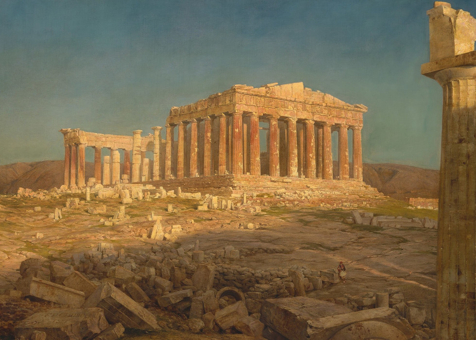

<h3>Overview of Magic</h3>

Soul material flows ambiently throughout all three realms, but it is inaccessible to the uninitiated. Those who can obtain access to large quantities of soul material gain the power to magically manipulate the world to their will. However, the powers of magic wielders differ based on the source of soul material. There are six categories of people who can achieve these results: Wildmages, Schoolmages, Wretches, Invokers, Ardents, and Devouts.

<h3>Spell Categories</h3>

<ul>
<li><strong>Augmentation</strong> spells are aimed at enhancing one's own abilities.</li>
<li><strong>Cthonic Warding</strong> spells are aimed at warding off Cthonians and the undead.</li>
<li><strong>Curse</strong> spells are aimed at bringing misfortune to their targets.</li>
<li><strong>Detection</strong> spells are aimed at perceiving otherwise unseen things.</li>
<li><strong>Elemental Damage</strong> spells use raw elemental forces to inflict damage. The six categories of elemental damage are sunlight, moonlight, fire, water, air (including lightning), and earth.</li>
<li><strong>Exorcism</strong> spells are aimed and purifying and banishing Cthonic taint.</li>
<li><strong>Healing</strong> spells are aimed at restoring the health and wellness of their targets.</li>
<li><strong>Illusion</strong> spells are aimed at creating false appearances to their targets.</li>
<li><strong>Mental Influence</strong> spells are aimed at affecting a person's mental state.</li>
<li><strong>Protection</strong> spells involve warding off physical and magical attacks.</li>
<li><strong>Soul Binding</strong> spells involve infusing physical things with soul material.</li>
<li><strong>Summoning</strong> spells temporarily phase in monsters from Cthonic or Ksylic spheres to help the caster.</li>
<li><strong>Transmutation</strong> spells manipulate physical substances.</li>
<li><strong>Utility</strong> spells are a catch-all category for non-combat spells that don't cleanly fit in other categories.</li>
</ul>

<h3>Magic Wielder Types</h3>

The below list of Magic Wielder Types includes a listing of what Spell Categories the Magic Wielder Type generally has access to. These are not absolute rules, but guidelines that instruct the tone of each category.

<ul>
<li><em>Always</em> means the wielder type unequivocally has access to this kind of magic.</li>
<li><em>Sometimes</em> means the wielder type may have access to variants of this magic which align thematically with the type.</li>
<li><em>Rarely</em> means the wielder typically does not have access to this kind of magic.</li>
</ul>

<h4>Wildmage</h4>

Wildmages passively absorb high amounts of soul material from their surroundings, then unleash their built-up soul material in a burst.

<ul>
<li><em>Always:</em> Elemental Damage, Illusion, Mental Influence, Utility</li>
<li><em>Sometimes:</em> Curse, Detection, Protection, Augmentation, Transmutation</li>
<li><em>Rarely:</em> Cthonic Warding, Healing, Exorcism, Soul Binding, Summoning</li>
</ul>

<h4>Schoolmage</h4>

Schoolmages in Conliah are educated by the Academy of Knowledge to understand the physical laws of Ksylia. This enables Schoolmages to cast spells by accessing the ambient soul material that flows through Ksylia. Low-level spells like elemental projectiles and defensive wards are commonplace, but knowledge of even these basic spells implies years of dedicated study at an Academy of Knowledge university. High-level spells like flight, teleportation, and weather manipulation are legendary powers not known to the Academy of Knowledge but learnable through re-discovery of ancient tomes.

Conlian Schoolmage spells are written in the Classical language. A single spell is so complicated that it may require several thick volumes just to convey one spell, when written in long-form Classical. Instead, each Schoolmage carries a personal spellbook which is written in Arcane Shorthand. This is a personalized script which is much denser than long-form Classical, and is illegible to anyone other than the owner of the spellbook.

Schoolmage spells require a great deal of precision to cast, and the experience is so mentally taxing that the spell is forgotten once performed. Consequently, Schoolmages must frequently re-read their personal notes when fully rested in order to continue casting the same spell.

Lodumpis has its own Schoolmages, who are present in the ranks of the Uzvu Confederation. Their power source draws on identical principles to Conlian Schoolmages, but their tomes are presently incomprehensible.

<ul>
<li><em>Always:</em> Detection, Elemental Damage, Illusion, Mental Influence, Soul Binding, Protection, Transmutation, Utility</li>
<li><em>Sometimes:</em> Curse, Healing, Augmentation, Summoning</li>
<li><em>Rarely:</em> Cthonic Warding, Exorcism</li>
</ul>

<h4>Wretch</h4>

Wretches are individuals directly touched by Cthonia, without having a deliberate pact with a specific Archon. As a result, Wretches have lingering Cthonic energy coursing through their bodies which they can use to cast powerful spells. Casting spells as a Wretch is forbidden in Conliah, but it is considered a legitimate form of magic in Lodumpis.

<ul>
<li><em>Always:</em> Curse, Elemental Damage, Mental Influence</li>
<li><em>Sometimes:</em> Detection, Illusion, Augmentation, Soul Binding, Summoning, Utility</li>
<li><em>Rarely:</em> Cthonic Warding, Healing, Exorcism, Protection, Transmutation</li>
</ul>

<h4>Invoker</h4>

Invokers are members of Cthonic cults who have directly communed with the Archon to receive their power. They continue to receive the blessing of the Archon through obedience, enabling them to channel the Archon's power into magical spells.

Archons are generally chatty and generous with bestowing initial gifts. There is a unique ritual required to solicit each particular Archon. Archons do not speak any mortal language, and the first gift the solicitor must consent to is the acquisition of the Archon's Cthonic cult language. Whenever a mortal communes with an Archon, the mortal may communicate through speaking aloud or internally, and the Archon replies in the mind of the mortal.

<ul>
<li><em>Always:</em> Curse, Mental Influence, Soul Binding, Summoning</li>
<li><em>Sometimes:</em> Detection, Elemental Damage, Illusion, Protection, Augmentation, Utility</li>
<li><em>Rarely:</em> Cthonic Warding, Healing, Exorcism, Transmutation</li>
</ul>

<h4>Ardent</h4>

Ardents are philosophers who have obtained enlightenment, flooding their bodies with blue soul material. They may channel this blue soul material into magical spells, as long as they remain in their elevated state. According to the Imperial Cult, Ardents achieve this enlightenment by means of recollecting their past experience of Asteria, although many Ardents do not self-conceive this way.

<ul>
<li><em>Always:</em> Detection, Healing, Exorcism, Protection, Utility</li>
<li><em>Sometimes:</em> Cthonic Warding, Illusion, Augmentation, Transmutation</li>
<li><em>Rarely:</em> Curse, Elemental Damage, Mental Influence, Soul Binding, Summoning</li>
</ul>

<h4>Devout</h4>

Most Devouts are members of the Imperial Cult who obey the will of a specific Agathos. Through their obedience to the Agathos, they apparently receive a divine blessing which grants magical powers. The specific powers Devouts wield vary based on the specific Agathos they serve.

The relationship between the obedience of Devouts and the blessings they receive is complex. Devouts can behave in ways which appear misaligned with the will of their deities, or use their magical powers in a way that defies religious orthodoxy. As a result there are certain spells which Devouts hypothetically have access to, but which are considered unacceptable by the Imperial Cult authorities. Examples of such spells are reviving a recently deceased person, or speaking to the soul of a recently deceased person. However, a Devout cannot recklessly act in a self-serving way in the long term or carelessly shirk religious rites without cause. Such actions, when persistent, are outward manifestations of a loss of faith which eventually strips Devouts of their powers.

Cloud Devouts are cloud worshippers in the ranks of the Uzvu Confederation, who apparently draw power from the clouds. However, despite the ostensible difference in source, they function similarly to Imperial Cult Devouts.

Advanced Devouts of both the Imperial Cult and cloud worship have the ability to commune with their deity. They do so by giving a silent or spoken prayer in any language they can speak, but the deity only replies by silently impressing one or two concepts on their mind in the same manner as High Tongue is heard.

<ul>
<li><em>Always:</em> Cthonic Warding, Detection, Healing, Exorcism, Protection</li>
<li><em>Sometimes:</em> Elemental Damage, Mental Influence, Augmentation, Transmutation, Utility</li>
<li><em>Rarely:</em> Curse, Illusion, Soul Binding, Summoning</li>
</ul>

<h3>Soul Color</h3>

The term "color" in reference to soul material is not literal, but refers to the magically detectable differences in signature based on where the soul material originated from. The color names are ancient conventions which have carried into the present, but it is only a feeling within the one probing magically infused substance. Remarkably, the soul color terminology was already used in exactly the same way in Lodumpis at the time contact was made with Conliah. Soul color applies to both ambient soul material and discrete souls, but not all colors exist in both forms.

<ul>
<li><strong>Green Souls:</strong> In the absence of other magical influences, mortals who are sentient have pure green souls. The Imperial Cult holds that green souls transmigrate to Asteria upon death. The Uzvu believe that green souls dissipate into Ksylia upon death, but separate into components that make it undetectable. Ambient green soul material apparently does not exist whatsoever.</li>
<li><strong>Yellow Souls:</strong> Wildmages and Schoolmages have green souls, but also have a noticeable aura of concentrated yellow soul material. Animals besides the sentient mortal races have discrete yellow souls. Yellow souls certainly do not transmigrate, and their souls dissipate into Ksylia upon death. Ambient yellow soul material flows throughout Ksylia.</li>
<li><strong>Blue Souls:</strong> Devouts and Ardents have green souls, but also emit faint traces of blue soul material. The Imperial Cult claims the Agathoi have discrete blue souls, and are immortal. The Imperial Cult also claims ambient blue soul material flows throughout Asteria.</li>
<li><strong>Red Souls:</strong> Wretches and Invokers have green souls, but also emit faint traces of red soul material. Cthonians have discrete red souls, and red soul material flows throughout Cthonia. Upon death, Cthonian bodies disintegrate into dust. Their red souls return to their respective sphere of Cthonia, where their physical forms slowly reconstitute. If the specific Cthonian has mortal-like intelligence, it retains all of its memories upon reconstitution.</li>
</ul>

<h3>Soul Binding &amp; Enchanting</h3>

Artifacts, locations, and other physical things may be infused with soul material. The effects of this infusion differ based on the nature of the soul material used and the techniques involved. The below list is not exhaustive, but provides an overview of common forms of soul infusion. Note the frequent use of the term "jar" as a non-living material which is used to house a soul. It can refer to a literal jar, but also frequently refers to other kinds of objects like gems and ornamental boxes. The term jar is used in the same manner in the Artificial Monsters and Undead sections of the sourcebook.

<ul>
<li><strong>Yellow Soul Bound Artifacts:</strong> <em>Requires a living creature.</em> The most common way to enchant artifacts with powerful magical properties is through the sacrifice of a living thing. The Imperial Cult does not forbid the use of animals for this purpose. The process typically involves killing an animal and trapping its soul in a jar, which is affixed to the artifact the enchanter seeks to enhance.</li>
<li><strong>Green Soul Bound Artifacts:</strong> <em>Requires a living creature.</em> Much more powerful enchantments are possible through the use of a green soul, instead of a yellow one. However, the transmigration cycle is sacred to the Imperial Cult, and using green souls for enchanting is strictly forbidden. The act of binding a green soul is considered an offense punishable by death, equal in gravity to Archon worship. By the same process as enchanting with yellow souls, a sentient mortal must typically be killed and the mortal's soul must be trapped in a jar. The Magellian Empire knew of how to harvest a green soul without killing the body, by immediately replacing it with a yellow soul. Either way, the jar then enhances the artifact the enchanter seeks to enhance. Furthermore, the artifact itself obtains the sentience of the green soul, although it may or may not be able to communicate with its wielder. Even if the ritual initially appears free of Cthonic corruption, souls bound in such a manner will inevitably become corrupted by the Archon Igedeng and take on Cthonic influence.</li>
<li><strong>Yellow Soul Bound Locations:</strong> <em>Requires a living creature.</em> A location may be enchanted with various magical properties. Again, the animal is killed and its soul is trapped in a jar. The jar is affixed to the physical location the enchanter seeks to imbue with a magical property.</li>
<li><strong>Blue Enchanted Artifacts &amp; Locations:</strong> <em>Does not require a living creature.</em> Ardents and Devouts can imbue blue soul material into a physical object or location, granting it the power to repel Cthonians. This is a very difficult process for all mediums except silver, which readily absorbs blue soul material. The use of a jar is not required, and instead the silver directly absorbs blue soul material.</li>
<li><strong>Red Enchanted Artifacts &amp; Location:</strong> <em>Does not require a living creature.</em> Various forces of Cthonia can imbue red soul material into a physical object or location, granting it destructive and corrupting powers. The use of a jar is not required, and instead the medium directly absorbs red soul material.</li>
<li><strong>Artifical Constructs and Undead:</strong> The nature of artifical constructs varies greatly based on their soul origin. These are elaborated upon in much greater detail in the Monsters section (see Artificial Monsters and Undead sections). The Magellian Empire experimented on the binding of green souls in various ways now considered heretical by the Imperial Cult, but the art was lost to time. In theory, the Imperial Cult also seeks to destroy these constructs to free their green souls, but it's a secondary concern as compared to eliminating Cthonic threats.</li>
</ul>

<h3>Magic Wielders in Cthonia</h3>

When a Magic Wielder phases into a sphere of Cthonia, their powers dramatically change. Invokers and Wretches become much more powerful, due to their proximity to their own power source. Wildmages and Schoolmages retain some of their power, because their mortal souls are tethered to Ksylia in a way that is not fully interrupted by phasing. However, their power is significantly stunted such that a wisened Schoolmage feels like a novice again. Devouts and Ardents become magically powerless due to the spiritual pressure of the surrounding environment.

<h3>Phasing</h3>

Without elaborating on what phasing truly means, the apparent physics of phasing are highly regular.

<ol>
<li>Phasing has an origin sphere and a destination sphere, which are different from each other. These spheres are three-dimensional manifolds. These spheres may be Cthonic spheres, Ksylic spheres, Asteric spheres, or "Ksylia proper". (This is only what is observed by phasing. There could plausibly be non-spherical sources and destinations which follow the same conservation laws. See the inter-sphere medium, below.)</li>
<li>Phasing has origin coordinates and destination coordinates, in three dimensions. These coordinates are only local; that is, they are not embedded in any shared Euclidean space. (Again, this is only what is observed by phasing. See the inter-sphere medium, below.)</li>
<li>Phasing has an object. This object may be one of three types: an inanimate object, an embodied living thing, or a projected soul.</li>
<li>Phasing does not create or destroy matter (raw elemental or soul material) across all spheres.</li>
<li>Phasing does not create or destroy mechanical energy across all spheres. When an object phases, ambient matter at both the origin and destination sphere/coordinates absorbs or releases the required energy to balance the total mechanical energy. This can also mean when an embodied living thing snaps back, it does not return to its precise home coordinates. This can also result in a mild but noticeable shockwave or temperature rise or fall across a large radius in both the source and destination. Phasing never causes a violent explosion due to energy differential, unless both the source and destination sphere are exceptionally small or devoid of matter and the mechanical energy released is tremendous.</li>
<li>Inanimate objects may phase between spheres permanently. Inanimate objects may be composed of just raw elements, just soul material, or a combination such as an inanimate enchanted artifact. For the purposes of phasing, the boundary between inanimate object and embodied living thing is a quantitative value of soul material pressure which becomes qualitative. This is a property of <em>living bodies</em>, not <em>minds</em>. Small insects and ordinary plants are inanimate, as are inanimate but sentient enchanted artifacts. Decapitated Steelskull heads are inanimate, but embodied Steelskulls are animate. Inorganic constructs, large animated plants such as treants, and large animals such as bears are animate. If an embodied living thing's soul is projected (such as temporarily anchored to a jar, possessing another entity, or phased into another sphere) its body is still animate. For inanimate objects, home is wherever they currently reside, and they never snap back.</li>
<li>Embodied living things who phase into another sphere track their home sphere and home coordinates. When the embodied living thing forcibly snaps back, it phases back to its home sphere and home coordinates. Even if the embodied living thing gracefully phases back to its home sphere, it still snaps back to its home coordinates. As mentioned in (5), these coordinates are only approximate and may be adjusted to smooth the energy difference. Any inanimate objects carried by the embodied living thing such as clothing, weapons, armor, accessories, bags, and held items phase with the embodied living thing as long as they are reasonably small and there is unbroken physical contact. As a rule of thumb, any single object that is too heavy for the living thing to lift may not phase with it.</li>
<li>Projected souls who phase follow a different set of complex rules, as compared to inanimate objects and embodied living things (see the Soul Projection section). The general principle is that a projected soul does not track a home sphere or home coordinates. Instead, a projected soul tracks its body identity and a series of temporary anchors. When snapping back, the soul returns to either one of its anchors or its body identity, regardless of what sphere those are in.</li>
<li>Death of a physical body or the binding of a soul are events which can disrupt (7) and (8), creating many exceptions to snapping back rules. For instance, when a Cthonian dies in Ksylia its body turns to dust which remains in Ksylia, but its soul snaps back to its home Cthonic sphere.</li>
</ol>

A consequence of these physics is that literal two-way spatial portals between spheres do not exist whatsoever. Additionally, two spheres never have any apparent hierarchy of spatial or gravitational influence, such as turning a bag upside-down and pouring out the contents from another sphere. Instead, there are two-way "interfaces" which are keyed to alternate spheres. But entering an interface at one sphere does not guarantee the destination coordinates of the alternate sphere, especially due to snap back physics. This fact is less obvious for inanimate objects, which do not snap back and may tend to appear at the coordinates of the alternate interface.

While sentient mortals have never observed a shared Euclidean space between spheres, the Imperial Cult and Cthonic cults infer that there is a substantive inter-sphere medium. The Uzvu cloud worshippers, on the other hand, reject that there is an inter-sphere medium and holds that spheres are not embedded in a shared space. The Archons notice that small but real quantities of matter predictably yet spontaneously enter and leave the boundary of their Cthonic spheres. According to this view, the inter-sphere medium holds matter and its interactive forces but does not have absolute gravity. Instead, gravity is only a force experienced within a sphere and the exact details of gravity can vary by sphere. Crossing the boundary into and out of a sphere counts as a phasing event, where all regular laws of phasing apply. For the Imperial Cult specifically, crossing the Firmament is a phasing event that travels to the inter-sphere medium of Asteria, and crossing the Hade is a phasing event that travels to the inter-sphere medium of Cthonia.

Spells may remotely affect other spheres by means of phasing soul material itself. One example is that it is possible to magically communicate between Ksylia proper and spherical subrealms. This is common for Devouts who apparently commune with the Agathoi, and Invokers who commune with the Archons. As another example, there are also immortal Steelskulls who solitarily inhabit remote Ksylic spheres silently contemplating the nature of reality. If a mortal in Ksylia attempted to magically communicate with such a Steelskull, it is plausible that the Steelskull would reply. According to the cosmology of the Imperial Cult, magic wielders who manipulate blue and red soul material access these by attracting soul material from other spheres.

<h3>Soul Projection</h3>

While soul binding may permanently re-anchor a soul, there are magical effects that temporarily project a soul without erasing its permanent anchor. This act is called soul projection. There are consistent physics for how a projected soul behaves.

<ol>
<li>A projected soul retains its body identity, unless an effect reassigns it. If all else fails, the projected soul seeks to return to its body identity. Body identities may be jars, living organic bodies, or non-living organic bodies.</li>
<li>A projected soul may have zero or more temporary anchors. These temporary anchors may be jars, living organic bodies, or non-living organic bodies.</li>
<li>A projected soul always has exactly one residence. Simply put, residence is the current location of the soul. This residence may be its body identity, a temporary anchor, or no anchor at all. If the soul's residence is not an anchor, then the soul is called a free projection. The soul may wander, or may seek an anchor.</li>
<li>Projected souls have a hierarchy of tension for a given residence. The most tense is free projection. Then, the next most tense is the temporary anchor farthest jumps from its body identity. Each jump closer to its body identity reduces the tension. Then, the least tense is residing in its body identity.</li>
<li>Death of a physical body, soul binding, phasing, dispel effects, and destruction of the temporary anchor are all events which may disrupt soul projection. The consequence varies by magic effect, but the universal outcome is a decrease in the absolute amount of tension as described in (4).</li>
<li>If the outcome is not clarified by the specific magic effect, then disruption removes all temporary anchors and snaps the soul back to its body identity.</li>
<li>If (6) occurs but the soul cannot successfully snap back to its body identity, the physical body dies and the soul departs as expected by ordinary death.</li>
<li>A vessel (jar, living organic body, non-living organic body) cannot contain more than one resident soul. However, they may share anchors if they are not simultaneous residents of that anchor. (This only applies to soul projections possessing a hostile body. It is possible to permanently bind multiple souls to a single jar, as the Magellians did to hybrid Mikton souls.)</li>
<li>During possession, the host soul is evicted from its body while retaining its body identity, and its residence is displaced to a new vessel. The specific rules regarding the host's new resident vessel vary according to the magical effect.</li>
</ol>

<h2>Factions</h2>

<em>KAITO THE HALFLING: What is most just for an empire: firstly to destroy the worse faction and enthrone the better, secondly to enthrone the better faction and force the worse to submit, or thirdly to reconcile them and neither destroy the worse or force it to submit?</em>

<em>SITAROPHILUS THE HIGH ELF: Obviously the third option.</em>

<em>KAITO THE HALFLING: That would be the most just option. And clearly, the empire who chooses the third option will not be at war, but will be at peace. Therefore, the empire which is just will be at peace with itself.</em>

<em>SITAROPHILUS THE HIGH ELF: Again, obviously so.</em>

<em>KAITO THE HALFLING: And the empire is now at war with itself, is it not?</em>

<em>-- The Thirty-Third Cloudruled Dialogue: The Warlords</em>

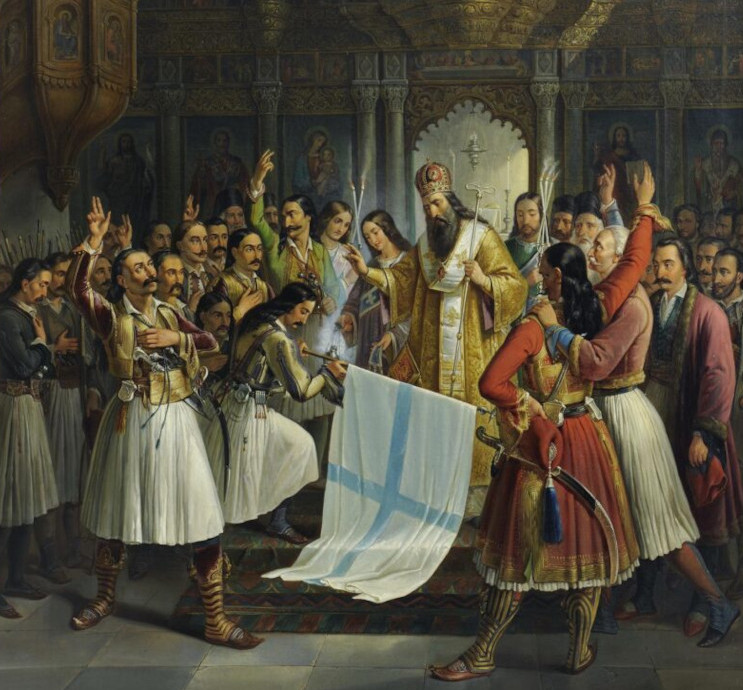

<h3>The Yargyez Empire</h3>

The Yargyez Empire is the dominant political force on the continent of Conliah. The center of power in the Yargyez Empire is the royal palace in Inton, Eastgardia. The Yargyez Emperor is the absolute ruler of the Yargyez Empire. The Grand Vizier oversees the Imperial Council and reports directly to the Yargyez Emperor.

The Imperial Council handles the day-to-day affairs of the Empire. It is composed of viziers, Royal Guard generals, and religious scholars. The Imperial Council decides the law and its practical enforcement across Conliah. They appoint provincial governors for each province across the continent, and have the power to revoke provincial governors' authority at-will.

The banner of the Yargyez features a white thunderbolt with three zags on a blue background.

<h3>The Royal Guard</h3>

The Yargyez Royal Guard are the military and law enforcement of the Yargyez Empire. They are a disciplined fighting force that works to suppress dissent.

<h3>The Uzvu Confederation</h3>

The Uzvu Confederation are a foreign state from a newly encountered continent named Lodumpis. They are a technologically advanced civilization that views its military incursion into Conliah as divinely sanctioned.

Their symbol is a white greataxe standing up straight, with three tulips at the base. The tulips are red, orange, and yellow with green stems. Behind the logo is a black background.

<h3>The Synomachos</h3>

The Synomachos are a conspiracy of High Elves, Wood Elves, and Dark Elves to overthrow the Yargyez Empire and establish High Elven rule. However, they operate in complete secrecy and nobody in Conliah is aware of this conspiracy, yet.

They seek the dissolution of the Imperial Cult, and its replacement with Burrueism which they consider the correct form of worship as spread by the Magellian Empire. This includes a belief in the racial superiority of the Elves above other mortal races.

They seek to dissolve the Imperial Cult pantheon and establish their own Burrueist Cult. The title "first among equals" is to be stripped from Iazus. Then Burrue will become the head of the pantheon - "first" but not "among equals" - with the other five being subordinated to Burrue.

Their signal to launch their secession is the first full moon of 190 YE, a year from now. This will be the 26th of Askonos, 190 YE. The King Typhen lin Maphelius of Fair Island is already part of the Synomachos. Khagan Anim lim Beldek of Westerwood will be usurped by Chieftain Tosir lim Arakzan, and the council of Ashfallen Tribes in Valorgale will be overthrown by the Pataf Tribe. Once power has been consolidated in these three provinces, the next phase of the plan is to invade the rest of Conliah.

The secret symbol of the Synomachos is a twelve-pointed sun.

<h3>The Belligerantes</h3>

The Belligerantes are a continent-spanning paramilitary organization with public-facing and private operations. As a public organization they operate as blades for hire, assisting smaller settlements that the Empire will not send aid to. As a private organization, they seek to overthrow the Yargyez Empire and institute a new order which can secure Conliah against enemies within and without. The majority of soldiers in the Belligerantes are aware of their unspoken goal to overthrow the Yargyez. The signal they are waiting for is the death of the emperor by natural means or assassination. Either way, they plan to attack the capital and seize the bureaucratic machinery of the Yargyez Empire. They shun magic and stealth as cowardly, favoring marching into battle in heavy plate armor with swords and shields.

In addition to seeking to overthrow the Yargyez Empire, the Belligerantes plan to reorganize the Imperial Cult. They believe the title of "first among equals" belongs to Inidilt, not Iazus.

There are about 2,000 members of the Belligerantes: approximately 1,600 infantry soldiers and 400 cavalry, and a small number of higher officers. For the higher ranking officers the hierarchy is the Supreme Commander, Captain, and Lieutenant. Below Lieutenant, the hierarchy divides between infantry and cavalry. For infantry the hierarchy is Sergeant, Corporal, Senior Private, and Private. For cavalry the hierarchy is Marshal, Brigadier, Senior Cavalier, Cavalier. There are approximately 24 Lieutenants across Conliah, and there are 8 Captains: one Captain for each province.

The keystone officers are the Lieutenants, who operate out of chapterhouses. Lieutenants have two roles: firstly, they intake mercenary jobs and submit them to their Captains for review and prioritization. Secondly, they are the commanding officers of infantry Sergeants and cavalry Marshals on-the-ground during missions.

The physical presence of the Belligerantes is through the chapterhouses. The Belligerantes headquarters is a large chapterhouse located in Omugi, Middlestone. All of their members are volunteers who perform various occupations when not in combat. The most common occupations are artisans and laborers. There are also passionate academics who volunteer out of a desire to defend Conliah, as well as nobles who occupy many of the higher officer roles.

Due to the outsized responsibility of the Lieutenants, there are several consequences:

<ul>
<li>They tend to be more personally invested in the work than officers higher and lower than them</li>
<li>They have outsized influence and may form subfactions of loyal subordinate officers, which threaten the integrity of the whole organization</li>
<li>They are often involved in this line of work for opportunistic personal gain rather than altruism or honest pay.</li>
</ul>

The emblem used by the Belligerantes is a long black horizontal line below a solid red triangle, representing a stylized mountain.

<h3>The Artisans Guild</h3>

The Artisans Guild is a price-fixing monopolist organization that represents the interests of large urban manufacturers against both merchants and political powers. They represent various kinds of craftspeople such as potion makers, blacksmiths, leathersmiths, and enchanters of magical weapons and armor.

The highest rank in the Artisans Guild is one Manufacturer Supreme, who resides in Eithar, Helscar. The Manufacturer Supreme is elected by a council of eight Syndics (one per province). Below Syndics are Master Manufacturers, divided by craft. Below the Master Manufacturers are skilled and unskilled crafters, who are the lowest rank.

There is an operative wing of the Artisans Guild. Their field agents are trained in combat and stealth. Additionally, they are equipped with advanced magical technology stolen from the Uzvu and ancient Magellian ruins. Each Syndic commands several superintendents. Each superintendent operates a safehouse, and commands several field agents from that safehouse. This operative wing serves multiple roles the Artisans Guild requires:

<ul>
<li>They ensure the functioning of commerce so that urban manufacturers have secure buyers for their wares. Practically, that can involve threatening merchants, overthrowing lords, and negotiating with factions otherwise hostile to the Yargyez Empire.</li>
<li>They advance the state-of-the-art of magical technology in Conliah. Practically, that involves stealing magical technology from the Uzvu or searching for rumored advanced technology in Magellian ruins.</li>
<li>They spy on other factions to monitor the development of events in Conliah, and report their findings back to the Syndic.</li>
</ul>

A secret session was held by the council of Syndics, where a referendum was agreed that in the case of an Uzvu takeover, the Artisans Guild will side with the apparent winner and not commit to Yargyez loyalty. If the Uzvu successfully capture a fort in Eastgardia and hold it for thirty days, an emergency session will be held. The likely outcome of this emergency session is that the Artisans Guild will cease to supply the Yargyez Empire, and conditions will be established for when to begin supplying the Uzvu Confederation.

The symbol used by the Artisans Guild is an eight-toothed gear with an eye in the center.

<h3>The Philosophers Guild</h3>

The Philosophers Guild is a coalition of heterodox thinkers who associate for mutual protection. Many of their members and patrons are from noble families who voluntarily choose to live austere lives. They have founded lodges across the continent and sponsor expeditions into Magellian ruins in search of ancient artifacts and tomes. There is no hierarchy above the lodges themselves, and individual lodges are associated or disavowed from the Philosophers Guild in a decentralized manner. Within a lodge itself, there is only one formal leader called the Lodgemaster. All other members are of equal rank, although some may be more advanced in their intellectual engagement. Lodges often fall under one of eight schools of thought listed below. This is not an absolute rule, and individual lodges can and do follow other schools of thought not listed.

<h4>The Quietists</h4>

The Quietist school of thought emerged in Wuthelark, based on their epistemological claim that truth can only be revealed by inward and outward silence. Their worldview rejected that it is necessary to act in the world or engage discursively to arrive at truth. Their goal is to defend the practice of solitude and silence as a pathway to truth. In their lodges, they offer silent meditation rooms where practicioners seek to obtain visions through total silence. Their followers have the ability to cast Ardent Magic, but only in complete darkness and silence. They are resistant to silencing spells, and have enhanced vision in darkness. Their master lodge is located in Wuthelark. Their lodge seal is a lion, sleeping on a hill. Their harshest critics are the Destructivists, and their sympathizers are the Refinists, the Escapists, and the Symphonists.

<h4>The Refinists</h4>

The Refinist school of thought emerged in Westerwood, based on their epistemological claim that truth requires individuals to cultivate their own moral improvement. Their worldview rejected that unthinking submission to authority or complete disengagement with the world were pathways to truth. Their goal is to defend the practice of contemplative, moral self-improvement as a pathway to truth. In their lodges, they keep a library of the meditative diaries of lodge members. Instead of discussing philosophy, they encourage lodge members to keep diaries and read the stored diaries of others. Their followers have the ability to cast Ardent Magic, but only if their actions are grounded in deep contemplation of the moral facts of the situation. They are resistant to silencing spells, and have the ability to resist dominating magic if it forces them to commit evil. Their master lodge is located in Westerwood. Their lodge seal is a wolf and a dog, mutually biting each other. Their harshest critics are the Freneticists, and their symphathizers are the Quietists, the Refusalists, and the Legalists.

<h4>The Escapists</h4>

The Escapist school of thought emerged in Valorgale, based on their epistemological claim that truth requires individuals to commune with unfiltered nature. Their worldview rejected that truth could be found through language or social activity, which corrupted the purity of nature itself. They do not completely reject social interaction, but purposefully agree to it on a temporary basis until individuals are prepared to abandon society and live as hermits. Their goal is to defend individual communion with nature as a means of obtaining the truth. In their lodges, they discuss less about philosophy and more about the practical hermitization process and documenting safe pathways to sites of natural beauty. Their actual practices take place outside their lodges, where they gradually spend more and more time outside of civilization and more time in untouched nature. Their followers have the ability to cast Ardent Magic, which becomes more and more potent as they become more socially isolated. They have an extraordinary knowledge of geography and survivalism. Their master lodge is located in Valorgale. Their lodge seal is a caged racoon, with its head peeking outside the cage bars. Their harshest critics are the Legalists, and their sympathizers are the Quietists, the Refualists, and the Freneticists.

<h4>The Refusalists</h4>

The Refusalist school of thought emerged in Nightglade, based on their epistemological claim that truth can only emerge when individuals actively contradict the dominant order of society. Their worldview rejected that truth could be found through purposeful social activity whatsoever, and society is a contaminant of pure individual will. They do not completely reject social interaction, but mutually agree to it on a provisional basis. Their goal is to defend individual autonomous action as a mean of obtaining the truth. In their lodges, they endlessly discuss philosophy for personal satisfaction, with the mutual understanding that no amount of discussion will lead to truth. Their actual practices take place outside of their lodges, where they make a point of living contrary to the dominant social order as beggars, thieves, and vagabonds. Their followers have the ability to cast Ardent Magic, but only when they are committing acts which contradict the dominant social order. They have resistance to mentally dominating magic, due to their active day-to-day resistance to society. Their master lodge is located in Nightglade. Their lodge seal is of two oxes formerlly yoked together: one is still yoked but the other has broken away from the yoke in rage. Their harshest critics are the Symphonists and their sympathizers are the Escapists, the Refinists, and the Destructivists.

<h4>The Symphonists</h4>

The Symphonist school of thought emerged in Fair Island, based on the epistemological claim that truth can only emerge through the social creation of beauty. Their worldview rejected that truth could be found through quiet meditation or purely rational discourse. Their goal is to defend aesthetic production as a means of obtaining truth. In their lodges, they host various activities involving the collective production of art such as massive paintings where each member fills in a section, musical productions, or dramatic performances. Their followers have the ability to cast Ardent Magic by means of witnessing grandeur, transcending their spirit to a sublime state. They can passively detect sources of extraordinary beauty, such as ancient buried megalographies. Their master lodge is located in Fair Island. Their lodge seal is a group of doves playing trumpets. Their harshest critics are the Refusalists, and their sympathizers are the Legalists, the Quietists, and the Freneticists.

<h4>The Legalists</h4>

The Legalist school of thought emerged in Eastgardia, based on the epistemological claim that truth is only accessible through complex social structures which reward correct thinking and acting. Their worldview rejected that individuals can ever transcend a social understanding of truth, but that the whole society needs to engage discursively to develop its understanding. Their goal is to defend the law and established social structures as necessary to preserve a coherent understanding of the truth. In their lodges, they host debates with large audiences to decide the better argument, and engage with each other through open letters. Their followers have the ability to cast Ardent Magic, but only when their actions are aligned with the overall will of the masses. They have an extraordinary ability to persuade others concerning why obedience to the law is actually for their own benefit, even in the middle of an evil act. Their master lodge is located in Eastgardia. Their lodge seal is one elephant holding a compass, and another elephant holding a straightedge, bound together by a rope. Their harshest critics are the Escapists, and their sympathizers are the Symphonists, the Refinists, and the Destructivists.

<h4>The Freneticists</h4>

The Freneticist school of thought emerged in Middlestone, based on the epistemological claim that truth can be obtained through extreme states of consciousness. Their worldview rejected that reason has any privileged claim to a correct understanding of reality. Their goal is to defend frenzy as a legitimate path to truth and tear down the monopoly of rationalism in philosophical circles. In their lodges, they engage in rituals that induce frenzy in their participants in order to obtain transcendent visions. Their followers have the ability to cast Ardent Magic by means of self-inducing a frenzied trance. They are difficult to persuade and intimidate because of their purpose-driven irrationalism. Their master lodge is located in Middlestone. Their lodge seal is a snake drinking from a goblet, with its body coiled in a spiral. Their harshest critics are the Refinists, and their sympathizers are the Symphonists, the Destructivists, and the Escapists.

<h4>The Destructivists</h4>

The Destructivist school of thought emerged in Helscar, based on their epistemological claim that knowledge of truth requires struggle against the morally corrupt majority. Their worldview rejected that discourse leads to truth, because the dominant social structure rewards evil. Their goal is to hypothetically defend periodic vast uprisings of zealots to cleanse the land from corruption. In their lodges, they actively train in combat which mixes martial and magical methods. Their followers have the ability to cast Ardent Magic, but only when they are actively enraged by social injustice. Their vigilance against an ever-present evil gives them a passive ability to detect deception and traps. Their master lodge is located in Helscar. Their lodge seal is a sheep standing on two legs, holding a sword and shield. Their harshest critics are the Quietists, and their sympathizers are the Freneticists, the Legalists, and the Refusalists.

<h3>The Academy of Knowledge</h3>

The Academy of Knowledge is the largest magical organization in Conliah, and has direct ties to the Yargyez Empire. It is dedicated to the open, systematic study of magic.

Each university is overseen by a Rectormage, who is appointed by an Archmage Provincial. Likewise, the Rectormage appoints Chairmages for each department of study. There are eight Archmage Provincials, one for each province. Above all of them stand the Archmage General in Inton, Eastgardia.

In addition to learning the principles of schoolmagic, the universities also emphasize civil, moral, and philosophical education to ensure graduates employ magic in line with the Yargyez Empire's wishes.

The symbol used by the Academy of Knowledge is a tetractys of white, four-pointed stars on a blue background. White suns and white moons on a blue background are also commonly used symbols.

<h3>The Imperial Cult</h3>

The Imperial Cult is the official religion of the Yargyez Empire. Each Agathos has its own clerical hierarchy and rites. The Yargyez Emperor is considered the ultimate head of the Imperial Cult, who guides the Archbishops of the Six Guardians. At the head of each cult of a Guardian Agathos is an Archbishop, who spiritually leads that specific cult. Below Archbishops are Bishops, whose main purpose is to serve as intermediaries between a group of Priests and the Archbishop. Priests are the leaders of a particular temple, who directly serve the local community. Below priests are Seminarians, who are training at a temple to become full-fledged priests.

<h4>The Order of Iazus</h4>

Imperial Cult Inquisitors are agents of the Order of Iazus, and they are dedicated to actively smiting evil across Conliah. Their mandate is to suppress Cthonic cult activity, gather intelligence regarding Cthonic magic and rituals, and to recover and destroy Cthonic artifacts. The local priest of Iazus will observe rumors of Cthonic rites being practiced, and send an Inquisitor cell to investigate the rumor. Then, the Inquisitors will conclude their investigation, take appropriate action, and report their findings back to the priest. The local law enforcers must yield to their Inquisitors during an investigation, backed by imperial law. They have the right to confiscate evidence, detain suspected individuals, and punish proven cultists with lethal force.

A typical Inquisitor cell has three members.

<ul>
<li>The lead inquisitor is the most experienced, and primarily focuses on martial presence. Their purpose is to make critical decisions for the cell, and speak on behalf of the cell. They have past experience in the other roles, but delegate to the other cell members.</li>
<li>The field researcher is often the least experienced member of the cell. Their purpose is to accumulate theoretical knowledge of cult activity, and actively search for evidence of cult activity.</li>
<li>The exorcist has a magical focus, and has the greatest knowledge on actively purifying locations and objects which are imbued with Cthonic magic.</li>
</ul>

Examples of contraband which the Inquisitors will seize are:

<ul>
<li>Cthonic amulets and tokens</li>
<li>Cursed scrolls and tomes</li>
<li>Weapons and armor enchanted with Cthonic magic</li>
<li>Various other artifacts with detectable Cthonic energy</li>
</ul>

<h4>Friends of the Hearth Keeper</h4>

The friends of the Hearth Keeper are missionaries who spread orthodox Agathos worship in remote regions of Conliah such as Valorgale. While they are not a militant order, their members equip themselves for self-defense against Cthonic threats.

<h3>Cthonic Cults</h3>

Across Conliah, there are a large number of small Cthonic cults. Their specific nature and activities depends on the Archon they serve.

<h4>The Tenkerlad Scholars</h4>

The Tenkerlad scholars are a decentralized network of necromancers who worship Igedeng, the Father of Bones. They form circles of researchers dedicated to studying the process of death and decay, and the reanimation of flesh through infusion with soul material.

<h4>The Tyvenlad Syndicates</h4>

The Tyvenlad are a decentralized network of criminal syndicates operating the black market economy across Conliah. Each Tyvenlad syndicate has its own territory and hierarchical structure, but there is no rank above the leader of a single syndicate. Instead, the leaders of syndicates negotiate and compromise with each other according to customs and informal rules of engagement in order to prevent feuding between thieves.

Within a single Tyvenlad syndicate, there is a common hierarchy. A Bandit King or Bandit Queen is the leader of a single syndicate. A Consigliere serves to arbitrate disputes between syndicates. The Consigliere reports directly to the Bandit King/Queen, but does not have any subordinate reports and is forbidden from succeeding the Bandit King/Queen. Also reporting directly to the Bandit King/Queen are one or more Captains, who each command a crew. The lowest rank are Soldiers, who perform the grunt work.

Although low-ranking members do not participate, Bandit Kings and Bandit Queens are intermediaries between a syndicate and the Archon Ogzim, and they make sacrifices to him for his blessing. The Tyvenlad are extensions of Ogzim's physical presence in Conliah.

<h4>The Morderlad Fraternities</h4>

The Morderlad fraternities are a decentralized underground association of assassins-for-hire. They worship Uluzing, the Mistress of Ends. Each fraternity house has its own High Priest who directly communes with Uluzing to receive notice of someone praying to Uluzing for her cult to perform an assassination. The High Priest then sends an agent to directly meet with the petitioner to receive payment and information regarding the target. Then, the High Priest sends an agent to assassinate the target, and the assassin receives part of the petitioner's payment.

<h4>The Spokefuglad Bands</h4>

The Spokefuglad bands are a decentralized underground association of pranksters. They worship Lozie, the Strifemaker. They travel from town to town, staging performances which are incomprehensible to local residents. While in the town, they constantly prank the local residents, create unnecessary strife between townsfolk, and humiliate nobles.

<h4>The Overvelderlad Armies</h4>

The Overvelderlad armies are a decentralized underground association of aspiring conquerors. They worship Lize, the Harvester of Mortals. They summon Cthonian creatures to serve in their armies and plan invasions starting from the countrysides of Conliah.

<h4>The Brannenlad Conspiracies</h4>

The Brannenlad Conspiracies are a decentralized underground association of nobles who aspire to overthrow the Yargyez Emperor. They worship Lundazing, the Queen of Destruction. They were responsible for a failed attempt on the Yargyez Emperor, but they are regrouping their forces.

<h4>The Tofflad Clubs</h4>

The Tofflad Clubs are a decentralized underground association of pugilists. They engage in bloodsport as an act of devotion to Dreze. Their cultists gather on a regular schedule to engage in bare-knuckle boxing with strict rules of competition.

<h4>The Drikenlad Bunches</h4>

The Drinkenlad Bunches are a decentralized underground association of party-goers. They organize lavish parties where music is played, excessive amounts of wine are consumed, and excessive amounts of food are eaten. These parties continue until everyone present passes out.

<h4>The Villiglad Societies</h4>

The Villiglad Societies are a decentralized underground association of vandals. They are disgruntled former peasants who could not survive off the land, and sought Embe's blessing to help them destroy watermills and windmills. The Villiglads capture eggs and live babies of dangerous animals from the wilderness, and introduce them to the areas surrounding the mills where they wreak havoc when they are grown. They also plant weeds that aggressively overtake the mills and destroy their foundations. Furthermore, Villiglads have the magical ability to animate plants into dangerous carnivorous monsters. Some of these animated plants are stationary, and some are mobile.

<h4>The Gladlad Dens</h4>

The Gladlad Dens are a decentralized underground association of drug users who worship Ulviazing. A common drug of choice for Gladlads are haze shrooms, which is a mushroom containing a depressant drug which commonly grows across Conliah.

<h4>The Grublelad Fellows</h4>

The Grublelad Fellows are a decentralized underground association of ruminators. They worship Inizozim, and gather together to dwell on injustices done to them. Grublelads discuss their fantasies of revenge, until they are confident enough to take action.

<h4>The Jaktlad Packs</h4>

The Jaktlad Packs are a decentralized underground association of poachers. They trespass against nobles to hunt game on their lands, out of reverence for Nabazie.

<h4>The Syklad Clinics</h4>

The Syklad Clinics are a decentralized underground association of false healers who worship Eovumid. They travel from town to town, claiming to have remedies for every ailment. In reality, they carry vials of blood infected with Blood Monstrosity. Syklad doctors receive payment and infect their patients with this blood, which leads to the patients becoming infected with Blood Monstrosity. Prior to the patients dying of Blood Monstrosity, they feel an intense euphoria that convinces them that they are healed. By the time the patients die of their sickness, the Syklads already moved on to another town with the money.

<h2>Monsters</h2>

<em>After repeated exposure to Cthonic energy, you are guaranteed to develop a faint synesthesia for its presence. Some describe a literal red glow, and others report the faint smell of burning garlic. Regardless of how it manifests, what is indispensible is to trust your senses and instincts. Once Cthonic energy is detected, it is necessary to take decisive action. A first strike can make the difference between life and death.</em>

<em>-- The Inquisitorial Field Manual of Iazus</em>

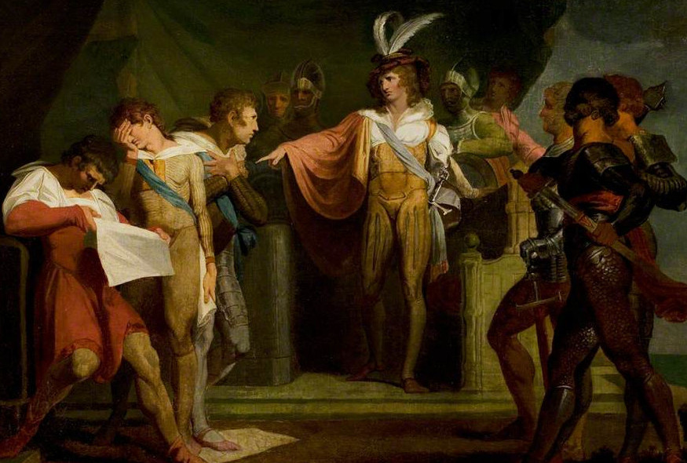

Note that Conliah lacks two distinct categories of monsters: "always evil humanoids" and "magical beasts". While classic mythological creatures may be present in Conliah in some form, they must be reimagined as belonging to one of the below categories outlined.

The below listing provides several traits, which help to contextualize what an encounter with the monster is like:

<ul>
<li><strong>Robustness</strong> refers to the overall resilience of the monster in combat, by analogy with a real-world animal.
<ul>
<li>0: Frailer than an untrained, sentient humanoid</li>
<li>1: Baseline for untrained, sentient humanoids</li>
<li>2: Domestic Mule</li>
<li>3: Wild Boar</li>
<li>4: Black Bear</li>
<li>5: Grizzly Bear</li>
<li>6: Cape Buffalo</li>
<li>7: American Bison</li>
<li>8: Black Rhinoceros</li>
<li>9: African Elephant</li>
<li>10: Resilient beyond analogy</li>
</ul></li>
<li><strong>Number appearing</strong> provides a range for how many monsters are present in a random encounter.</li>
<li><strong>Disposition</strong> may be peaceful, cautious, or hostile. It refers to the default, unprovoked friendliness of the monster.</li>
<li><strong>Courage</strong> may be relentless, brave, pragmatic, or cowardly. It refers to the willingness of the monster to fight to the death.</li>
<li><strong>Soul color</strong> describes the magical signature that the monster's presence emits.</li>
<li><strong>Intelligence</strong> may be mortal-like, animal-like, or automaton-like. It refers to whether the monster is capable of social interaction and improvisation.</li>
</ul>

<h3>Corrupted Mortals</h3>

These common monsters are former mortals, who were corrupted by Cthonic forces in life, or in death. Corrupted mortals enact the will of the Archons, whether they want to or not. For their common fear of being persecuted by the sentient mortal races on the surface, these corrupted mortals will often settle in the same underground complexes such as Magellian ruins and caves. The different groups of corrupted mortals do not necessarily trust each other, but avoid conflict with one another in order to survive.

<h4>Gutterplots</h4>

<ul>
<li><strong>Robustness:</strong> 1</li>
<li><strong>Number appearing:</strong> 2-8</li>
<li><strong>Disposition:</strong> Hostile</li>
<li><strong>Courage:</strong> Cowardly</li>
<li><strong>Soul color:</strong> Green core, with traces of red</li>
<li><strong>Intelligence:</strong> Mortal-like</li>
</ul>

Mortals who seek Inizozim's blessing for vengeance may be turned into a Gutterplot. Gutterplots grow fish scales all over their body, and gain the ability to breathe underwater, in addition to being able to breathe air. Their faces widen and their eyes begin to drift apart. After taking vengeance, Gutterplots often live in fear of retribution towards themselves in turn. Gutterplots are afraid of melee combat, preferring to use cunning tricks to gain an advantage. They plan surprise attacks on innocent travelers for fear that they are the friends and family of those they wronged.

<h4>Husks</h4>

<ul>
<li><strong>Robustness:</strong> 2</li>
<li><strong>Number appearing:</strong> 1-6</li>
<li><strong>Disposition:</strong> Cautious</li>
<li><strong>Courage:</strong> Pragmatic</li>
<li><strong>Soul color:</strong> Green core, with traces of red</li>
<li><strong>Intelligence:</strong> Mortal-like</li>
</ul>

Mortals who seek Ulviazing's blessing for blissful dreams may be turned into a Husk. Husks grow to seven feet tall, and they grow an insect carapace all over their torso. Their arms and legs remain as they were, without insect features. Husks have faces that look like grasshoppers. Due to their Cthonic corruption, Husks dream even when they are awake. Oftentimes they do not intend to initiate combat, but due to their confusion feel they are under attack. Nonetheless, Husks retain their intelligence and strategic capabilities after transformation. Groups of Husks roam the wilderness wielding weapons for use in self-defense.

<h4>Zoners</h4>

<ul>
<li><strong>Robustness:</strong> 1</li>
<li><strong>Number appearing:</strong> 1-3</li>
<li><strong>Disposition:</strong> Peaceful</li>
<li><strong>Courage:</strong> Cowardly</li>
<li><strong>Soul color:</strong> Green core, with traces of red</li>
<li><strong>Intelligence:</strong> Mortal-like</li>
</ul>

Mortals who serve Ogzim may be transformed into Zoners. The only apparent effect of this transformation is permanent, complete invisibility. This invisibility covers all body parts, but it does not effect clothing, weapons, jewelry, etc. that the Zoner possesses. In general, Zoners are not combatants and they prefer to use their newfound power for personal material gain. However, their invisibility isolates them from living in normal society, often undermining their original motivation to gain social advantage through invisibility.

<h4>Draklings</h4>

<ul>
<li><strong>Robustness:</strong> 1</li>
<li><strong>Number appearing:</strong> 2-8</li>
<li><strong>Disposition:</strong> Cautious</li>
<li><strong>Courage:</strong> Cowardly</li>
<li><strong>Soul color:</strong> Green core, with traces of red</li>
<li><strong>Intelligence:</strong> Mortal-like</li>
</ul>

Mortals who seek Lundazing's blessing in a revolutionary plot may be gifted with transformation into a Drakling. They grow reptilian scales, tails, and curved horns. They gain the ability to breathe fire or acid. Draklings are cunning, but prefer to avoid direct combat in melee range. Instead, they tend to use ranged weapons, lay traps, and ambush their enemies. Draklings are usually former nobles and their loyal courts. The goal of most Draklings is to usurp their superiors and rule over the land. Even if they successfully kill their superiors, their monstrous transformation undermines their legitimacy and authority.

<h4>Iavols</h4>

<ul>
<li><strong>Robustness:</strong> 1</li>
<li><strong>Number appearing:</strong> 2-8</li>
<li><strong>Disposition:</strong> Hostile</li>
<li><strong>Courage:</strong> Pragmatic</li>
<li><strong>Soul color:</strong> Green core, with traces of red</li>
<li><strong>Intelligence:</strong> Mortal-like</li>
</ul>

Mortals who worship Lize in hopes of conquering Conliah may be gifted with transformation into an Iavol. Their skin turns red, and they grow horns and a barbed tail. They gain the ability to induce unbearable pain in others. Iavols are bent on war and domination. When Iavols invade a region, they establish a lair to launch attacks on the country side. They raid settlements to loot weapons, armor, and rations.

<h4>Doombinders</h4>

<ul>
<li><strong>Robustness:</strong> 3</li>
<li><strong>Number appearing:</strong> 1-4</li>
<li><strong>Disposition:</strong> Hostile</li>
<li><strong>Courage:</strong> Brave</li>
<li><strong>Soul color:</strong> Green core, with traces of red</li>
<li><strong>Intelligence:</strong> Mortal-like</li>
</ul>

Mortals who worship Uluzing through a long career of assassination may be gifted with transformation into a Doombinder. Their skin turns pitch black, and their bodies emit plumes of smoke. The smoke makes it very difficult to see exactly where Doombinders are, when attacking them. In addition to becoming stronger, they gain the ability to curse a single mortal in their presence: if the Doombinder dies, then the cursed person simultaneously dies. The curse is permanent unless magically lifted, and the Doombinder may transfer the curse to another mortal at will.

<h4>Lycanthropes</h4>

<ul>
<li><strong>Robustness:</strong> 4</li>
<li><strong>Number appearing:</strong> 1-6</li>
<li><strong>Disposition:</strong> Cautious</li>
<li><strong>Courage:</strong> Pragmatic</li>
<li><strong>Soul color:</strong> Green core, with floods of red</li>
<li><strong>Intelligence:</strong> Mortal-like</li>
</ul>

Lycanthropy is a disease that spreads through a bite or claw attack from the infected. Unless cured, the infected becomes a Lycanthrope within 3-18 days. By contracting the disease, Lycanthropes gain the power to transform themselves at-will into an animal-human hybrid form. In addition, they are involuntarily transformed into their animal-human hybrid form upon the waxing gibbous moon, and revert back to their mortal form upon the waning gibbous moon. Which animal the Lycanthrope resembles upon transformation is based on the form of Lycanthrope who caused the infection. Lycanthropes fully retain their intelligence and memories upon infection. While transformed into their animal form, their minds are polluted by an insatiable hunger for the flesh of mortals. Contracting Lycanthropy has no effect on the infected mortal's outward appearance when untransformed. The Archon Nabazie is the original source of all Lycanthropes.

<h4>Laffids</h4>

<ul>
<li><strong>Robustness:</strong> 4</li>
<li><strong>Number appearing:</strong> 1-6</li>
<li><strong>Disposition:</strong> Cautious</li>
<li><strong>Courage:</strong> Brave</li>
<li><strong>Soul color:</strong> Green core, with traces of red</li>
<li><strong>Intelligence:</strong> Mortal-like</li>
</ul>

Mortals who worship Lozie may be transformed into a Laffid. Their physical form becomes warped and repulsive, as if their skin has melted and boiled, leading them to wear wooden masks to conceal their faces. Their transformation also makes Laffids physically strong and fast. In addition, their transformation allows them to temporarily shape-shift into any humanoid, sentient mortal they choose to resemble. This shape-shifting may be sustained for several hours, but requires an equal amount of time to rest in between impersonations. Laffids tend to use their powers of impersonation to cause social discord. However, while in their true form they live in constant fear of being mocked for their revolting faces.

<h4>Pertinaxes</h4>

<ul>
<li><strong>Robustness:</strong> 5</li>
<li><strong>Number appearing:</strong> 1-4</li>
<li><strong>Disposition:</strong> Peaceful</li>
<li><strong>Courage:</strong> Relentless</li>
<li><strong>Soul color:</strong> Green core, with floods of red</li>
<li><strong>Intelligence:</strong> Mortal-like</li>
</ul>

Mortals who seek Dreze's blessing for the endurance to complete a task may be transformed into Pertinaxes. A Pertinaxe's skin turns to stone, and large stone spikes grow out of its back. The transformation changes the mind of the Pertinaxe into a being single-mindedly committed to the completion of a single task. Their specific behavior depends on what the mortal was originally petitioning Dreze for strength with. Once the task is complete, the Pertinaxe is doomed to repeatedly attempt to complete the same task, regardless of whether it is still meaningful. The metabolism and digestion of the Pertinaxe also changes significantly. They move substantially slower, but have greatly reduced food and water requirements. They become capable of extracting nutrition from stones and soil, which their hands are capable of breaking and digging into. They have total disregard for social norms, and will opportunistically engage in cannibalism of sentient mortals. However, they do not rely on hunting to survive as they can exclusively live on stones and soil. Pertinaxes still retain their intelligence and memories. They are capable of holding a conversation, and engaging in long-term planning. However, Pertinaxes will completely ignore what is happening around them until it is either useful to them or an obstacle to achieving their task. If combat is required to achieve a Pertinaxe's goal, it will resort to fighting. However, Pertinaxes move slowly and lack ranged attacks, making them easy to flee. Once close enough, they strike with their sharp claws.

<h4>Sunspawns</h4>

<ul>
<li><strong>Robustness:</strong> 2</li>
<li><strong>Number appearing:</strong> 1-4</li>
<li><strong>Disposition:</strong> Peaceful</li>
<li><strong>Courage:</strong> Pragmatic</li>
<li><strong>Soul color:</strong> Green core, with traces of red</li>
<li><strong>Intelligence:</strong> Mortal-like</li>
</ul>

Mortals who seek Omuzast's blessing for magnetic beauty may be transformed into Sunspawns. Their skin glows radiantly, causing uncorrupted mortals around them to be instantly attracted them. However, those who are compelled to walk close to a Sunspawn begin to feel confused. This confusion can cause others to feel dizzy, wander around, or attack wildly. Sunspawns tend not to worry about the confusion they cause, and continue to use their power to draw attention to themselves. As a result, the time lapse between becoming a Sunspawn and being killed by inquisitors is uniquely short. Sunspawns usually do not seek to fight, but they will violently resist any attempt to restrain the use of their gift. Sunspawns have the ability to project blasts of elemental sunlight at their enemies, and often use simple weapons like daggers to defend themselves.

<h4>Troggles</h4>

<ul>
<li><strong>Robustness:</strong> 4</li>
<li><strong>Number appearing:</strong> 2-12</li>
<li><strong>Disposition:</strong> Hostile</li>
<li><strong>Courage:</strong> Cowardly</li>
<li><strong>Soul color:</strong> Green core, with floods of red</li>
<li><strong>Intelligence:</strong> Mortal-like</li>
</ul>

Mortals who seek Embe's blessing for freedom from obligation may be transformed into Troggles. They begin to walk on all fours, develop a hunched back, and lose their vision. The transformation also grants sharp claws and teeth. Troggles become very timid, and seek to escape by burrowing underground. Troggles find each other and establish larger underground burrows. They periodically leave their burrows to hunt animals. They have an incredible sense of smell, which makes them excellent hunters despite their loss of vision. They retain their intelligence and memories, but become uncontrollably terrified of civilized mortals. They are more likely to run away than to fight, but when pressed they will use their claws and teeth in self-defense.

<h3>Cthonians</h3>

These exotic monsters originate in Cthonia, and cannot persist in Ksylia for prolonged periods. If a mortal summons a Cthonian, it may remain for a brief time until it overstays which causes it to phase back into Cthonia. Invokers aligned with an Archon may temporarily summon a Cthonian as a willing ally, and Wretches may forcibly summon a Cthonian and force it to obey. However, seeing any of these monsters wandering in the open without a summoner is a sure sign of a Cthonic Breach.

<h4>Lykoids</h4>

<ul>
<li><strong>Robustness:</strong> 2</li>
<li><strong>Number appearing:</strong> 3-18</li>
<li><strong>Disposition:</strong> Hostile</li>
<li><strong>Courage:</strong> Pragmatic</li>
<li><strong>Soul color:</strong> Red</li>
<li><strong>Intelligence:</strong> Mortal-like</li>
</ul>

Lykoids are two-legged humanoids with the bodies of ordinary humans without fur, but the faces of wolves. They are native to Nabazie's sphere of Howling Hall, where they endlessly chase prey animals around the halls. Their society is based on packs led by a hierarch. Lykoids fight by grabbing their targets, and using their powerful jaws to bite. They prefer to move in packs, and swarm their enemies.

<h4>Nightcreeps</h4>

<ul>
<li><strong>Robustness:</strong> 1</li>
<li><strong>Number appearing:</strong> 1-8</li>
<li><strong>Disposition:</strong> Cautious</li>
<li><strong>Courage:</strong> Cowardly</li>
<li><strong>Soul color:</strong> Red</li>
<li><strong>Intelligence:</strong> Mortal-like</li>
</ul>

Nightcreeps are short, three-foot-tall humanoids with eerie faces with abnormally large, pitch-black eyes. They are native to Ogzim's sphere of the Starless Abyss, where they live on permanent wooden rafts that float across a pitch-black ocean. They are very stealthy, but are afraid of bright lights. Proximity to a Nightcreep gradually dulls all of one's senses. After several minutes of exposure, those affected instantly die.

<h4>Oktocheirs</h4>

<ul>
<li><strong>Robustness:</strong> 10</li>
<li><strong>Number appearing:</strong> 1-4</li>
<li><strong>Disposition:</strong> Hostile</li>
<li><strong>Courage:</strong> Relentless</li>
<li><strong>Soul color:</strong> Red</li>
<li><strong>Intelligence:</strong> Animal-like</li>
</ul>

Oktocheirs are fifteen-foot-tall creatures who are composed of Human torsos with eight arms, no legs, and no heads. In the absence of eyes or ears, Oktocheirs can detect where mortals are positioned based on the vibration of their footsteps, however subtly their prey attempts to sneak. They can move in different ways, often either by crawling on all eight arms like a spider, or by walking on two arms like humanoid legs. They are native to Uluzing's Quaking Peaks, where they threaten to push or throw travellers onto either side of a narrow cliff.

<h4>Tentacle Heads</h4>

<ul>
<li><strong>Robustness:</strong> 10</li>
<li><strong>Number appearing:</strong> 1-4</li>
<li><strong>Disposition:</strong> Cautious</li>
<li><strong>Courage:</strong> Brave</li>
<li><strong>Soul color:</strong> Red</li>
<li><strong>Intelligence:</strong> Mortal-like</li>
</ul>

Tentacle Heads are ten-foot-tall Human heads with eight tentacles attached at the neck. They levitate in the air, and have the power to read thoughts. They are native to Igedeng's Deadwoods, where they compile knowledge of the world by probing the thoughts those visiting the Deadwoods. Tentacle Heads primarily fight by grappling and crushing their opponents with their tentacles.

<h4>Microdragons</h4>

<ul>
<li><strong>Robustness:</strong> 0</li>
<li><strong>Number appearing:</strong> 6-60</li>
<li><strong>Disposition:</strong> Hostile</li>
<li><strong>Courage:</strong> Cowardly</li>
<li><strong>Soul color:</strong> Red</li>
<li><strong>Intelligence:</strong> Animal-like</li>
</ul>

Microdragons are three-foot-long lizards who breathe weak blasts of fire and bite with sharp teeth. Microdragons are also capable of using simple and improvised weapons. They are not very intimidating alone, but when encountered in swarms have the ability to cause enormous destruction. Microdragons lack a fighting spirit, and tend to flee at the first sign of real danger. Microdragons are the lowest caste in Lundazing's sphere of Cinderthrone, and constantly rebel against their superiors the Drakes.

<h4>Drakes</h4>

<ul>
<li><strong>Robustness:</strong> 3</li>
<li><strong>Number appearing:</strong> 3-18</li>
<li><strong>Disposition:</strong> Hostile</li>
<li><strong>Courage:</strong> Pragmatic</li>
<li><strong>Soul color:</strong> Red</li>
<li><strong>Intelligence:</strong> Mortal-like</li>
</ul>

Drakes are bipedal reptiles standing at eight feet tall who can breathe fire. They are broad and strong, and have powerful wings capable of flight. Drakes often wield melee weapons and javelins, but often switch between these weapons and their natural claws, teeth, and breath weapons. Drakes march into battle more confidently than Microdragons, who they command as cannon fodder. In Lundazing's sphere of Cinderthrone, Drakes stand above Microdragons but below all other castes. Often times, Drakes will band with either Dragonsnakes or Drakotherians to demote the other caste, in order to earn the spoils of siding with the victor.

<h4>Dragonsnakes</h4>

<ul>
<li><strong>Robustness:</strong> 5</li>
<li><strong>Number appearing:</strong> 2-12</li>
<li><strong>Disposition:</strong> Hostile</li>
<li><strong>Courage:</strong> Pragmatic</li>
<li><strong>Soul color:</strong> Red</li>
<li><strong>Intelligence:</strong> Mortal-like</li>
</ul>

Dragonsnakes are limbless ten-foot-long reptiles with powerful jaws, who are capable of breathing fire. They are very good at burrowing underground and ambushing their enemies. Dragonsnakes are patient and calculating in their approach to battle. Dragonsnakes are native to Lundazing's sphere of Cinderthrone, where they rank above Drakes but below Dragons. Whether Drakotherians rank above or below Dragonsnakes varies between Dragon kingdoms, and their relative positions are constantly switching. When Dragonsnakes rank above Drakotherians, the Dragon kingdom tends to take an underhanded approach to battle.

<h4>Drakotherians</h4>

<ul>
<li><strong>Robustness:</strong> 8</li>
<li><strong>Number appearing:</strong> 2-12</li>
<li><strong>Disposition:</strong> Hostile</li>
<li><strong>Courage:</strong> Brave</li>
<li><strong>Soul color:</strong> Red</li>
<li><strong>Intelligence:</strong> Mortal-like</li>
</ul>

Drakotherians are fifteen-foot-long lizards who reside in Lundazing's Cinderthrone. In battle, Drakotherians have two main weapons: a potent fire breath, and club tails covered in spikes. Drakotherians are proud combatants who must demonstrate courage in battle to maintain rank within their own caste. Drakotherians rank above Drakes but below Dragons. Dragon kingdoms vary in whether Drakotherians outrank Dragonsnakes or not. When Drakotherians are the most dominant caste next to Dragons, the Dragon kingdom tends to take a straightforward approach to battle.

<h4>Dragons</h4>

<ul>
<li><strong>Robustness:</strong> 10</li>
<li><strong>Number appearing:</strong> 1-4</li>
<li><strong>Disposition:</strong> Hostile</li>
<li><strong>Courage:</strong> Brave</li>
<li><strong>Soul color:</strong> Red</li>
<li><strong>Intelligence:</strong> Mortal-like</li>
</ul>

Dragons are enormous, fire-breathing, winged reptiles who reside in Lundazing's Cinderthrone. The largest Dragons may be fifty feet long. They have a well-defined social hierarchy in which the leader of a Dragon kingdom is constantly being overthrown by their subject Dragons. They rule over other lesser Dragon-like beings who populate Cinderthrone who exist at lower strata of this social hierarchy. According to legend, the ancient Dwarves who worshipped Lundazing were granted the power to summon Dragons as flying mounts.

<h4>Tormentors</h4>

<ul>
<li><strong>Robustness:</strong> 10</li>
<li><strong>Number appearing:</strong> 1-4</li>
<li><strong>Disposition:</strong> Hostile</li>
<li><strong>Courage:</strong> Relentless</li>
<li><strong>Soul color:</strong> Red</li>
<li><strong>Intelligence:</strong> Mortal-like</li>
</ul>

Tormentors are eight-foot-tall muscular humanoids with horns, crimson skin, leathery wings, and hooked tails who reside in Lize's sphere of the Reaping Grounds. Tormentors use implements of torture to inflict unspeakable pain on mortals who phase into her Reaping Grounds.

<h4>Holders</h4>

<ul>
<li><strong>Robustness:</strong> 0</li>
<li><strong>Number appearing:</strong> 1</li>
<li><strong>Disposition:</strong> Hostile</li>
<li><strong>Courage:</strong> Cowardly</li>
<li><strong>Soul color:</strong> Red</li>
<li><strong>Intelligence:</strong> Mortal-like</li>
</ul>

Holders are native to Lize's sphere of the Reaping Grounds. Holders are unusual for Cthonians, in that they phase out of Ksylia within one second or so while in their true form. Even in Cthonia, Holders merely appear as a plume of thick white smoke, are easily physically destroyed, and have no physical abilities. Instead, the main ability of Holders is to immediately possess the body of an animal or a sentient mortal upon entry into Ksylia. Possession is not guaranteed, but depends on the Holder successfully wrestling with the soul of the possessed. Holders are quite fast in their true form, allowing them to move about 30 feet per second. This grants them about a 30 foot radius where they may take possession of someone before phasing out of Ksylia. The exact effect is different depending on whether an animal or sentient mortal is possessed.

When a Holder possesses an animal body, the animal's soul is instantly destroyed and dissipates into Ksylia. If the animal was quadrupedal, it may choose to stand bipedally sometimes. If the Holder is exorcised out of the animal's body, the animal's body simply dies. The most common use of animal possession is for the Holder to act as a discreet servant for the Invoker who summoned it. However, the Holder is not inherently loyal to the Invoker, and obeys the Invoker based on shared obedience to Lize.

When a Holder possesses a sentient mortal's body, the sentient mortal's soul is instantly phased into Lize's sphere of the Reaping Grounds and inhabits a temporary physical body which resembles the sentient mortal's original body. This temporary physical body then becomes subject to torture at the hand of Tormentors. If the Holder is exorcised out of the sentient mortal's body, then the sentient mortal's soul instantly phases out of Lize's sphere back into its original body, alive and well as it was just prior to exorcism. The temporary body in the Reaping Grounds then disintegrates. If the sentient mortal's body dies while possessed, then its soul remains permanently in the Reaping Grounds.

Other aspects of possession are identical between animals and sentient mortals. The Holder takes full control of the possessed being's body, and the Holder may do so indefinitely without the usual restriction of being forced to phase back into Cthonia. During possession, the possessed being exclusively speaks in Lize's language, and animals gain the ability to do so. The possessed being still needs to perform all of its ordinary activites like eating and drinking to continue living. The possessed creature retains its physical strength and speed. The Holder may cast simple offensive magic while possessing a host, but is not extremely magically powerful in combat.

Holders have the ability to abandon a host. This mostly has the same effect as exorcism, in its consequences for the abandoned host. However, exorcism forces the Holder back into Cthonia, whereas abandonment gives the Holder the opportunity to repossess a new host. A Holder cannot use abandonment to dodge a successful exorcism. The exorcism "yanks" the Holder into Cthonia regardless of its immediate host. Abandonment also fails if the current host is already dead before the Holder chooses to flee. Killing the host forces the Holder back into Cthonia. After abandonment, failure to wrestle with the new host's soul also forces the Holder back into Cthonia, without a second chance.

Holders are sadistic and enjoy taunting their enemies from a position of dominance, but feel genuine fear of banishment. They prefer self-preservation of their hosts over being forced back into Cthonia. Holders avoid sacrificing or abandoning their hosts unless backed into a corner, even if it would offer a tactical benefit. A Holder who possesses a sentient mortal's body feels the most confident when it knows its adversaries refuse to kill the host and do not have access to exorcism magic.

<h4>Nagas</h4>

<ul>
<li><strong>Robustness:</strong> 4</li>
<li><strong>Number appearing:</strong> 3-18</li>
<li><strong>Disposition:</strong> Cautious</li>
<li><strong>Courage:</strong> Brave</li>
<li><strong>Soul color:</strong> Red</li>
<li><strong>Intelligence:</strong> Mortal-like</li>
</ul>

Nagas are creatures with the upper body of a human and the lower body of a snake. They can hold their breath underwater for hours at a time. They lurk in Inizozim's Mirror Marshes, where they meticulously balance the weight of logs sitting on rocks. Nagas will not hesitate to strike anyone who disturbs the weight of one of the logs. They are very fast when slithering or swimming, and they typically wield two longswords to strike their opponents.

<h4>Arachnaurs</h4>

<ul>
<li><strong>Robustness:</strong> 9</li>
<li><strong>Number appearing:</strong> 1</li>
<li><strong>Disposition:</strong> Peaceful</li>
<li><strong>Courage:</strong> Brave</li>
<li><strong>Soul color:</strong> Red</li>
<li><strong>Intelligence:</strong> Mortal-like</li>
</ul>

Arachnaurs are centaur-like creatures with the upper body of a human and the lower body of a spider. They are highly magically inclined. Arachnaurs lurk in Ulviazing's Blissful Hollow, a land of petrified trees. Arachnaurs spin webs and play them like instruments. They are friendly to intruders at first, but Arachnaurs expect their audience to applaud the performance. Those who do not applaud become immediate enemies of the Arachnaurs. Arachnaurs fight with magical spells, which include a combination of elemental blasts and mental control such as forcing opponents to act aggressively towards their own allies.

<h4>Pulsecutters</h4>

<ul>
<li><strong>Robustness:</strong> 5</li>
<li><strong>Number appearing:</strong> 1-4</li>
<li><strong>Disposition:</strong> Hostile</li>
<li><strong>Courage:</strong> Brave</li>
<li><strong>Soul color:</strong> Red</li>
<li><strong>Intelligence:</strong> Mortal-like</li>
</ul>

From the outside, Pulsecutters appear to be amorphous masses of knives pointed outwards, standing at three feet tall. The only opening in this shell of knives reveals two glowing red eyes. Pulsecutters move by extending a temporary pseudopod to crawl. The true bodies of Pulsecutters are a tangled web of slimy black cords that are so densely packed that they form a solid mass. The ends of these black cords firmly hold the handles of the exterior knives. A single knife may be extended approximately three feet away by extending the cord that holds that knife. In general, each cord has total freedom of motion, but the constriction on their interior prevents Pulsecutters from extending multiple knives at once. Pulsecutters live in Eovumid's sphere, the Apothecary of Knives, which is an endless row of prison cells on either side. The Pulsecutters guard the halls, and visit each of the prisoners one at a time. Pulsecutters gently extend one of their cords to cut the prisoners with their knives, slowly poisoning them to death. Cuts from their knives are not very immediately dangerous, but they inject their victims with a slow-acting poison that kills them. The poison also causes incredible pain to the victim. Each additional cut increases the potency of the poison, which reduces the time until death. Pulsecutter Toxin is different from Blood Monstrosity, but if a Pulsecutter cuts a Blood Monster, then there is a chance it will transmit Blood Monstrosity at the same time.

<h4>Fluttermice</h4>

<ul>
<li><strong>Robustness:</strong> 2</li>
<li><strong>Number appearing:</strong> 4-9</li>
<li><strong>Disposition:</strong> Hostile</li>
<li><strong>Courage:</strong> Cowardly</li>
<li><strong>Soul color:</strong> Red</li>
<li><strong>Intelligence:</strong> Animal-like</li>
</ul>

Fluttermice are five-foot-tall mice with leathery bat wings who harass mortals who refuse to fight in Lozie's sphere of Clashcircus. They have sharp teeth and claws. Fluttermice prefer to fly high in the sky, and periodically swoop down to strike.

<h4>Percussors</h4>

<ul>
<li><strong>Robustness:</strong> 10</li>
<li><strong>Number appearing:</strong> 1</li>
<li><strong>Disposition:</strong> Peaceful</li>
<li><strong>Courage:</strong> Relentless</li>
<li><strong>Soul color:</strong> Red</li>
<li><strong>Intelligence:</strong> Automaton-like</li>
</ul>

A Percussor is a twenty-foot-tall stone statue of a humanoid form that walks in a single direction at a constant pace. It crushes anything in its way, and then moves on. If it can somehow be forcibly rotated, then the Percussor will not actively resist but will continue walking forward in the direction it is turned. The Percussor is generally unintelligent and does not have any self-preservation instinct whatsoever, and will destroy itself by falling off cliffs or walking into the ocean. However, it has some capacity to reason to recognize e.g. that it must use its hands to scale a steep mountain in its way.

<h4>Fouskalas</h4>

<ul>
<li><strong>Robustness:</strong> 5</li>
<li><strong>Number appearing:</strong> 2-8</li>
<li><strong>Disposition:</strong> Hostile</li>
<li><strong>Courage:</strong> Relentless</li>
<li><strong>Soul color:</strong> Red</li>
<li><strong>Intelligence:</strong> Animal-like</li>
</ul>

Fouskalas are gelatinous slimes that crawl throughout Omuzast's Shining Mansion. They force themselves into the mouths of mortals, suffocating them.

<h4>Angstworms</h4>

<ul>
<li><strong>Robustness:</strong> 8</li>
<li><strong>Number appearing:</strong> 3-7</li>
<li><strong>Disposition:</strong> Hostile</li>
<li><strong>Courage:</strong> Brave</li>
<li><strong>Soul color:</strong> Red</li>
<li><strong>Intelligence:</strong> Animal-like</li>
</ul>

Angstworms are native to Embe's sphere of the Whimsical Grove. Angstworms are twenty-foot-long worm-like creatures with reptilian hides. Angstworms have no discernable head or eyes, but they have a mouth with razor-sharp teeth. They have keen senses of smell and hearing to compensate for their lack of vision. Angstworms are capable of levitating for short distances, and they are very good at burrowing. Being in the presence of an Angstworm causes immediate terror. They slither on the ground, striking at their prey with their sharp teeth.

<h3>Artificial Monsters</h3>

There are some monsters which were magically created by mortals. Some are simple tools of their creators such as War Puppets, and others are fully sentient such as Mechanids and Steelskulls. These sentient beings are often lost, living artifacts of the Magellians who continue to haunt their ancient ruins. These Magellian constructs do not have any connection to the Cthonic, but often pose as dangerous adversaries to intruders.

One important category of soul the Magellians created are called <i>Miktons</i>. Miktons were created by encasing a sentient mortal soul (green) within the shell of an animal soul (yellow). The green soul retains the full identity of the sentient mortal including its intelligence, memories, and intentions, but it can only perceive and act through the yellow soul's mediation. The yellow soul gathers sensory information, and only partially transmits that information inward to the green soul. The green soul responds to this sensory information with an intended action. The yellow soul receives the intended action, then applies it to the full external situation. This creates a sharp divide between the inner person and the apparent person of the composite Mikton. The composite Mikton behaves as intelligently as the green soul was in life, but without any of its memories prior to hybridization. However, the composite Mikton forms post-hybridization memories without apparent issue.

The Magellians were never able to discover a means of binding a green soul to a construct without caveats. Binding a pure green soul to a jar always, without exception, resulted in Igedeng's corruption. Binding yellow souls was perfected by the Magellians, and Miktons provided a solution which both avoided Igedeng's corruption and served them effectively. Steelskulls were not a result of soul binding at all, and solved the problem by sustaining the still living brain of the subject.

<h4>Flesh Mutants</h4>

<ul>
<li><strong>Robustness:</strong> 5</li>
<li><strong>Number appearing:</strong> 1-8</li>
<li><strong>Disposition:</strong> Hostile</li>
<li><strong>Courage:</strong> Brave</li>
<li><strong>Soul color:</strong> Yellow</li>
<li><strong>Intelligence:</strong> Animal-like</li>
</ul>

The Magellians could harvest a green soul from a living sentient mortal, and sustain the mortal's body by binding an animal's yellow soul to it. The Magellians experimented with enhancing the flesh of these mortal bodies, hoping to develop living weapons. However, their plan backfired. The flesh became covered in deformed growths, and these mutants began rampaging wildly. These monsters became known as Flesh Mutants. Now, Flesh Mutants wander around Magellian ruins in search of food. If they are hungry or provoked, they will blast their targets with elemental projectiles. Flesh Mutants do not age, as a consequence of the soul binding process. They can survive for as long as they are able to obtain food and water.

<h4>Steelskulls</h4>

<ul>
<li><strong>Robustness:</strong> 6</li>
<li><strong>Number appearing:</strong> 1-4</li>
<li><strong>Disposition:</strong> Peaceful</li>
<li><strong>Courage:</strong> Brave</li>
<li><strong>Soul color:</strong> Green</li>
<li><strong>Intelligence:</strong> Mortal-like</li>
</ul>

Powerful mages attempted to immortalize themselves by encasing their brains in steel, skull-shaped chambers etched with magical runes on the interior. Their skulls have two crystals for eyes, which glow faintly green. Steelskulls have hinged jaws that move open and closed as they speak. Their bodies vary in shape and size depending on how the vessel was constructed. Some are humanoid, and others resemble spiders or quadrupeds. They retain the full knowledge of their past life. Some Steelskulls haunt underground libraries, often seeking to complete research that was unfinished in life. Other Steelskulls sought to dedicate their immortal existence to the practice of philosophy, and sealed themselves away solitarily in Ksylic spheres.

Steelskulls are neither undead nor true constructs. A Steelskull's still living brain is the seat of its soul, and its brain chamber sustains the living brain beyond what is natural. The brain chamber itself is completely non-magical. A Steelskull's brain casts a spell, called "the Steelskull sustaining spell", which has several properties:

<ul>
<li>It is a unique, permanent spell which is not disrupted by most counter magic. Therefore, a simple dispel does not instantly kill a Steelskull or interrupt its operation.</li>
<li>The steel brain chamber's runes respond to the spell as long as it is active.</li>
<li>The Steelskull's brain is preserved, without any need to eat, drink, or breathe. It does not age. The Steelskull still needs to sleep, as an ordinary living mortal.</li>
<li>The Steelskull is granted a sense of sight, sound, and touch.</li>
<li>The Steelskull is granted the power of speech.</li>
<li>The Steelskull is granted the ability to telekinetically animate its steel body, which is welded to the brain chamber.</li>
<li>While embodied the Steelskull has the ability to cast spells, including any it may have learned before its transformation into a Steelskull.</li>
</ul>

For a Steelskull, decapitation has a specific outcome:

<ul>
<li>The Steelskull does not die. To kill a Steelskull, it is necessary to damage either its brain, or its steel brain chamber.</li>
<li>The Steelskull's body goes limp.</li>
<li>The Steelskull is still completely aware of sight, sound, and touch.</li>
<li>The Steelskull is still capable of speech.</li>
<li>If its brain chamber is welded to a new steel body, the Steelskull may operate its new body just like its original one.</li>
<li>The Steelskull is essentially helpless. It cannot cast any spells, although the Steelskull sustaining spell is still active.</li>
</ul>

A Steelskull's body is not clockwork, but is made of solid steel body parts mechanically fastened by solid steel joints, making its articulation similar to a War Puppet. Because Steelskulls are not truly constructs, they are affected by mental influence spells including charm, sleep, and hold. Steelskull senses are "ordinary" such that illusions and magical sensory impairment work as expected. However, they are immune to disease and poison. The bodies of Steelskulls are quite tough, but in combat they prefer to keep their distance and dominate their enemies with elemental blasts.

<h4>Mechanids</h4>

<ul>
<li><strong>Robustness:</strong> 3</li>
<li><strong>Number appearing:</strong> 1-8</li>
<li><strong>Disposition:</strong> Cautious</li>
<li><strong>Courage:</strong> Brave</li>
<li><strong>Soul color:</strong> Yellow and green mixed</li>
<li><strong>Intelligence:</strong> Mortal-like</li>
</ul>

Mechanids are constructs the Magellians used as guards, servants and soldiers. They have humanoid clockwork bodies made of pure brass, and they are animated by Mikton souls bound to jars affixed to their heads. Unlike War Puppets and Agalmaliths, Mechanids are tactically clever due to their capacity for advanced reasoning. Mechanids are magically compelled to obey their broad directive, even centuries after the Magellian Empire has collapsed. However, this obedience is moderated by a self-preservation instinct which allows them to retreat when survival serves their ultimate aims.

Mechanid soldiers are skilled with both melee and ranged weapons. The standard equipment for soldiers are one ray gun rifle, one crossbow with bolts, and one dagger. In combat they prefer to open by exhausting their ray gun blasts, follow up with their crossbows, then close in with daggers if necessary. Mechanids generally do not wear armor, as their entire brass bodies are as protective and durable as plate armor.

Mechanids are capable of automatically self-repairing minor dents and scratches to their exterior, as well as minor damage to their internal clockwork. This magical process occurs at nearly the same rate as healing similar injuries for a human being. However, this does not mean healing spells targeted at living things affect them differently than other constructs. Completely killing a Mechanid requires the destruction of its jar, but their self-repair cannot recover from catastrophic damage to their bodies such as the loss of limbs. In such cases, it is possible to repair a Mechanid manually, and Mechanids often possess knowledge of how to manually repair themselves and others. If a Mechanid's body is destroyed beyond repair but its jar is preserved, its soul sits idle in its jar for eternity until destroyed.

<h4>War Puppets</h4>

<ul>
<li><strong>Robustness:</strong> 2</li>
<li><strong>Number appearing:</strong> 1-4</li>
<li><strong>Disposition:</strong> Hostile</li>
<li><strong>Courage:</strong> Relentless</li>
<li><strong>Soul color:</strong> Yellow</li>
<li><strong>Intelligence:</strong> Automaton-like</li>
</ul>

War Puppets are life-sized humanoid wooden dolls, resembling marionette dolls but standing freely. The soul of a War Puppet is in a jar, affixed to its head. War Puppets are not intelligent, and can only follow simple commands without much ability to improvise. They generally wield melee weapons, and strike fiercely at their targets. War Puppets are one of the only constructs which enchanters of the Artisans Guild and the Academy of Knowledge are able to create. War Puppets commonly serve as stationary guards, bodyguards for travellers, and tools for dungeon explorers checking for traps.

<h4>Agalmaliths</h4>

<ul>
<li><strong>Robustness:</strong> 7</li>
<li><strong>Number appearing:</strong> 1-3</li>
<li><strong>Disposition:</strong> Hostile</li>
<li><strong>Courage:</strong> Relentless</li>
<li><strong>Soul color:</strong> Yellow</li>
<li><strong>Intelligence:</strong> Animal-like</li>
</ul>

The ancient Magellians knew how to construct enormous clockwork machines, which remain as guardians in their ruins. Some are giant humanoid statues, and others are shaped like vehicles of war. Agalmaliths are capable of greater autonomy in following its commands, compared to War Puppets. An Agalmalith's yellow soul is stored in a jar. If the Agalmalith is humanoid, its jar is affixed to its head.

<h4>Arketons</h4>

<ul>
<li><strong>Robustness:</strong> 9</li>
<li><strong>Number appearing:</strong> 1</li>
<li><strong>Disposition:</strong> Hostile</li>
<li><strong>Courage:</strong> Pragmatic</li>
<li><strong>Soul color:</strong> Yellow and green mixed</li>
<li><strong>Intelligence:</strong> Mortal-like</li>
</ul>

The ancient Magellians constructed enormous clockwork machines as weapons of war called Arketons. In order to enhance its intelligence and size, they were infused with several Mikton souls. However, the results were not predictable. While the resulting consciousness was more intelligent than the average of the constituent souls, the conflicting minds disoriented the being. Emotionally, Arketons were unpredictable and could lash out without apparent reason. Arketons were ultimately too unstable to be useful as weapons of war. Their physical form was oftentimes a mechanical clockwork dragon which could spew fire or acid, but other forms were constructed of similar size. An Arketon has four to six jars distributed throughout its body. Each jar that is destroyed gradually weakens the Arketon.

<h4>Stoicheioi</h4>

<ul>
<li><strong>Robustness:</strong> 10</li>
<li><strong>Number appearing:</strong> 1</li>
<li><strong>Disposition:</strong> Hostile</li>
<li><strong>Courage:</strong> Relentless</li>
<li><strong>Soul color:</strong> Yellow</li>
<li><strong>Intelligence:</strong> Animal-like</li>
</ul>

A Stoicheios is an artificial being made of a single pure element, one of fire, water, air, earth, sunlight, or moonlight. They are unstable, and prone to rampaging. However, due to their usefulness when tactically deployed in combat, the ancient Magellians sealed away armies of Stoicheioi in Ksylic spheres where they could be summoned at will. It was possible to temporarily phase a single Stoicheios out of its sphere to rampage against enemy armies, then phase it back into its sphere after its utility had run out. A Stoicheios possesses a jar at its core which contains its soul, and it is necessary to destroy the jar to destroy the Stoicheios.

<h4>Odioktons</h4>

<ul>
<li><strong>Robustness:</strong> 8</li>
<li><strong>Number appearing:</strong> 1</li>
<li><strong>Disposition:</strong> Cautious</li>
<li><strong>Courage:</strong> Relentless</li>
<li><strong>Soul color:</strong> Yellow and green mixed</li>
<li><strong>Intelligence:</strong> Mortal-like</li>
</ul>

The ancient Magellians bound Mikton souls to elemental air for use as covert assassins called Odioktons. They strike with blasts of the surrounding air to eliminate their targets. However, Odioktons are inherently defiant of their masters, and require powerful magic to remain under control. In order to keep these creatures under control, they were sealed away in Ksylic spheres. The summoner would phase the Odiokton out of the sphere, bind the Odiokton to force it to obey, then phase the Odiokton back into its Ksylic sphere upon completion of its task. However, Odioktons bound in this manner still had the ability to maliciously comply with its orders. An Odiokton possesses a jar at its core which contains its soul, and it is necessary to destroy the jar to destroy the Odiokton. This jar is completely invisible, as is the Odiokton as a whole, due to its composition being elemental air.

<h3>Undead Monsters</h3>

The undead are similar to artificial beings, in that their existence is almost always based on soul binding rituals granted by the Archon Igedeng. There are exceptions like Blood Monsters, which are spread by a disease and not soul binding. However, all undead creatures possess two universal traits: (1) their existence perverts the cycle of life and death, either spiritually or physically and (2) they are Cthonically corrupt.

A unique category of Undead are Ghosts. Certain ancestor veneration rituals feature a physical object that anchors the ancestor's soul, which is exactly the same type of object used for trapping souls in jars. Such rituals tend to create Ghosts, although the effect is not always obvious to those performing the ritual. Initially, this soul binding ritual has beneficial effects. Such Ghosts often have subtle presences, such as giving their venerators a feeling of warmth or protection. In such cases that the Ghost was intentionally bound, it may spiritually project a visible form and speak to offer wisdom to its venerator. Creating Ghosts is forbidden by the Imperial Cult. While Ghosts are benign at first, over the course of centuries Ghosts are corrupted by Igedeng's influence.

Once corrupted, the Ghost becomes restless and hostile to all surrounding mortals. The soul projection of a Ghost, being incorporeal, cannot be harmed by ordinary weapons. However, they may be harmed by enchanted weapons, elemental damage spells, and exorcism magic. When a Ghost's soul projection is defeated, it retreats into its jar. Finally releasing the Ghost requires the physical destruction of that same jar. There are several varieties of Ghosts, each with different abilities and appearances. All types of Ghost have a touch-based attack which drains the vitality of those who come into contact with their soul projections.

<h4>Blood Monsters</h4>

<ul>
<li><strong>Robustness:</strong> 7</li>
<li><strong>Number appearing:</strong> 1-6</li>
<li><strong>Disposition:</strong> Cautious</li>
<li><strong>Courage:</strong> Brave</li>
<li><strong>Soul color:</strong> Green core, with floods of red</li>
<li><strong>Intelligence:</strong> Mortal-like</li>
</ul>

Blood Monstrosity is a disease that spreads through contact with the blood of the infected. It is also possible to acquire Blood Monstrosity through the bite of the infected, but the risk is much lower. The time between contracting the disease and fatality varies between 24 hours and 1 week, but unless it's cured the infected spontaneously dies. Between transmission and death, the infected feels a sense of euphoria but is actually rapidly weakening. Regardless of whether the infected died spontaneously due to the disease, or if their death was externally caused, the infected person rises again as a Blood Monster with physical and mental alterations.

<ul>
<li>They gain immense strength.</li>
<li>If they do not feed on the blood of mortals, they die.</li>
<li>They mostly appear as they did in life, but with sharpened carnivorous teeth, sharpened and hardened fingernails, pale skin, and red irises.</li>
<li>They do not age.</li>
<li>They are able to withstand the sunlight of dawn and dusk, but they are vulnerable to elemental sunlight attacks and die when exposed to the midday sun for several minutes.</li>
<li>They can regenerate quickly from localized wounds, by means of their blood congealing around the wound to form a barrier.</li>
<li>They retain the intelligence and memories they held in life.</li>
<li>Their minds are polluted by the insatiable hunger for the blood of mortals.</li>
<li>They are terrified of garlic, mirrors, and holy symbols of the Agathoi. This is completely psychological, and these objects do not physically harm or weaken them.</li>
</ul>

Due to its regenerative abilities, the clearest ways to defeat a Blood Monster after subduing it are to impale it through the heart with a sufficiently large object, decapitating it, or exposing it to the midday sun. Blood Monsters are aggressive physical combatants who may wield melee weapons, or otherwise use their teeth, fists, and claws. Blood Monsters grab their enemies in the middle of combat if the opportunity presents itself, and bite on their necks to feed. However, Blood Monsters will wait to feed if doing so exposes them to an attack. The Archon Eovumid is the original source of all Blood Monsters.

<h4>Liches</h4>

<ul>
<li><strong>Robustness:</strong> 10</li>
<li><strong>Number appearing:</strong> 1</li>
<li><strong>Disposition:</strong> Hostile</li>
<li><strong>Courage:</strong> Brave</li>
<li><strong>Soul color:</strong> Green core, with floods of red</li>
<li><strong>Intelligence:</strong> Mortal-like</li>
</ul>

Cthonic magic from the Archon Igedeng can anchor one's mortal soul to a jar, then reanimate the spellcaster's own flesh. In the case of Liches, this jar has the special name of phylactery. Liches no longer suffer to aging, hunger, or thirst. Over time, the flesh rots off their bones and they continue to live as a reanimated skeleton. When the physical body of a Lich is totally destroyed, its soul retreats to its phylactery and its body gradually regenerates from the surrounding elements. Liches have incredible magical abilities, and prefer to fight with spells instead of physical combat. Notably, all Liches have the ability to read minds. However, regardless of their original motivations to transform, a Lich's mind is polluted by the insatiable desire to extract enormous volumes of information. They tend to raise undead armies to attack villages, and bring living mortals back to their lairs. The Lich reads their minds, then extracts their bodies and souls as necromantic resources.

<h4>Corpsals</h4>

<ul>
<li><strong>Robustness:</strong> 3</li>
<li><strong>Number appearing:</strong> 2-8</li>
<li><strong>Disposition:</strong> Hostile</li>
<li><strong>Courage:</strong> Pragmatic</li>
<li><strong>Soul color:</strong> Green core, with traces of red</li>
<li><strong>Intelligence:</strong> Mortal-like</li>
</ul>

Those who prematurely seek to attain Lichhood are doomed to live as Corpsals. There are three steps which must be performed almost simultaneously to become a successful Lich:

<ol>
<li>The spellcaster's soul is anchored to a jar.</li>
<li>The spellcaster's body dies.</li>
<li>The spellcaster's soul re-takes possession of the body, reanimating it.</li>
</ol>

A slight mistake in any one of these steps easily causes all three to fail. The result is that the soul remains anchored in the spellcaster's flesh, which sits halfway between life and proper reanimation.

The inferior binding process has several effects. First, they continue to require food and water to survive as they did in life. Second, their mind is damaged, severely stunting their magical power. Even so, Corpsals generally retain all the intelligence and memories they held in life, besides the capacity to perform magic. Third, their entire body is continuously rotting, requiring replacement with body parts from fresh cadavers. As a result, they spend their immortal lives searching for cadavers to sew onto their bodies to replace damaged parts. However, the transformation enhances their physical strength, making them formidable melee combatants.

<h4>Wraiths</h4>
<ul>
<li><strong>Robustness:</strong> 4</li>
<li><strong>Number appearing:</strong> 1</li>
<li><strong>Disposition:</strong> Hostile</li>
<li><strong>Courage:</strong> Relentless</li>
<li><strong>Soul color:</strong> Green core, with floods of red</li>
<li><strong>Intelligence:</strong> Mortal-like</li>
</ul>

Ghosts who died with unresolved intense hatred manifest as Wraiths. Their soul projections lack features of the deceased, but take the shape of shadowy humanoids. Sometimes their soul projections appear with images of weapons and armor, if the deceased was a warrior. However, these are just appearances and do not change their combat behavior. Wraiths do not have special abilities beyond the touch attack common to Ghosts.

<h4>Haunters</h4>
<ul>
<li><strong>Robustness:</strong> 5</li>
<li><strong>Number appearing:</strong> 1</li>
<li><strong>Disposition:</strong> Hostile</li>
<li><strong>Courage:</strong> Relentless</li>
<li><strong>Soul color:</strong> Green core, with floods of red</li>
<li><strong>Intelligence:</strong> Mortal-like</li>
</ul>

Haunters are very dangerous Ghosts who appear in large catacombs. They view themselves as guardians of the tombs they inhabit, and mortals who enter as intruders. The soul projection of a Haunter looks like a faint, flickering sillhouette. As with all Ghosts, Haunters have a touch attack. However, their true danger is the power to reanimate surrounding bodies into Zombies and Skeletons using Igedeng's magic.

<h4>Specters</h4>
<ul>
<li><strong>Robustness:</strong> 6</li>
<li><strong>Number appearing:</strong> 1</li>
<li><strong>Disposition:</strong> Hostile</li>
<li><strong>Courage:</strong> Relentless</li>
<li><strong>Soul color:</strong> Green core, with floods of red</li>
<li><strong>Intelligence:</strong> Mortal-like</li>
</ul>

Specters have one of two origins. The original Specter is most often a victim of murder, who seeks revenge against the killer. When a Specter kills a sentient mortal with its touch attack, the mortal killed may be automatically bound to an empty jar and immediately transformed into a Specter. That is the second origin of Specters.

<h4>Banshees</h4>
<ul>
<li><strong>Robustness:</strong> 7</li>
<li><strong>Number appearing:</strong> 1</li>
<li><strong>Disposition:</strong> Hostile</li>
<li><strong>Courage:</strong> Relentless</li>
<li><strong>Soul color:</strong> Green core, with floods of red</li>
<li><strong>Intelligence:</strong> Mortal-like</li>
</ul>

When an extremely vain, self-obsessed person becomes a Ghost, it manifests as a Banshee. Banshees appear as they did in life, but pale, translucent, and with horrifyingly twisted visages. Banshees always have an expression of anguish. Banshees can magically detect nearby living things, and harm their enemies with a powerful scream.

<h4>Dybbuks</h4>

<ul>
<li><strong>Robustness:</strong> 10</li>
<li><strong>Number appearing:</strong> 1</li>
<li><strong>Disposition:</strong> Hostile</li>
<li><strong>Courage:</strong> Relentless</li>
<li><strong>Soul color:</strong> Green core, with floods of red</li>
<li><strong>Intelligence:</strong> Mortal-like</li>
</ul>

A Dybbuk is a powerful Ghost who is obsessed with obtaining a corporeal form to settle unresolved issues in its past life. Accordingly, Dybbuks have the ability to possess the bodies of mortals. The Dybbuk's soul projection wrestles for control of its target, then takes control of the target's body. This displaces the host's soul into the jar. If either the Dybbuk is forced out of the host's body or the jar is destroyed, while the jar is also in proximity to the host's body, then the host's original soul safely returns to its own body unscathed. Otherwise, it is possible that the host's soul departs which kills the host.

Although Dybbuks prefer to immediately take possession of a host, they possess the touch attack common to all Ghosts. Their soul projections appear as they did in life, but with a slightly translucent body and glowing red eyes.

<h4>Skeletons</h4>

<ul>
<li><strong>Robustness:</strong> 1</li>
<li><strong>Number appearing:</strong> 3-18</li>
<li><strong>Disposition:</strong> Hostile</li>
<li><strong>Courage:</strong> Relentless</li>
<li><strong>Soul color:</strong> Red</li>
<li><strong>Intelligence:</strong> Automaton-like</li>
</ul>

Raising reanimated skeletons requires Cthonic magic to animate bones. This requires a skeleton that is more or less whole. They are not intelligent, and mindlessly obey the commands of their creators. The Archon Igedeng grants this power to his cultists. Skeletons often appear in large numbers and wield melee or ranged weapons to attack.

<h4>Zombies</h4>

<ul>
<li><strong>Robustness:</strong> 2</li>
<li><strong>Number appearing:</strong> 2-8</li>
<li><strong>Disposition:</strong> Hostile</li>
<li><strong>Courage:</strong> Relentless</li>
<li><strong>Soul color:</strong> Red</li>
<li><strong>Intelligence:</strong> Automaton-like</li>
</ul>

Raising reanimated zombies requires Cthonic magic to animate corpses. This requires a corpse with flesh that is more or less whole. They are not intelligent, and mindlessly obey the commands of their creators. The Archon Igedeng grants this power to his cultists. Zombies are very slow compared to skeletons, but they move silently. Zombies can scratch and bite to attack, but they are also capable of wielding melee weapons.

<h4>Misozonts</h4>

<ul>
<li><strong>Robustness:</strong> 5</li>
<li><strong>Number appearing:</strong> 1-4</li>
<li><strong>Disposition:</strong> Hostile</li>
<li><strong>Courage:</strong> Brave</li>
<li><strong>Soul color:</strong> Green core, with floods of red</li>
<li><strong>Intelligence:</strong> Mortal-like</li>
</ul>

Misozonts resemble humanoid skeletons made of an alloy of silver and bronze. In the past they were clockwork constructs, but Igedeng's corruption twisted their physical form. Their eyes glow red, and their fingers are elongated into sharp claws. A Misozont has a jar affixed to its metallic skull, containing its soul. If the Misozont's body is physically destroyed but the jar is preserved, its metallic body regenerates its destroyed metallic parts.

Misozonts are the terrible outcome of early experiments by the Magellian Empire, which sought to bind green souls to constructs. There were many iterations attempted, especially based on the theory that incorporating silver would counteract Cthonic corruption, but each attempt consistently resulted in catastrophic failure through Igedeng's corruption. This corruption took hold much more quickly than Ghosts, which appear benign for centuries. Instead, within a matter of weeks, Misozonts consistently broke down and became corrupted by Igedeng.

Misozonts retain all of their intelligence and memories they held in life. However, their minds are polluted by an unrelenting hatred of living, organic beings. Misozonts are not mindless brutes. They are capable of long-term planning in their ultimate goal to exterminate as much life as possible. The vast majority of Misozonts were destroyed by the Magellian Empire and long forgotten. However, some are still imprisoned in ancient Magellian ruins, and would become a tremendous danger if released.

In combat, Misozonts vary in their approach. They may use ranged weapons and set traps. However, most Misozonts prefer the thrill of striking with their claws in melee combat. They do not cast offensive spells, although Igedeng's magic grants specific abilities to them.

In the same way Misozonts can regenerate, Igedeng's magic also allows them to slowly fabricate the bodies of new Misozonts from the surrounding elements. Furthermore, Igedeng's magic grants them the ability to bind the souls of mortals they kill into jars and affixing those jars to the inanimate Misozont body. By these means, Misozonts have the potential to raise armies single-mindedly dedicated to the goal of killing mortals and capturing their souls into Misozonts.

<h2>Provinces</h2>

<h3>Eastgardia</h3>

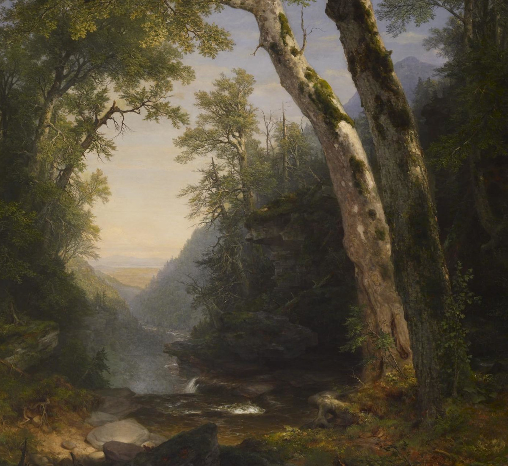

<ul>
<li><strong>Capital:</strong> Inton (pop. 80,000)</li>
<li><strong>Population:</strong> 24 million</li>
<li><strong>Majority Race:</strong> Human</li>
<li><strong>Wild Beasts:</strong> Black Bears, Giant Rats, Wild Boars</li>
<li><strong>Uzvu Presence:</strong> Medium</li>
<li><strong>Cthonian Presence:</strong> Low</li>
<li><strong>Magellian Ruin Presence:</strong> Medium</li>
<li><strong>Haunted Tomb Presence:</strong> Low</li>
<li><strong>Resources:</strong> grain, timber, livestock, fish</li>
<li><strong>Area:</strong> 720 thousand square miles</li>
<li><strong>Important NPCs:</strong>
<ul>
<li><strong>Emperor Ezgar of House Yargyez (Human)</strong> is the head of the Yargyez Empire. He rules from the Royal Palace, in Inton.</li>
<li><strong>Archmage General Gopa (Human)</strong> is the head of the Academy of Knowledge, and resides in Inton. He does not have any personal loyalty to the Yargyez Empire, but cooperates with it in order to continue his research.</li>
<li><strong>Archbishop Ushra (Human)</strong> is the head of the Order of Iazus. She is incredibly dedicated to rooting out Archon worship across Conliah, but worries that her inquisitors are stretched thin.</li>
<li><strong>Bandit King Lo the Vicious (Human)</strong> is the head of a province-spanning Tyvenlad syndicate. He operates out of Bridgeport, where he controls the government.</li>
</ul></li>
</ul>

Eastgardia is a temperate region with fertile soil, and numerous lakes and rivers. The heart of the Yargyez Empire is in the Royal Palace, located in the mountain city of Inton. In the Jang River region, there is the city of Bridgeport, which has a corrupt government loyal to the local Bandit King. The Karlsvale region to the south borders Nightglade, and faces constant attacks from Lizardfolk rebels. To the north are the Chainledges region, home to Portborough University, the largest school of the Academy of Knowledge.

<h3>Helscar</h3>

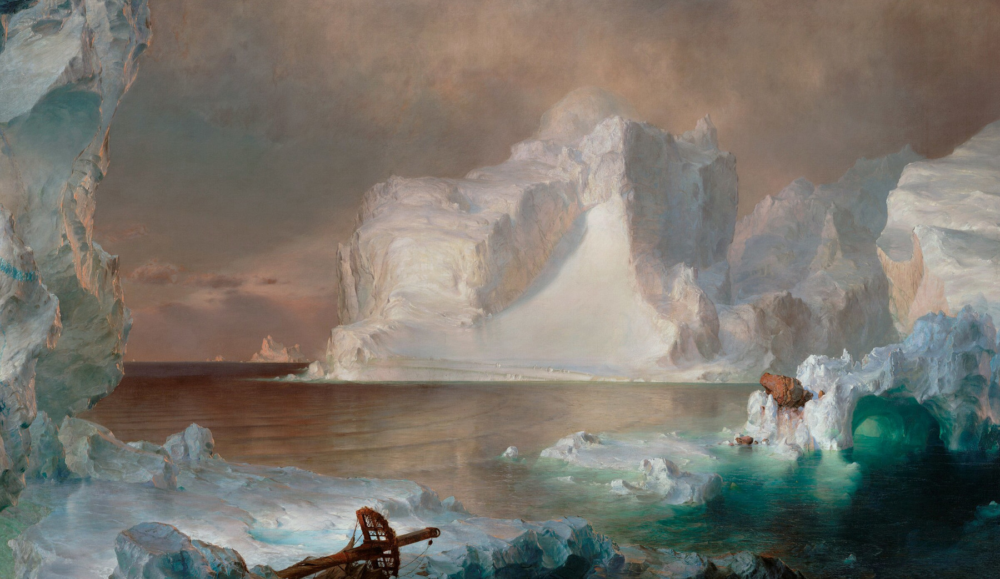

<ul>
<li><strong>Capital:</strong> Eithar (pop. 4,000)</li>
<li><strong>Population:</strong> 1.2 million</li>
<li><strong>Majority Race:</strong> Dwarf</li>
<li><strong>Wild Beasts:</strong> Dire Wolves, Giant Spiders, White Carnivorous Apes</li>
<li><strong>Uzvu Presence:</strong> Low</li>
<li><strong>Cthonian Presence:</strong> Low</li>
<li><strong>Magellian Ruin Presence:</strong> Low</li>
<li><strong>Haunted Tomb Presence:</strong> High</li>
<li><strong>Resources:</strong> ore, fish</li>
<li><strong>Area:</strong> 2.9 million square miles</li>
<li><strong>Important NPCs:</strong>
<ul>
<li><strong>Chieftain Asbirn Hamarson (Dwarf)</strong> resides in the Highchill Mountains city of Hrafnagil. He is a firebrand who supports soul-binding ancestral veneration.</li>
<li><strong>Manufacturer Supreme Vasa (Human)</strong> is the head of the Artisans Guild. She resides in Eithar.</li>
</ul></li>
</ul>

Helscar is a massive tundra region, which mainly exports ore and requires agricultural exports from Middlestone and Eastgardia for survival. The local chieftains have no formal authority, but are respected by the Imperial provincial governor as representatives of their clans. The region is divided between the western chieftains of the Highchill Mountains who demand greater autonomy, and the eastern chieftains of the Shifting Foothills who willingly submit to Imperial oversight.

<h3>Middlestone</h3>

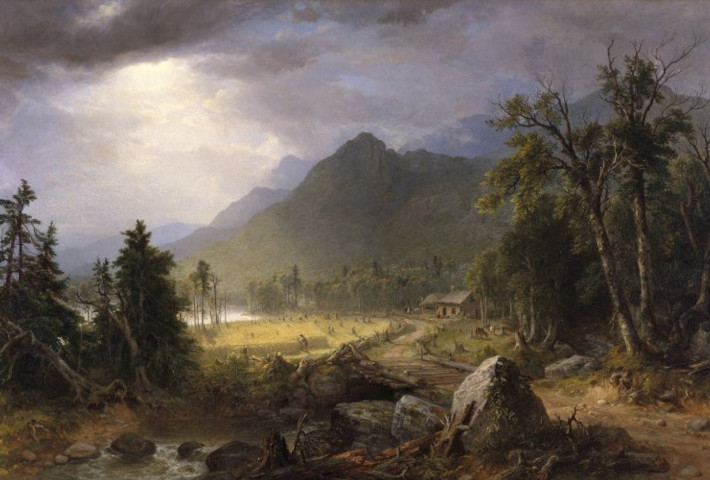

<ul>
<li><strong>Capital:</strong> Omugi (pop. 40,000)</li>
<li><strong>Population:</strong> 12 million</li>
<li><strong>Majority Race:</strong> Halfling</li>
<li><strong>Wild Beasts:</strong> Giant Ants, Giant Badgers, Giant Bees</li>
<li><strong>Uzvu Presence:</strong> None</li>
<li><strong>Cthonian Presence:</strong> Medium</li>
<li><strong>Magellian Ruin Presence:</strong> Medium</li>
<li><strong>Haunted Tomb Presence:</strong> High</li>
<li><strong>Resources:</strong> grain, wine, livestock</li>
<li><strong>Area:</strong> 1.4 million square miles</li>
<li><strong>Important NPCs:</strong>
<ul>
<li><strong>Supreme Commander Taeko Kariko-zu (Halfling)</strong> is the head of the Belligerantes. She resides in Omugi.</li>
<li><strong>Lord Kobuno Atana-zu (Halfling)</strong> is a noble in the Oto foothills who is seeking to revive Omuzast worship.</li>
</ul></li>
</ul>

Middlestone is divided into three regions. First are the massive Uzu Plains to the north, which produce abundant grain. Secondly are the Oto foothills in the center, which is filled with orchards and vinyards. Last are the Koha Highlands to the south, which are forested and haunted. Halflings of Middlestone are fervently loyal to the Yargyez Empire on the surface, but they are also hostile to outsiders and prone to feuding over land rights. Middlestone is governed by land-owning Halfling nobles who ultimately answer to the Imperial governor.

<h3>Valorgale</h3>

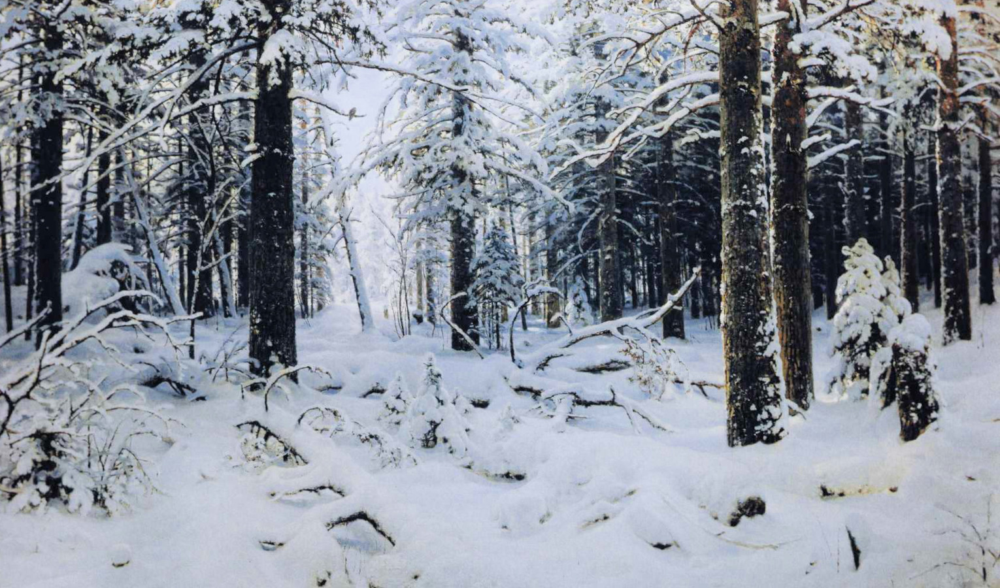

<ul>
<li><strong>Capital:</strong> Matay (pop. 1,200)</li>
<li><strong>Population:</strong> 370 thousand</li>
<li><strong>Majority Race:</strong> Dark Elf</li>
<li><strong>Wild Beasts:</strong> White Tigers, Wooly Mammoths, Wooly Rhinoceroses</li>
<li><strong>Uzvu Presence:</strong> Low</li>
<li><strong>Cthonian Presence:</strong> High</li>
<li><strong>Magellian Ruin Presence:</strong> Low</li>
<li><strong>Haunted Tomb Presence:</strong> High</li>
<li><strong>Resources:</strong> timber, hunted meat</li>
<li><strong>Area:</strong> 1.8 million square miles</li>
</ul>

Valorgale is divided into three regions. First is the southern Zama Valley, which is a vast taiga of flowing rivers. Second is the northern Zensuke Peninsula, which is a harsher taiga to the north which borders the Highchill Mountains of Helscar. Last is Iktib Island, which is a massive active volcano at the center of the province. It is jointly governed by an Imperial governor and a council of the Six Ashfallen Tribes. Each of the Ashfallen Tribes has a distinct disposition towards the Yargyez Empire. Distinctly, the Pataf Tribe is conspiring with the Synomachos, the Osti Tribe is reviving worship of the Archon Dreze, and the Tivik Tribe is steadfastly loyal to the Yargyez Empire. Wooly rhinoceros herding for subsistence is common in the Zensuke Peninsula, and timber from the Zama Valley is exported to the rest of the Empire.

<h3>Westerwood</h3>

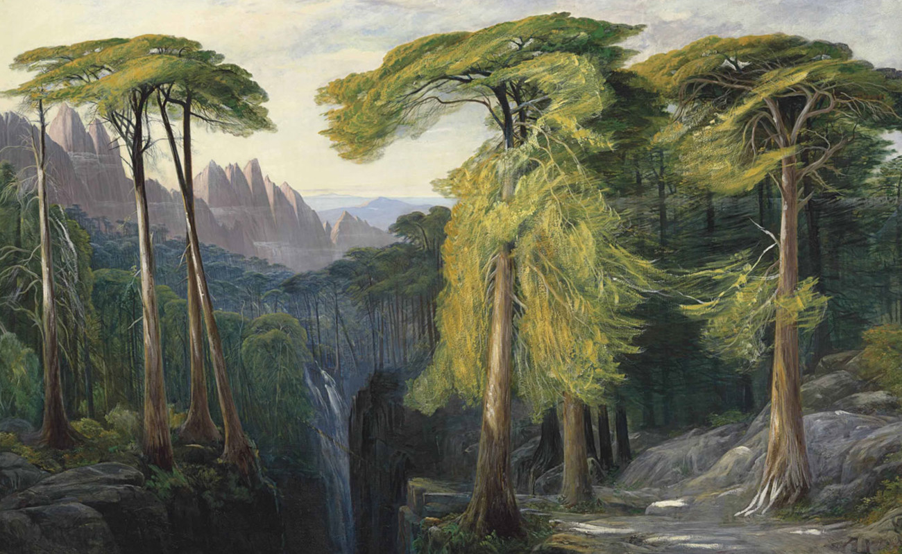

<ul>
<li><strong>Capital:</strong> Kabat (pop. 5,000)</li>
<li><strong>Population:</strong> 1.5 million</li>
<li><strong>Majority Race:</strong> Wood Elf</li>
<li><strong>Wild Beasts:</strong> Brown Bears, Giant Elks, Giant Owls</li>
<li><strong>Uzvu Presence:</strong> None</li>
<li><strong>Cthonian Presence:</strong> Medium</li>
<li><strong>Magellian Ruin Presence:</strong> Medium</li>
<li><strong>Haunted Tomb Presence:</strong> Low</li>
<li><strong>Resources:</strong> timber, livestock, hunted meat</li>
<li><strong>Area:</strong> 720 thousand square miles</li>
<li><strong>Important NPCs:</strong>
<ul>
<li><strong>Khagan Anim lim Beldek (Wood Elf)</strong> is the ruling Khagan of Westerwood. He is fervently loyal to the Yargyez Empire.</li>
<li><strong>Chieftain Tosir lim Arakzan (Wood Elf)</strong> is a member of the Synomachos conspiracy. He seeks to overthrow Anim lim Beldek and replace him.</li>
</ul></li>
</ul>

Westerwood is divided into three regions. First is the densely forested Teren Basin at the center, which holds the capital of Kabat and is the political center of Westerwood. Second are the rugged and forested Kara Ates Mountains to the north, which is home to the Wood Elves' ancient capital of Koknar which is long ruined. Last are the semi-arid grasslands of the Ak Ates Mountains to the south, which are occupied by pastoral nomads. Westerwood is ruled chieftains who ultimately answer to the Khagan Anim lim Beldek of Westerwood, who jointly rules with the Imperial governor. The current Khagan is loyal to the Yargyez Empire, but the Wood Elf Chieftain Tosir lim Arakzan is planning to overthrow him in the Synomachos conspiracy.

<h3>Fair Island</h3>

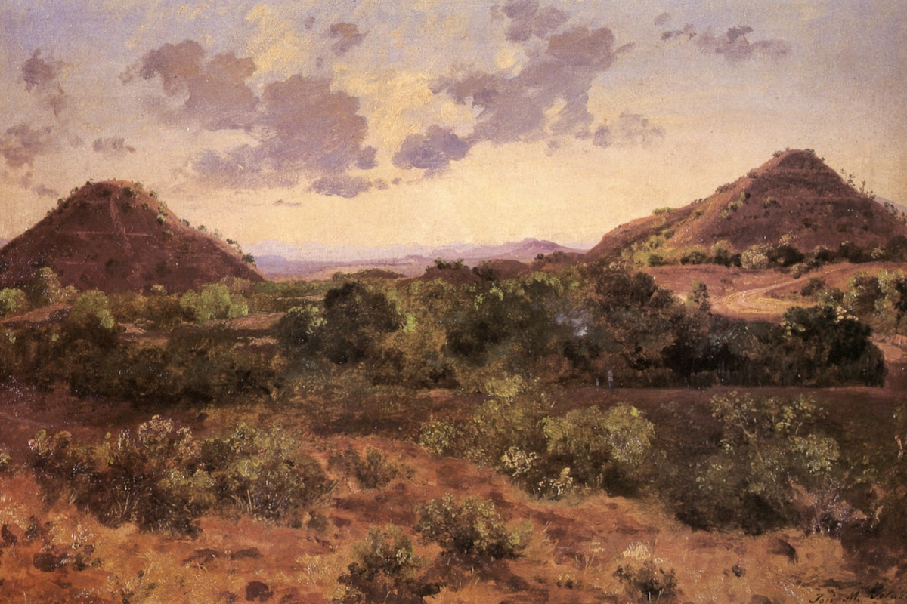

<ul>
<li><strong>Capital:</strong> Thesekira (pop. 5,000)</li>
<li><strong>Population:</strong> 1.5 million</li>
<li><strong>Majority Race:</strong> High Elf</li>
<li><strong>Wild Beasts:</strong> Giant Eagles, Protoceratopses, Velociraptors</li>
<li><strong>Uzvu Presence:</strong> None</li>
<li><strong>Cthonian Presence:</strong> Low</li>
<li><strong>Magellian Ruin Presence:</strong> High</li>
<li><strong>Haunted Tomb Presence:</strong> Low</li>
<li><strong>Resources:</strong> fruit, wine</li>
<li><strong>Area:</strong> 720 thousand square miles</li>
<li><strong>Important NPCs:</strong>
<ul>
<li><strong>King Typhen lin Maphelius (High Elf)</strong> is the ruling king of Fair Island. He is a member of the Synomachos conspiracy, and is planning an invasion on the rest of Conliah.</li>
</ul></li>
</ul>

Fair Island is a massive arid island divided into three regions. The Tispus Coast to the west receives winter rainfall which allows for massive orchards. The Tipsus Coast is home to the capital of Thesekira, as well as the ancient Magellian capital of Atherita which is still inhabited. The Taknis Mountains at the center are sparsely populated grasslands, and the Gastus Coast to the east is a barren, uninhabited desert. The High Elf King Typhen resides in Thesekira, and jointly rules Fair Island with the Imperial governor. However, he is not loyal to the Yargyez Empire and is part of the Synomachos conspiracy.

<h3>Wuthelark</h3>

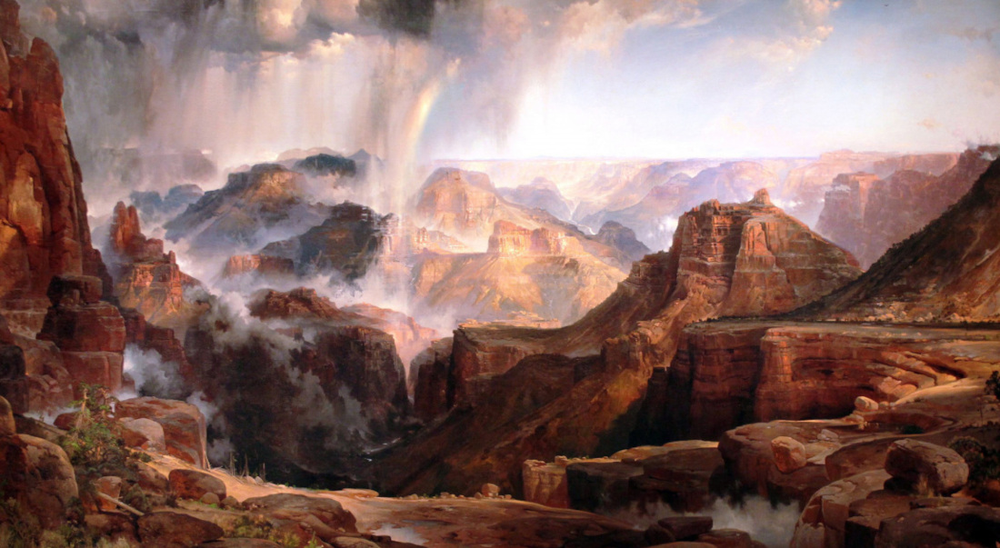

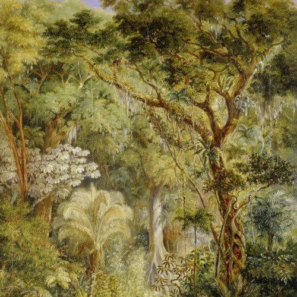

<ul>
<li><strong>Capital:</strong> Ramadiya (pop. 15,000)</li>
<li><strong>Population:</strong> 4.5 million</li>
<li><strong>Majority Race:</strong> Catfolk</li>
<li><strong>Wild Beasts:</strong> Leapords, Giant Cobras, Giant Scorpions</li>
<li><strong>Uzvu Presence:</strong> Low</li>
<li><strong>Cthonian Presence:</strong> Medium</li>
<li><strong>Magellian Ruin Presence:</strong> Medium</li>
<li><strong>Haunted Tomb Presence:</strong> Low</li>
<li><strong>Resources:</strong> fruit, ore</li>
<li><strong>Area:</strong> 1.8 million square miles</li>
<li><strong>Important NPCs:</strong>
<ul>
<li><strong>Willis the Watcher (Catfolk)</strong> is the founder of the Quietest Master Lodge in Wuthelark. He trains new members in the art of silent contemplation.</li>
<li><strong>Pip the Crier (Catfolk)</strong> is a legendary prankster who seeks a revival of Lozie worship.</li>
</ul></li>
</ul>

Wuthelark is divided into three regions. First is the southern Tamain Jungle, which is an untamed wilderness ruled by land-owning Catfolk nobles who ultimately answer to the Imperial governor. Second are the Karamain Highlands, which are a semi-arid region dividing the southern jungle and the northern desert, which is hardly inhabited. Last is the Namara Desert to the north, which is home to nomadic tribes who resist Imperial rule. They have not formed an active resistance, but essentially do not respect the laws of the Yargyez Empire and view it as an illegitimate occupier of their nomadic lands.

<h3>Nightglade</h3>

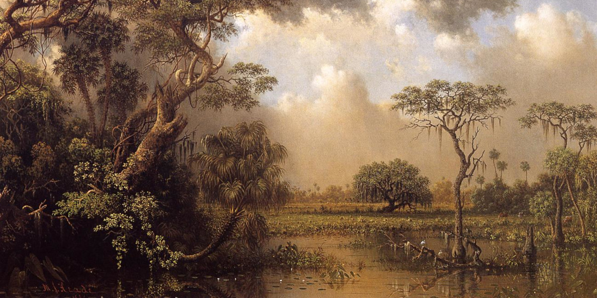

<ul>
<li><strong>Capital:</strong> Emtong (pop. 20,000)</li>
<li><strong>Population:</strong> 12 million</li>
<li><strong>Majority Race:</strong> Lizardfolk</li>
<li><strong>Wild Beasts:</strong> Giant Crocodiles, Giant Leeches, Giant Turtles</li>
<li><strong>Cthonian Presence:</strong> Medium</li>
<li><strong>Uzvu Presence:</strong> High</li>
<li><strong>Magellian Ruin Presence:</strong> Low</li>
<li><strong>Haunted Tomb Presence:</strong> Medium</li>
<li><strong>Resources:</strong> fish</li>
<li><strong>Area:</strong> 720 thousand square miles</li>
</ul>

Nightglade is divided into two regions. First is the Kangiet Highlands to the west, which are the headwaters of the marsh. Second is the Aungkong Lowlands to the east, which drain the rivers into the Talantic Ocean. Since the conquest of the Yargyez Empire, the entire region has been in an open civil war between the land-owning Lizardfolk nobles who willingly surrendered to the Yargyez Empire and answer the Imperial governor, and the vast majority of Lizardfolk who view the Yargyez Empire's presence as an illegitimate occupier of their lands. There are numerous deep caves across Nightglade which have served as fortresses for Lizardfolk rebels.

<h2>Daily Life</h2>
<h3>Crime</h3>
<h4>Gambling</h4>
<ul>
<li><b>Trifle</b> is a 2v2 trick-taking card game. It is mainly a game of chance played for money, but there is a small element of skill during trick-taking. The deck for trifle has 52 cards, 4 suits, and 13 ranks. The suits are hammers, coins, swords, and cups. The ranks are 1 through 10, knight, queen, and king.
</li>
<li><b>Spider-Eyes</b> is a game of pure chance played with four six-sided dice.
</ul>
<h4>Drugs</h4>
<ul>
<li><b>Mola dust</b> is a powdered stimulant which is snorted and absorbed in the nostrils. It is derived from the the mola nut, which must be roasted then ground into a fine powder. Without exposure to high temperatures, the drug is inert. Mola trees grow natively in Westerwood. It is highly addictive, and it is illegal to trade, possess and consume.</li>
<li><b>Mola tea</b> is a more mild stimulant created by brewing the dry leaves of the mola tree. It contains the same active ingredient as mola dust. Brewing the dry leaves in hot water activates a smaller quantity of the active drug, but also releases the complex flavors of the leaf. Despite it being only weakly addictive, it is illegal to trade, possess, and consume due to its association with the highly addictive mola dust.</li>
<li><b>Azeta nectar</b> is a sweet secretion given by azetas, a species of giant aphid native to Wuthelark. It has depressant effects when ingested. It is highly addictive, and it is illegal to trade, possess and consume.</li>
<li><b>Haze shrooms</b> are brown mushrooms with pink spots which have a depressant effect when ingested. They grow underground across all of Conliah. It is illegal to trade, possess and consume.</li>
<li><b>Ongvakong plants</b> are herbs native to Nightglade with hallucinogenic effects. They are used by Lizardfolk for ancestor veneration rituals.</li>
</ul>

<h2>Image Credits</h2>

All images are either original for this sourcebook or taken from the public domain, but for the reader's convenience public domain images are cited here.

<ul>
<li>
Cover

<ul>
<li>Clouds by John Constable, 1822</li>
</ul></li>

<li>
Introduction

<ul>
<li>Waterfalls at Subiaco by Joseph Anton Koch, c. 1813</li>
</ul></li>
<li>
History: Mythological

<ul>
<li>The Glory of Psara by Nikolaos Gyzis, 1898</li>
</ul></li>
<li>
History: Written

<ul>
<li>Serpentara Landscape with the Procession of the Magi by Joseph Anton Koch, 1820</li>
</ul></li>
<li>
Races

<ul>
<li>Landschaft nach einem Gewitter by Joseph Anton Koch, c. 1830</li>
</ul></li>
<li>
Religion

<ul>
<li>The Monastery of Arkadios by Theodoros Vryzakis, c. 1867</li>
</ul></li>
<li>
Magic

<ul>
<li>The Parthenon by Frederic Edwin Church, 1871</li>
</ul></li>
<li>
Factions

<ul>
<li>The German of Old Patras blesses the flag by Theodoros Vryzakis, 1865</li>
</ul></li>
<li>
Monsters

<ul>
<li>Henry V Discovering the Conspirators by Henry Fuseli, c. 1780</li>
</ul></li>
<li>
Provinces

<ul>
<li>The Catskills by Asher B. Durand, 1858</li>
<li>The Icebergs by Frederic Edwin Church, 1861</li>
<li>The First Harvest in the Wilderness by Asher B. Durand, c. 1855</li>
<li>Winter by Ivan Shishkin, 1890</li>
<li>Forest of Bavella by Edward Lear, c. 1869</li>
<li>Piramides del Sol y de la Luna Jose Maria Velasco, 1878</li>
<li>Brazilian Virgin Forest by Johann Moritz Rugendas, 1830</li>
<li>Chasm of the Colorado by Thomas Moran, c. 1874</li>
<li>The Great Florida Marsh by Martin Johnson Heade, 1886</li>
</ul></li>
</ul>

<h2>Licensing</h2>

Nephelai is released into the public domain by the terms of the CC0 
1.0 Universal license. Simply put, you are granted the maximum possible 
rights to re-use this work as I may grant according to the law. I have 
chosen to release Nephelai to the public domain in hopes that people in 
general find it useful, rather than a desire to receive income or 
credit. I know that players and GMs have many options besides Nephelai, 
and I felt making it public domain could sweeten the deal for some to 
try it out.

    

     <h2 id="legal-code-title">
      CC0 1.0 Universal
     </h2>
     

      CREATIVE COMMONS CORPORATION IS NOT A LAW FIRM AND DOES NOT PROVIDE LEGAL SERVICES. DISTRIBUTION OF THIS DOCUMENT DOES NOT CREATE AN ATTORNEY-CLIENT RELATIONSHIP. CREATIVE COMMONS PROVIDES THIS INFORMATION ON AN "AS-IS" BASIS. CREATIVE COMMONS MAKES NO WARRANTIES REGARDING THE USE OF THIS DOCUMENT OR THE INFORMATION OR WORKS PROVIDED HEREUNDER, AND DISCLAIMS LIABILITY FOR DAMAGES RESULTING FROM THE USE OF THIS DOCUMENT OR THE INFORMATION OR WORKS PROVIDED HEREUNDER.
     

     <h3 id="sop">
      Statement of Purpose
     </h3>
     

      The laws of most jurisdictions throughout the world automatically confer exclusive Copyright and Related Rights (defined below) upon the creator and subsequent owner(s) (each and all, an "owner") of an original work of authorship and/or a database (each, a "Work").
     

     

      Certain owners wish to permanently relinquish those rights to a Work for the purpose of contributing to a commons of creative, cultural and scientific works ("Commons") that the public can reliably and without fear of later claims of infringement build upon, modify, incorporate in other works, reuse and redistribute as freely as possible in any form whatsoever and for any purposes, including without limitation commercial purposes. These owners may contribute to the Commons to promote the ideal of a free culture and the further production of creative, cultural and scientific works, or to gain reputation or greater distribution for their Work in part through the use and efforts of others.
     

     

      For these and/or other purposes and motivations, and without any expectation of additional consideration or compensation, the person associating CC0 with a Work (the "Affirmer"), to the extent that he or she is an owner of Copyright and Related Rights in the Work, voluntarily elects to apply CC0 to the Work and publicly distribute the Work under its terms, with knowledge of his or her Copyright and Related Rights in the Work and the meaning and intended legal effect of CC0 on those rights.
     

     <h3 id="copyright">
      1. Copyright and Related Rights.
     </h3>
     

      A Work made available under CC0 may be protected by copyright and related or neighboring rights ("Copyright and Related Rights"). Copyright and Related Rights include, but are not limited to, the following:
     

     <ol type="i">
      <li>
       the right to reproduce, adapt, distribute, perform, display, communicate, and translate a Work;
      </li>
      <li>
       moral rights retained by the original author(s) and/or performer(s);
      </li>
      <li>
       publicity and privacy rights pertaining to a person's image or likeness depicted in a Work;
      </li>
      <li>
       rights protecting against unfair competition in regards to a Work, subject to the limitations in paragraph 4(a), below;
      </li>
      <li>
       rights protecting the extraction, dissemination, use and reuse of data in a Work;
      </li>
      <li>
       database rights (such as those arising under Directive 96/9/EC of the European Parliament and of the Council of 11 March 1996 on the legal protection of databases, and under any national implementation thereof, including any amended or successor version of such directive); and
      </li>
      <li>
       other similar, equivalent or corresponding rights throughout the world based on applicable law or treaty, and any national implementations thereof.
      </li>
     </ol>
     <h3 id="waiver">
      2. Waiver.
     </h3>
     

      To the greatest extent permitted by, but not in contravention of, applicable law, Affirmer hereby overtly, fully, permanently, irrevocably and unconditionally waives, abandons, and surrenders all of Affirmer's Copyright and Related Rights and associated claims and causes of action, whether now known or unknown (including existing as well as future claims and causes of action), in the Work (i) in all territories worldwide, (ii) for the maximum duration provided by applicable law or treaty (including future time extensions), (iii) in any current or future medium and for any number of copies, and (iv) for any purpose whatsoever, including without limitation commercial, advertising or promotional purposes (the "Waiver"). Affirmer makes the Waiver for the benefit of each member of the public at large and to the detriment of Affirmer's heirs and successors, fully intending that such Waiver shall not be subject to revocation, rescission, cancellation, termination, or any other legal or equitable action to disrupt the quiet enjoyment of the Work by the public as contemplated by Affirmer's express Statement of Purpose.
     

     <h3 id="fallback">
      3. Public License Fallback.
     </h3>
     

      Should any part of the Waiver for any reason be judged legally invalid or ineffective under applicable law, then the Waiver shall be preserved to the maximum extent permitted taking into account Affirmer's express Statement of Purpose. In addition, to the extent the Waiver is so judged Affirmer hereby grants to each affected person a royalty-free, non transferable, non sublicensable, non exclusive, irrevocable and unconditional license to exercise Affirmer's Copyright and Related Rights in the Work (i) in all territories worldwide, (ii) for the maximum duration provided by applicable law or treaty (including future time extensions), (iii) in any current or future medium and for any number of copies, and (iv) for any purpose whatsoever, including without limitation commercial, advertising or promotional purposes (the "License"). The License shall be deemed effective as of the date CC0 was applied by Affirmer to the Work. Should any part of the License for any reason be judged legally invalid or ineffective under applicable law, such partial invalidity or ineffectiveness shall not invalidate the remainder of the License, and in such case Affirmer hereby affirms that he or she will not (i) exercise any of his or her remaining Copyright and Related Rights in the Work or (ii) assert any associated claims and causes of action with respect to the Work, in either case contrary to Affirmer's express Statement of Purpose.
     

     <h3 id="limitations">
      4. Limitations and Disclaimers.
     </h3>
     <ol type="a">
      <li>
       No trademark or patent rights held by Affirmer are waived, abandoned, surrendered, licensed or otherwise affected by this document.
      </li>
      <li>
       Affirmer offers the Work as-is and makes no representations or warranties of any kind concerning the Work, express, implied, statutory or otherwise, including without limitation warranties of title, merchantability, fitness for a particular purpose, non infringement, or the absence of latent or other defects, accuracy, or the present or absence of errors, whether or not discoverable, all to the greatest extent permissible under applicable law.
      </li>
      <li>
       Affirmer disclaims responsibility for clearing rights of other persons that may apply to the Work or any use thereof, including without limitation any person's Copyright and Related Rights in the Work. Further, Affirmer disclaims responsibility for obtaining any necessary consents, permissions or other rights required for any use of the Work.
      </li>
      <li>
       Affirmer understands and acknowledges that Creative Commons is not a party to this document and has no duty or obligation with respect to this CC0 or use of the Work.
      </li>
     </ol>
    

</body>
</html>
